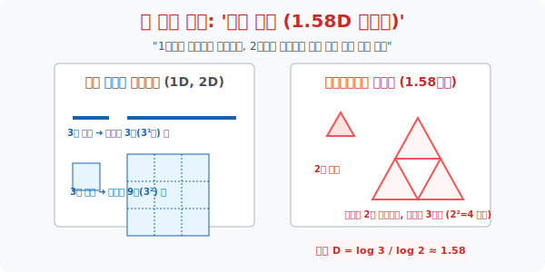

# 3. 소수 차원의 괴물: '프랙탈과 1.58차원'

## [도입부] 학습 목표 (Learning Objectives)
- 1, 2, 3... 처럼 정수로 딱 떨어지지 않고 무한히 쪼개지는 소수(Decimal) 값을 가진 **'소수 차원(Fractional Dimension)'** 이라는 이단적 수학 개념, 프랙탈 기하학(Fractal Geometry) 에 발을 내딛습니다.
- 확대(Scaling) 의 비율과 그 안에 담기는 조각(Mass) 의 개수 사이의 법칙을 이용해, 길이는 커지는데 면적은 텅 비어버리는 <시에르핀스키 삼각형(1.58D)> 의 신비를 해부합니다.
- 파이썬(Python)의 수학 모듈 `math.log` 로 이 괴물 같은 모양들의 차원을 직접 스캐닝하여, 1차원 선보다는 공간을 많이 차지하지만 2차원 면이라고 부르기엔 뻥 뚫려있는 소수점 좌표 우주를 소환합니다.

---

## 1. 확장의 법칙이 붕괴되다

우리는 공간의 차원을 이야기할 때 굉장히 자연스러운 법칙 하나를 알고 있습니다. 이 도형을 $k$배만큼 길이를 확 잡아 늘린다고(확대) 가정해 봅시다.

1. **[1차원] 선분**: 길이를 2배 늘리면, 그 안에는 원래 선분이 똑같이 **$2^1 = 2$개** (2배) 가 들어갑니다.
2. **[2차원] 정사각형**: 가로세로를 2배로 늘리면, 원래 정사각형이 **$2^2 = 4$개** (4배) 가 필요합니다.
3. **[3차원] 정육면체 큐브**: 가로, 세로, 높이를 2배로 늘리면, 원본 큐브가 **$2^3 = 8$개** (8배) 가 필요합니다.

수학자들은 이 완벽한 패턴에 전율했습니다. 
> 길이를 **$R$** 배 늘렸을 때, 조각이 **$N$** 개 필요하다면?
> 그 형태의 차원 **$D$** 에 대해 무조건 **$R^D = N$** 이라는 강력한 록(Lock) 이 걸립니다.

수학자 맹거와 시에르핀스키가 이 공식에 장난을 쳤습니다.
"삼각형 모양에서 가운데를 계속 치즈처럼 파먹는 삼각형(시에르핀스키 삼각형) 을 만들어보자. 길이를 **2배**로 키웠는데, 가운데가 뻥 비어버려서 조각이 4개가 안 되고 **3개**만 나오네?"

**$2^D = 3$** 이 되는 차원 $D$ 가 있단 말인가?
로그(Log) 를 씌워봅니다. $\mathbf{D = \log 3 / \log 2 \approx 1.5849}$

그렇습니다! 이 괴물 같은 삼각형은 1차원의 얇은 선보다는 복잡하고 넓게 퍼져있지만, 2차원의 면이라고 부르기에는 구멍이 너무 송송 뚫려 있어서 **1.58차원**이라는 미친 소수점 세계관에 살고 있었던 것입니다.



<br>

## 2. 대자연은 모두 소수(Fraction) 차원이다

구불구불한 영국의 해안선 매핑, 번개가 칠 때 땅에 꽂히는 지그재그 패턴, 브로콜리의 무한 반복되는 꽃송이 형태, 사람의 폐포에 있는 혈관의 수많은 잔가지들.
이 모든 대자연의 구조는 결코 1차원 선이나 2차원 원형의 부드러운 유클리드 기하학이 아닙니다. 이들은 공간을 구불구불하게 채워 나가다 멈춘 **'프랙탈 (Fractal) 1.XX 차원 혹은 2.XX 차원'** 들의 집합체입니다.

이 소수 차원은 무한하게 작은 스케일로 들어가도 계속해서 원래의 거대한 패턴과 똑같은 자기 유사성(Self-Similarity) 을 가지고, 무한한 둘레의 길이를 가지지만 유한한 넓이 안에 갇혀있는 미스터리한 수학적 버그 코드를 실행하고 있습니다.

---

## 3. 💻 파이썬(Python) 프랙탈 탐지기 (로그 계산)

우리는 인공지능이 복잡한 지형(해안선, 산맥) 이나 바이러스의 텍스쳐 복잡도를 계산할 때 사용하는 차원 해킹 알고리즘 기법인 박스카운팅(Box-Counting) 파라미터 연산을 구현해 봅니다.

### 🐍 파이썬 예제: $\log(N) / \log(R)$ 차원 추출기

```python
import math

print("--- 🔬 기하학 스캐너: 프랙탈(소수 차원) 추출기 가동 ---")

# 차원을 분석할 도형 데이터 투입
# Data 1: 시에르핀스키 삼각형 (Scale 2배, Mass 3개)
scale_r1 = 2
mass_n1 = 3

# Data 2: 코흐 곡선 (눈송이) (Scale 3배, Mass 4개)
scale_r2 = 3
mass_n2 = 4

# Data 3: 맹거 스펀지 (큐브) (Scale 3배 확장에 가운데 다 파버림 -> Mass 20개)
scale_r3 = 3
mass_n3 = 20

def calculate_fractal_dimension(r, n):
    # D = log(N) / log(R) 파이썬 로그 분석기!
    dimension = math.log(n) / math.log(r)
    return round(dimension, 4)

dim_sierpinski = calculate_fractal_dimension(scale_r1, mass_n1)
dim_koch = calculate_fractal_dimension(scale_r2, mass_n2)
dim_menger = calculate_fractal_dimension(scale_r3, mass_n3)

print(" [분석 결과 리포트]")
print(f" 🔺 시에르핀스키 삼각형 스캔: 약 {dim_sierpinski} 차원 (1D와 2D 사이의 괴짜 면적)")
print(f" ❄️ 코흐 눈송이(해안선) 스캔: 약 {dim_koch} 차원 (선인데 구불거려서 면을 침범하기 시작)")
print(f" 🧽 맹거 3D 스펀지 스캔      : 약 {dim_menger} 차원 (입체인데 구멍이 뚫려 3차원이 못 됨)")
print("-" * 50)
print(" 💡 [자연의 지문] 대자연의 복잡도가 높은 구조일수록 1, 2, 3 정기적인 차원을 이탈합니다.")

# 결과창:
# --- 🔬 기하학 스캐너: 프랙탈(소수 차원) 추출기 가동 ---
#  [분석 결과 리포트]
#  🔺 시에르핀스키 삼각형 스캔: 약 1.585 차원 (1D와 2D 사이의 괴짜 면적)
#  ❄️ 코흐 눈송이(해안선) 스캔: 약 1.2619 차원 (선인데 구불거려서 면을 침범하기 시작)
#  🧽 맹거 3D 스펀지 스캔      : 약 2.7268 차원 (입체인데 구멍이 뚫려 3차원이 못 됨)
# --------------------------------------------------
#  💡 [자연의 지문] 대자연의 복잡도가 높은 구조일수록 1, 2, 3 정기적인 차원을 이탈합니다.
```

데이터 애널리스트들은 비트코인이나 주가 차트의 구불구불한 톱니바퀴 변동폭 패턴을 이 코흐(Koch) 프랙탈 로그 공식에 때려 박아, 이 차트가 우연인지 특정 패턴인지를 수학적 차원값으로 분류하여 잡아냅니다.

---

## [결론] 학습 정리 (Summary)

1. **차원 방정식 $(R^D = N)$**: 어떤 도형을 확대시켰을 때(비율 $R$), 그 안에 자신과 똑같은 놈들이 몇 개 복제되어($N$) 채워지는가에 따라 उस 도형의 절대 차원($D$) 이 결정되는 수학계의 신비로운 비율 공식입니다.
2. **소수(Decimal) 차원의 등장**: 확대 비율과 개수 간의 싱크로율이 맞지 않고 어그러져 (구멍이 뻥 뚫리거나 미친 듯이 꼬여서), 로그 방정식을 풀어보니 **1.58D**, **2.72D** 로 나타나는 것이 바로 프랙탈 기하학입니다.
3. 인간이 인공적으로 만든 건물 창살, 직선도로 등은 1, 2, 3차원 유클리드 차원에 딱 떨어지지만, 우주의 번개, 구름, 해안선, 나뭇잎맥 등의 혼돈(Chaos) 은 모두 프랙탈 소수 차원 시스템 위에 설계되어 있습니다.
