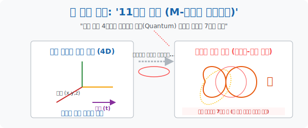

# 4. 돌돌 말려진 7개의 축: '11차원 세계 (M-이론)'

## [도입부] 학습 목표 (Learning Objectives)
- 인류의 머리로는 눈에 보이지 않는 차원을 어떻게 공간 좌표에 쑤셔 넣을 수 있는지 현대 물리학의 정수인 **'초끈이론(String Theory)' 과 'M-이론'** 의 핵심 스펙을 해부합니다.
- 먼 우주에서 보면 1차원의 얇은 전깃줄이지만, 현미경으로 개미 관점으로 축소해 보면 쳇바퀴처럼 원통을 도는 2번째 독립 축이 발견되는 **'말려진 차원(Curled-up Dimension)'** 의 개념을 상상합니다.
- 우리가 사는 4차원 시공간(공간3 + 시간1) 뒤편에, 눈에 보이지 않게 원자보다 수억 배 작게 압축되어 기타 줄처럼 진동(Vibration) 히고 있는 7개의 추가 차원 공간 좌표의 의미를 깨닫습니다.

---

## 1. 전깃줄에 숨은 개미의 차원

수학자들에게 4차원 이상을 머릿속에 상상하라고 하면 욕을 먹습니다. 뇌는 3차원에 맞춰져 있기 때문입니다. 그런데 어떻게 우주가 11차원이라는 결론이 나왔을까요?

아주 가느다란 고장 난 **전깃줄(전선)** 이 있다고 칩시다. 헬리콥터를 타고 하늘에서 100m 떨어진 전선을 봅니다.
"저 전선은 앞뒤로만 이동 가능한 아주 얇은 **'1차원의 선'** 이야." 라고 생각할 것입니다. 자유도가 딱 1개(x좌표뿐) 라고 단정 짓습니다.

하지만 그 전선 위에 살고 있는 벼룩이나 초미세 개미의 관점은 어떨까요?
1. 전선을 따라 앞뒤로 걸어갈 수 있습니다. (**독립 축 1개: 직진**)
2. 전선 표면(원통) 을 타고 삥 둘러서 360도로 회전하며 오른쪽 왼쪽으로 기어 다닐 수 있습니다. (**독립 축 2개: 원통 둘레 회전!**)

방금 헬리콥터에서는 1개밖에 없다고 생각했던 차원 좌표가, 극도로 작은 세상으로 줌인(`Zoom-in`) 하니 **숨겨져 있던(돌돌 말려있던) 두 번째 자유의 축**이 관측된 것입니다.

<br>

## 2. 초끈이론: 숨겨진 7개의 돌돌 말린 입자

현대 물리학자들은 양자역학과 상대성이론(우주의 가장 핵심 법칙 2가지) 의 수식이 서로 엇박자가 나며 폭발해 버리는 수학적 버그를 해결하려 50년을 매달렸습니다.
수학자 위튼(Edward Witten) 이 이끄는 M-이론(M-Theory) 진영이 방대하게 방정식을 풀던 중 경악스러운 결론을 냈습니다.
"우리의 수학 수식이 터지거나 무한대로 뻗어 나가지 않고 우주를 조화롭게 묘사하려면, **무조건 변수(차원) 가 11개여야만 한다.**"

1. **관측 가능한 세계 (4D)**: 우리가 발을 딛고 걷는 3차원의 공간 + 흐르는 시간 1차원. 총 4개의 축.
2. **양자 세계의 숨겨진 축 (7D)**: 전깃줄의 둘레방향처럼 우리 눈에는 결코 보이지 않지만, 아원자 입자(쿼크) 보다도 더 작게 플랑크 길이 단위로 **미세하게 돌돌 오그라져 말려있는 7차원의 추가 공간**입니다. 

우주의 기본 입자는 점이나 구슬이 아니라 아주 작은 고무줄 같은 '끈(String)' 이며, 이 끈이 숨겨진 7차원의 미세 그물망(칼라비-야우 다양체) 속에서 **'어떤 진동 패턴(주파수) 으로 떨고 있느냐'** 에 따라 그것이 튕겨 인간계의 모니터(현실) 에서는 빛(광자), 전자, 혹은 쿼크로 서로 다르게 스캐닝되어 나타난다는 궁극의 우주론입니다.



---

## 3. 💻 파이썬(Python) 11차원 벡터 하이퍼스페이스

자유도가 11개인 우주는 인간 상상력의 절망을 주지만, 파이썬 NumPy 배열 엔진에서 11차원 우주는 그저 길이 11짜리 배열(리스트) 로 싱겁게 정의됩니다. 두 우주 사이의 거리를 계산하는 공식은 완전히 똑같습니다. 유클리드의 피타고라스 정리가 지배합니다.

### 🐍 파이썬 예제: 11차원 텐서 유클리드 스캐닝

```python
import numpy as np

print("--- 🌌 M-이론 기하학: 11차원 우주 좌표 거리 계산 엔진 ---")

# 현재 내가 서 있는 11차원 우주의 좌표 (x1~x11)
point_A = np.array([1, 0, 5, -2, 4, 0, 8, -1, 3, 2, 7])

# 반물질이 존재하는 다른 11차원 우주의 타겟 좌표
point_B = np.array([0, 2, 1, 4, -3, 5, 2, -2, 6, 1, 0])

# 두 우주 입자 간의 절대 직선거리 계산 (11차원 피타고라스 정리 연속 적용)
# 각 원소의 차이를 빼고 -> 제곱하고 -> 다 더해서 루트 씌움
distance_11d = np.linalg.norm(point_A - point_B)

print(f" [초끈 좌표 1 (나)] {point_A}")
print(f" [초끈 좌표 2 (별)] {point_B}")
print("-" * 50)
print(f" 🚀 [연산 완료] 11개의 모든 시공간 변수를 관통하는 두 점 사이의 우주 거리: {distance_11d:.2f} 단위 광년")
print(f"    (파이썬은 100차원이어도 0.0001초 만에 거리를 계산합니다!)")

# 결과창:
# --- 🌌 M-이론 기하학: 11차원 우주 좌표 거리 계산 엔진 ---
#  [초끈 좌표 1 (나)] [ 1  0  5 -2  4  0  8 -1  3  2  7]
#  [초끈 좌표 2 (별)] [ 0  2  1  4 -3  5  2 -2  6  1  0]
# --------------------------------------------------
#  🚀 [연산 완료] 11개의 모든 시공간 변수를 관통하는 두 점 사이의 우주 거리: 13.93 단위 광년
#     (파이썬은 100차원이어도 0.0001초 만에 거리를 계산합니다!)
```

현존하는 ChatGPT 와 같은 거대 인공지능(LLM) 모델은 수천 개의 단어를 수천 차원의 공간에 점으로 분산시켜 배치(Vector Embeddings) 한 뒤, 위와 같이 다차원 간의 거리 공식을 재어 "이 두 단어가 의미적으로 가깝다!" 라고 문장(맥락) 을 예측하는 우주적 차원 매핑을 수행하고 있습니다.

---

## [결론] 학습 정리 (Summary)

1. **말려진 여분 차원**: 눈에 보이지 않는 차원이란 신비한 영혼 세계가 아니라, 호스 표면을 기어가는 미생물의 무브먼트처럼 우주의 아주 미세한 입자 스케일 영역에만 국한되어 말려있는 **여분의 수학적 자유도(축)** 를 의미합니다.
2. **M-이론의 11차원**: 일반 상대성이론의 거시적 질량 왜곡망 + 양자역학의 입자 진동망 두 가지를 결합해 수학적 해가 폭주하지 않기 위해 현대 물리학이 도달한 궁극의 11축 좌표 세계입니다.
3. 파이썬 배열 리스트 속 숫자가 11개 들어있는 `1D array` 혹은 다차원 매트릭스는 인간 눈으론 볼 수 없는 11차원의 속성을 완벽히 조작 가능하게 만들며, 이것이 곧 컴퓨터 데이터 사이언스의 정점입니다.
