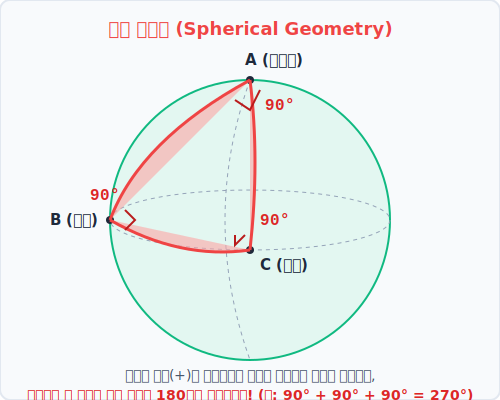



# 04. 공 위의 일탈: 삼각형의 내각이 180도를 넘다 (구면 기하학)

## 1. 학습 목표 (Learning Objectives)
* 종이 위에 그릴 때 영원불멸의 진리로 믿었던 '삼각형 세 각의 합 = 180도' 법칙이 공 모양 위에서는 어떻게 박살 나는지 증명합니다.
* 가우스 곡률이 **양수(Positive)**인 세상, 이른바 **'구면 기하학(Spherical Geometry)'**의 기묘한 세계를 시각 자료로 탐구해 봅니다.

## 2. 세 각이 모두 90도(직각)인 삼각형이 존재한다?
초등학교 때부터 수학 선생님은 "어떤 크기의 삼각형이든, 세 모서리의 뾰족한 각도를 잘라 붙이면 무조건 평평한 일직선(180도)이 된다!" 라고 가르치셨습니다. 
하지만 지구의 북극점으로 올라가서 훌라후프 크기의 거대한 자를 들고 삼각형을 그려볼까요?

  

1. 먼저 지구 꼭대기인 북극점($A$)에 서서 적도(배꼽)를 향해 수직으로 쭉 미끄러져 내려옵니다 (선 1).
2. 적도선($B$)에 도착하면, 거기서 몸을 직각(90도)으로 꺾어서 적도를 따라 옆으로 쭉 걸어갑니다 (선 2).
3. 적당히 걸어간 지점($C$)에서, 다시 몸을 왼쪽으로 90도 꺾어서 북극점을 향해 수직으로 쭉 거슬러 올라갑니다 (선 3).

이렇게 빙빙 돌아 북극점에서 출발선과 다시 만났을 때 생기는 각도는 신기하게도 **90도**가 되어버립니다!
**결론:** 분명히 세 개의 선을 이어 삼각형을 만들었는데, 밑단 2개 각이 90도이고 꼭대기 각마저 90도인 해괴망측한 '90+90+90 = $\mathbf{270^{\circ}}$' 삼각형이 만들어졌습니다.

## 3. 팽창 도수와 양의 곡률
공처럼 바깥으로 볼록하게 팽창된 공간(가우스 곡률 $K > 0$)에서는 빵이 부풀어 오르듯 모서리들이 바깥으로 늘어나는 성질을 가집니다. 
따라서 구면 위에서 삼각형을 그리면 공간의 팽창력 때문에 각도가 벌어져 **세 내각의 합은 무조건 180도보다 커집니다 ($\sum > 180^{\circ}$)**.

또한, 이전 단원에서 배운 '평행선 제5공준' 역시 무참히 깨집니다.
구면에서는 가장 긴 직선 역할을 하는 모든 대원(적도 선)들이 북극과 남극에서 2번씩 교차하며 만나버리므로, **구면 기하학에서는 '평행선이라는 것 자체가 아예 존재하지 않습니다(개수 0개)'**.

## 4. 학습 정리 (Summary)
1. **구면 기하학 (Spherical Geometry)**: 19세기 수학자 리만(Riemann)이 체계화한 공간으로, 가우스 곡률이 양수인 구형 표면의 수학입니다.
2. **법칙의 전복**: 유클리드 평면 기하학과 달리 (1) 삼각형 내각의 합 > 180도 (2) 평행선이 0개 (어떤 직선이든 무조건 2군데서 충돌함) 이라는 기하학의 역전이 발생합니다.
3. 배와 비행기가 지구를 누비는 대항해시대의 항해술은 바로 이 구면 기하학을 바탕으로 나침반의 각도를 계산했습니다.

