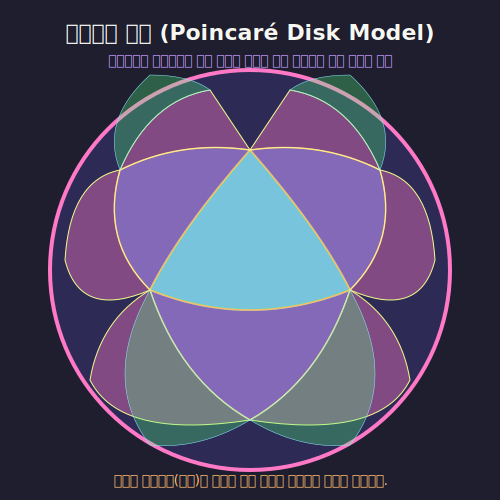

# 05. 말 안장 우주, 무한의 프랙탈: 쌍곡 기하학

## 1. 학습 목표 (Learning Objectives)
* 구면 모델과 정반대로, 바깥으로 오목하게 휘어진 가우스 음의 곡률($K < 0$)을 가지는 **'쌍곡 기하학(Hyperbolic Geometry)'**의 괴상한 현상을 이해합니다.
* 네덜란드의 판화가 M.C. 에셔(Escher)가 그렸던 천재적인 악마와 천사 그림의 배경인 **'푸앵카레 원반(Poincaré Disk)'**의 프랙탈 구조를 시각적으로 감상합니다.

## 2. 오그라드는 삼각형과 무한한 평행선
이전 단원의 구면(지구본)에서는 평행선이 북극에서 충돌해버렸고, 삼각형은 뚱뚱하게 부풀어 올라서 세 각의 합이 180도를 넘었습니다.
쌍곡 기하학은 **프링글스 감자칩**이나 말의 등에 얹는 **안장(Saddle)**처럼 좌우로는 볼록하고 앞뒤로는 안으로 푹 파인 옴폭한 공간입니다.

이 세계에서는 땅이 안쪽으로 팽팽하게 수축하여 잡아당겨지기 때문에, 삼각형을 그리면 모서리가 안쪽으로 오그라들면서 뾰족해집니다.
따라서 쌍곡 기하학 우주에서는 **삼각형의 세 내각의 합이 180도보다 항상 무조건 작아지는($\sum < 180^{\circ}$)** 경이로운 마법이 일어납니다.

또한 유클리드 제5공준에서 1개뿐이라고 배운 '평행선'의 규칙도 산산조각 납니다.
쌍곡면에서는 공간이 바깥으로 계속 퍼져 열려버리므로, 한 점 밖을 지나는 직선과 평행한 선을 **'무수히 많이, 무한대 급'**으로 그을 수 있습니다.

## 3. 푸앵카레 원반: 중심에서 변두리로의 무한 수축 축소
19세기의 프랑스 수학 괴물 푸앵카레(Poincaré)는 3차원의 복잡한 말 안장 모형을 2차원의 납작한 원반 모형으로 짜부라뜨려 렌더링하는 천재적인 수식을 만들었습니다. 이것이 그 유명한 **푸앵카레 원반(Disk)** 프랙탈 렌더링입니다.

  

* **원반의 작동 원리:** 원반의 중심은 유클리드 공간의 우리가 사는 곳처럼 편안합니다. 하지만 가장자리(테두리) 쪽으로 걸어나가면 걸어나갈수록 우주의 공간 자체가 무한히 쪼그라들고 수축합니다. 
* 원 안의 그려진 삼각형들은 사실 쌍곡 기하학에서는 **'모두 넓이와 크기가 완전히 똑같은 100% 동일한 삼각형'** 입니다!
* 우리가 보기엔 가장자리로 갈수록 개미 콧구멍만 해지게 작아 보이지만, 그 공간으로 직접 걸어 들어가 보면 내 몸 자체도 저 비율에 맞춰 무한대로 작아지기 때문에, 테두리 끝(우주의 끝)에 도달하는 데는 **'영원한 무한대의 시간'**이 걸립니다.

## 4. 학습 정리 (Summary)
1. **쌍곡 기하학 (Hyperbolic)**: 로바체프스키(Lobachevsky)가 발견한 오목한 말 안장 곡면 공간으로, 삼각형의 내각의 합이 180도 미만이고 평행선이 무한히 많아지는 우주 모델입니다.
2. **푸앵카레 모델과 예술**: 판화가 M.C. 에셔는 이 푸앵카레 원반의 복잡한 쌍곡선 수학 공식에 매료되어, 중심의 거대한 박쥐가 가장자리로 갈수록 무한히 작게 수축되는 저명한 수학 프랙탈 걸작들을 남겼습니다.
