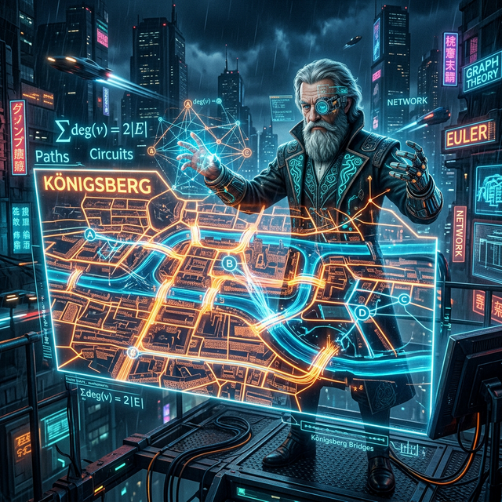

# 00. 그래프 이론의 창시자 오일러(Euler)

## 1. 학습 목표 (Learning Objectives)
* 복잡다단한 현실 세계의 문제(지도, 네트워크, 대인 관계)를 오직 '점(Node)'과 '선(Edge)'만으로 극단적으로 단순화시킨 **그래프 이론(Graph Theory)** 의 탄생을 배웁니다.
* 수학 역사상 가장 유명한 난제 중 하나였던 **'쾨니히스베르크의 7개의 다리'** 퍼즐을 완벽하게 논리로 파괴한 레온하르트 오일러의 천재적 시각을 확인합니다.

## 2. 7개의 다리는 과연 한 붓으로 건널 수 있을까?
18세기 유럽 프로이센(현재 러시아 칼리닌그라드)의 중심에는 프레겔 강이 흐르는 아름다운 도시 **쾨니히스베르크(Königsberg)** 가 있었습니다. 
이 도시 한가운데에는 두 개의 섬이 있었고, 섬과 육지를 잇는 총 **7개의 교량(다리)** 이 설치되어 있었습니다.

시민들은 매일 오후 산책을 즐기며 하나의 내기를 하기 시작했습니다.
> "어떤 다리도 두 번 건너지 않고(중복 X), 이 7개의 다리를 딱 한 번씩만 건너서 도시를 모두 돌아볼 수 있을까?"

수많은 사람이 이 섬 저 섬을 빙빙 돌며 시도해 보았지만 번번이 실패했습니다. 
무식하게 몸으로 뛰던 사람들은 당대 최고의 천재 수학자 **레온하르트 오일러(Leonhard Euler, 1707~1783)** 에게 이 문제를 편지로 보냈습니다.

## 3. 오일러의 홀로그램 차원 축소 (Dimension Reduction)

편지를 받은 오일러는 지도의 복잡한 생김새에 현혹되지 않았습니다.
> **오일러의 해킹**: "섬의 크기가 얼만지, 다리의 길이가 몇 미터인지는 이 문제에서 쓰레기 데이터다! 오직 이 땅덩어리들이 서로 어떻게 '연결(Link)' 되어 있는지만 남기면 된다!"

그는 거대한 섬과 육지 덩어리 4개를 단 4개의 **'점(Node/Vertex)'** 으로 압축시켰고, 그들을 잇는 7개의 다리를 단순한 7가닥의 **'선(Edge/Link)'** 으로 치환해 버렸습니다.

이것이 인류 역사상 최초로 현실 세계의 복잡한 위치 정보를 데이터 통신망 구조로 뽑아낸 위대한 **그래프 이론(Graph Theory)** 의 탄생 순간입니다!!

## 4. "불가능하다" 수학적 사망 선고
오일러는 점과 선만으로 이루어진 추상적인 거미줄(네트워크) 도면을 펼쳐놓고 단숨에 증명해 냅니다.

* 여행자가 어떤 점(육지)을 지나가려면, 들어오는 선(In) 하나와 나가는 선(Out) 하나가 짝꿍으로 있어야 한다.
* 즉, 출발지나 도착지가 아닌 중간 기착지 점들은 무조건 연결된 선의 개수가 **'짝수(Even)'** 여야만 통과가 가능하다!
* 그런데 쾨니히스베르크의 4개 점(육지)에 연결된 선의 개수(차수)는 각각 $3, 3, 3, 5$개가 연결되어 있다. **(전부 다 홀수점이다!)**

**"홀수점이 4개나 되는 이 구조에서는 어떤 신이 와도 7개의 다리를 한 번씩만 건너는 것은 100% 불가능하다."**

오일러의 이 단순 명쾌한 논리에 수학계는 경악했고, 도시의 시민들은 더 이상 쓸데없는 산책 다리 내기를 하지 않으며 편안하게 잠들 수 있었습니다. 

## 5. 학습 정리 (Summary)
1. **쾨니히스베르크의 다리 문제**: 7개의 다리를 중복 없이 오직 한 번씩만 건너는 산책 경로가 존재하는지 묻는 18세기 최고의 퍼즐이었습니다.
2. **그래프 이론(Graph Theory)**: 오일러가 복잡한 지도 모양을 버리고, 오직 요소들의 연결 관계만을 '점(Node)'과 '선(Edge)'으로 극단적 추상화(Abstraction)시켜 논리를 증명해 낸 현대 인터넷망과 인공지능 신경망의 근간이 되는 수학 모델입니다.
