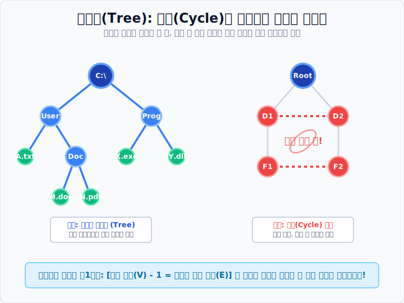

# 04. 회로를 거부하는 생태계: 수형도 (Tree)

## 1. 학습 목표 (Learning Objectives)
* 그래프 안에 갇혀서 뺑뺑 도는 무한루프(회로/Cycle)가 생기는 것을 철저히 거부하고 위에서 아래로 뻗어 나가기만 하는 순결한 그래프, **'수형도(Tree)'** 의 정의를 배웁니다.
* 생물학의 진화 계통수, 가계도, 컴퓨터 데이터베이스의 인덱스 폴더 구조가 모조리 이 트리(Tree) 구조로 설계된 이유를 파악합니다.

## 2. 닫히면 죽는다, 뻗어나가라!
오일러와 해밀턴은 어떻게든 "시작점으로 한 바퀴를 돌아서 돌아오는" 원형 링(회로/Circuit, 혹은 사이클/Cycle)을 만들어 내는 것에 혈안이 되어 있었습니다.
그런데 컴퓨터 과학자들은 회로(사이클)를 극도로 혐오하는 새로운 구조를 필요로 했습니다.

> **"파일 복사를 하려고 폴더를 들어갔더니 그 폴더 안에 상위 폴더가 또 들어있고, 그 안에 들어가니 또 자기 자신이 들어있고... 우악! 무한루프(버그)다!!"**

이런 파멸적인 무한루프를 원천 차단하기 위해 고안된 것이 바로, 어떤 선(Edge)을 따라가도 **절대 제자리로 되돌아올 수 없는(사이클이 존재하지 않는) 연결된 그래프**, 곧 **수형도(Tree)** 입니다.

## 3. 가지 (Branch)와 뿌리 (Root)
수형도는 한자로 나무 수(樹), 모양 형(形), 그림 도(圖)를 쓰며 영어로도 완벽하게 **Tree** 라고 부릅니다.
나무가 씨앗 하나에서 시작해 위로 가지를 치며 뻗어 나갈 뿐, 잔가지가 기괴하게 다시 몸통과 융합(사이클)되는 끔찍한 돌연변이는 없는 것과 같습니다.

* **최상위 뿌리 (Root Node)**: 모든 족보의 시작점. 윈도우의 `C:\` 드라이브, 가계도의 맨 위 '증조할아버지'. 
* **분기점 (Branch Node)**: 중간에 다른 폴더나 후손으로 갈라지는 노드.
* **단말/잎파리 (Leaf Node)**: 제일 끄트머리에 매달려 더 이상 선이 밑으로 뻗지 않는 도착점. (가장 하위 텍스트 문서 파일)

축구 월드컵의 **토너먼트 대진표** 역시 우승자(Root)를 꼭대기로 하여 아래 참가국 32개(Leaf)로 뻗어 나가는 전형적인 완벽한 거꾸로 수형도(Tree)입니다.

## 4. 수형도 해킹 제1법칙: "점 빼기 1은 선!"
이 그래프가 무한루프 회로(사이클)가 있는지 없는지 복잡해서 눈으로 모르겠다고요?
수형도라면 자연계의 놀라운 절대 공식을 100% 무조건 따르게 됩니다.

> **수형도의 공식: $V$ (점의 개수) - $1$ = $E$ (선의 개수)**

예를 들어 컴퓨터 폴더와 파일(점)이 총 **30개** 가 있다면, 사이클 없이 완벽한 트리 구조로 연결하기 위해 필요한 선(Edge)의 갯수는 백발백중 **29개** 입니다.
만약 선이 28개라면? $\rightarrow$ "그래프가 끊겨 파편화되었다!"
만약 선이 30개라면? $\rightarrow$ "원래 필요한 선보다 1개가 더 그어졌다! 어딘가에 치명적인 순환 회로(버그)가 생겼다!"

## 5. 학습 정리 (Summary)
1. **수형도(Tree)의 정의**: 모든 꼭짓점이 단절 없이 이어져 있으면서도, 그 내부에 본진으로 돌아오는 빙글 도는 순환선(회로/사이클)이 티끌만큼도 없는 청정 그래프입니다.
2. **트리 구조의 활용**: 혈통 가계도, 동식물 생물 분류표, 토너먼트 대진표, 컴퓨터 디렉터리(폴더) 시스템, 기업의 조직도(CEO $\rightarrow$ 임원 $\rightarrow$ 부장 $\rightarrow$ 사원) 등 "계층적(Hierarchical)" 질서를 지닌 세상 모든 데이터는 트리 구조로 코딩됩니다.
