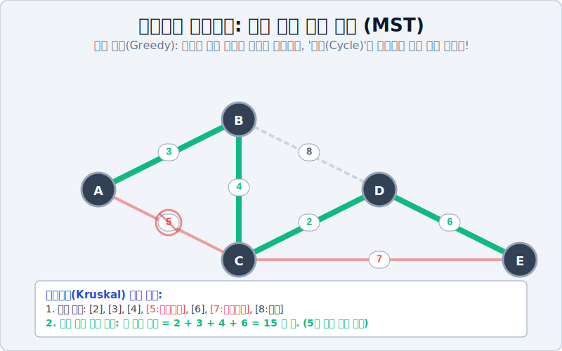

# 05. 비용을 깎아라: 최소 비용 신장 트리 (MST)

## 1. 학습 목표 (Learning Objectives)
* 모든 지점을 끊김 없이 연결하되 통신망 설치 비용을 최저로 깎아내는 마법의 네트워크, **'최소 비용 신장 트리(Minimum Spanning Tree, MST)'** 를 이해합니다.
* 당장 눈앞의 가장 싼 길부터 맹목적으로 주워 담는 이른바 **'탐욕 알고리즘(Greedy Algorithm)'** 의 철학과 **크루스칼(Kruskal)** 의 배선 구축 과정을 SVG 시각화로 해부해 봅니다.

## 2. 5천 억짜리 통신망 공사: 회로의 죄악
당신이 국가 주도 통신망 케이블 책임자라고 합시다. 서울, 대전, 대구, 부산, 광주 5개의 거점 도시를 100% 끊김 없이 연결하여 모든 도시가 서로 인터넷 통신이 되게 통신망 선을 깔아야 합니다.
그런데 각 도시를 연결하는 산맥과 강 때문에 케이블 설치 비용(가중치)이 천차만별입니다.

통신사 회장님의 불호령이 떨어집니다.
> **"모든 도시가 통신은 무조건 돼야 한다! 하지만 단 한 푼이라도 통신망 케이블 까는 공사 비용이 최소화되도록 해라!"**

이때 어설픈 공사 팀이 "인터넷이 터지면 우회해야 하니 링 형태로 공사하겠습니다!"라며 도시 간에 사이클(회로)을 만들어버리는 순간, 불필요한 중복 케이블을 깐 죄로 회사에서 해고당합니다.
비용을 극한으로 아끼려면, 전 챕터에서 배운 **회로 지수 0%의 청정 구역 '수형도(Tree)' 구조** 로만 통신망을 지어야 합니다. 전체 통신망을 최소 비용으로 덮는(Spanning) 이 궁극의 트리를 **최소 비용 신장 트리(MST)** 라고 부릅니다.

## 3. 크루스칼의 탐욕(Greedy) 알고리즘
1956년, 천재 수학자 조셉 크루스칼(Joseph Kruskal)은 이 복잡한 문제를 세상에서 제일 단순 무식한 방법으로 풀어버립니다.
이른바 **"눈앞의 싼 것부터 무조건 줍고 본다! (탐욕 알고리즘)"**

**[크루스칼의 3단계 배선 룰]**
1. 이 우주에 존재하는 모든 간선(길)의 비용 프라이스 텍스트를 보고, 싼 것부터 비싼 것 순으로 일렬 횡대로 정렬시킵니다.
2. 제일 싼 가닥 선부터 차례대로 하나씩 주워서 도시를 연결해 나갑니다.
3. **[핵심 방어막]** 선을 잇다가 만약 "어? 이 선 치면 빙글 도는 회로(루프)가 생겨버리네?" 하는 순간, 아무리 그 선이 싸더라도 가차 없이 휴지통에 버리고 다음 싼 선으로 넘어갑니다.

이렇게 (점의 개수 - 1)개의 선이 무사히 깔리는 순간, 전 우주에서 가장 저렴한 통신망이 기적처럼 100% 완성됩니다. 프림(Prim) 알고리즘 역시 이웃 노드 중 제일 싼 것만 뻗어나가는 동일한 탐욕(Greedy) 메커니즘을 사용합니다.

## 4. 로컬 최적화가 전체 최적화를 이긴다
세상의 많은 문제는 당장 눈앞의 푼돈을 아낀다고 전체 비용이 아껴지지 않는 경우가 많습니다(로컬 최적화의 함정).
그러나 그래프 이론의 이 '신장 트리(MST)' 세상만큼은, 그딴 거창한 마스터플랜 없이 그저 매 순간 영혼을 팔고 눈앞의 제일 싼 선만 탐욕스럽게 주워 먹어도 결국 **우주 전체에서 가장 저렴한 글로벌 최적(Global Optimum)** 답안지에 100% 도달하게 된다는 놀라운 수학적 사실을 선사합니다.

## 5. 학습 정리 (Summary)
1. **최소 비용 신장 트리(MST)**: 주어진 그래프의 모든 노드를 방해 없이 끊김 없이 연결하면서도 전체 간선(선)들의 가중치 합계를 최저로 다이어트한 완벽한 수형도 뼈대 구조입니다.
2. **크루스칼의 탐욕(Greedy)**: 복잡한 장기 계획 없이 그저 '제일 싼 가격표' 선부터 하나씩 순서대로 공사하되, '회로/사이클 단속망' 하나만 발동시키면 완벽한 최저가 통신망이 만들어진다는 매우 실용적인 알고리즘입니다.
