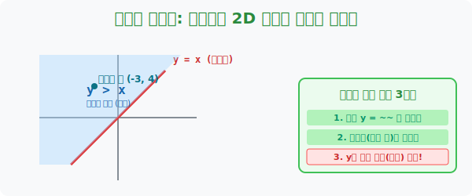
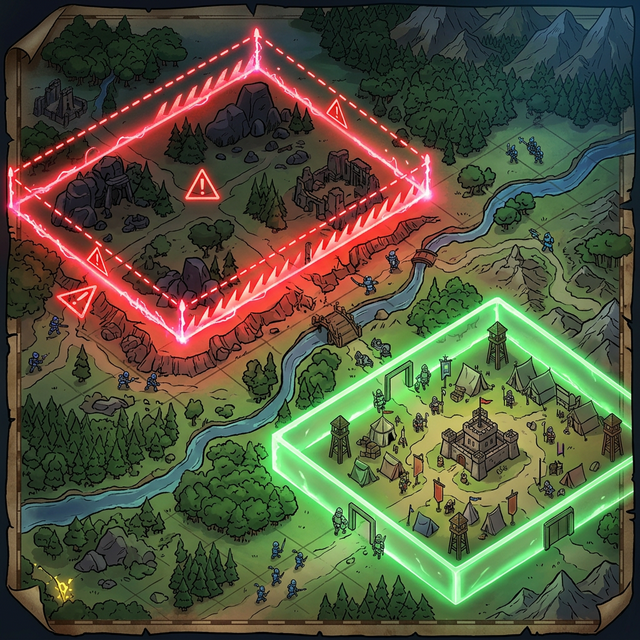

# 2. 도화지 반갈죽: 부등식을 2D 그래프 영토로 그리기

## [도입부] 학습 목표 (Learning Objectives)
- 수직선($1$차원) 위에서만 머물던 부등식을 $x, y$ 축이 있는 거대한 $2$차원 도화지로 가져와 모니터 전체를 **형광펜(영역)** 으로 찢어버리는 그리기 스킬을 획득합니다.
- 복잡한 방정식 $2x - y + 3 < 0$ 그림 따위를 만났을 때, 무조건 좌변에 **$y$ 혼자만 남겨두고 식을 싹 다 세탁(이항)** 하는 **'절대 $y$ 판별법'** 의 메커니즘을 터득합니다.
- 파이썬(Python)의 수학 그래프 그래픽스 툴인 `matplotlib` 의 `fill_between` 기능을 이용해 등식(선) 위아래의 허공을 잉크로 가득 채우는 부등식 렌더링을 체험합니다.

---

## 1. 선을 긋고, 영토를 반으로 가르다

이제 최적화 이론의 진짜 무대인 **2차원 함수 그래프** 로 전투 환경을 끌어올릴 시간입니다.
$y = x$ 라는 방정식을 그려보세요. 도화지 대각선을 정중앙으로 쭉 가르는 빨간 실선 하나가 시크하게 생성됩니다.

그런데 부등식 **$y > x$** 를 그려보라고 하면 어떤 일이 벌어질까요?
$y$ 는 '건물의 높이'를 뜻합니다. 건물의 높이가 기준 실선($x$) 보다 거대하게 '초과($>$)' 하고 있다는 뜻입니다. 
따라서 우리는 방금 그렸던 **대각선 국경선의 위쪽 허공(하늘/천장)을 지배하는 모든 무한대의 영토** 에 형광펜을 잔뜩 칠해버리면 됩니다! 

명심하십시오. 부등식을 2차원 평면에 그리면 선(Line) 하나가 딸랑 떨어지는 게 아니라, 모니터 화면의 거대한 절반을 집어삼키는 **'면(Area, Region)'** 이 탄생합니다.



<br>

## 2. 부등식 영토 렌더링 절대 3원칙 (y 판독법)



마치 스타크래프트의 미니맵 테리토리처럼, 2D 평면 위에 부등식이 지배하는 영토를 색칠하는 것은 아주 간단한 3가지 룰만 따르면 됩니다. 
항상 식의 형태를 `y = ...` 의 방정식(경계선 뼈대) 형태로 마사지한 뒤, 부등호가 $y$ 를 향해 벌어져 있는지 닫혀있는지만 판독하면 됩니다. 

**[Step 1. $y$ 만 남기고 싹 다 넘겨 탈곡기 돌리기]**
무조건 좌변에는 식의 주인인 **$y$ 한 놈**만 남겨야 위/아래 판단이 가능해집니다.
$2x - y + 1 > 0 \rightarrow \mathbf{y < 2x + 1}$
*(주의: 마이너스 $y$ 를 넘길 때 부등호 주둥이가 반대로 휙 돌아간다는 사실을 놓치면 영토가 통째로 박살 납니다)*

**[Step 2. 부등호를 가리고 일단 기준선 긋기]**
부등호를 살짝 무시하고 눈가림용 판자인 **$y = 2x + 1$** 이펙트를 발동해 1차 함수 실선을 도화지에 쫙 그어 국경선 기준을 잡습니다. 

**[Step 3. 하늘($>$)이냐? 지하실($<$)이냐?]**
다시 Step 1의 최종 결과물을 봅니다. **$y < 2x + 1$**.
주인인 $y$ 의 입장이 기준선보다 작다($<$) 고 나와 있으므로, 여러분은 방금 그어놓은 실선의 아랫배, 즉 **땅바닥(지하실) 영역 전체에 형광펜 잉크를 들이부으면 됩니다.** (만약 $y > \dots$ 였다면 위쪽 하늘에 부었을 것입니다)

---

## 4. 💻 파이썬(Python)의 2D 영토 채굴기 (Area Fill)

수학자들이 형광펜으로 뻘뻘대며 칠하던 영역을, 데이타 과학자들은 파이썬의 `fill_between` 명령어 한 줄로 수만 픽셀의 공간을 단 0.1초 만에 렌더링 잉크로 칠해냅니다.

### 🐍 파이썬 예제: $y > 2x$ 부등식 영역 렌더링 스크립트

```python
import numpy as np
# (주의: matplotlib.pyplot 모듈은 시각화 창을 띄우는 용도입니다)
# import matplotlib.pyplot as plt

print("--- 🖍️ 2D 부등식 형광펜 렌더링 엔진 가동 ---")

# 1. 뼈대 축 셋업: X 파라미터로 -10 부터 10 까지 100개의 점 찍어두기
x_axis = np.linspace(-10, 10, 100)

# 2. 국경선(방정식) 추출: 기준이 될 y = 2x 선 긋기
y_border = 2 * x_axis

print("▶ 스캔 명령 하달: y > 2x 조건 발동. (y가 크므로 하늘/천장 영역 조준!)")
print(" [SYSTEM] matplotlib_fill_between 모듈 호출 -> 기준선부터 +무한대(천장)까지 잉크 살포 중...")

# 3. 렌더링 (그래프 그리기 - 실행시 주석해제)
# plt.plot(x_axis, y_border, color='red', label='y = 2x (국경선)')
# 
# # 부등식 마법 발사: 기준선(y_border) 부터 하늘 높은 곳(y=20 한계치)까지만 속을 채워버림!
# plt.fill_between(x_axis, y_border, 20, color='blue', alpha=0.3, label='y > 2x (영역)')
# 
# plt.ylim(-20, 20)
# plt.legend()
# plt.grid(True)
# plt.show()

print("\n✅ 임무 완수: 빨간색 국경선 대각선의 윗배(하늘) 영역이 푸른 바다처럼 칠해졌습니다. 이것이 부등식의 실체입니다.")

# 결과창 (내부 처리 메시지):
# --- 🖍️ 2D 부등식 형광펜 렌더링 엔진 가동 ---
# ▶ 스캔 명령 하달: y > 2x 조건 발동. (y가 크므로 하늘/천장 영역 조준!)
#  [SYSTEM] matplotlib_fill_between 모듈 호출 -> 기준선부터 +무한대(천장)까지 잉크 살포 중...
# 
# ✅ 임무 완수: 빨간색 국경선 대각선의 윗배(하늘) 영역이 푸른 바다처럼 칠해졌습니다. 이것이 부등식의 실체입니다.
```

이렇게 그려진 무한하고 푸르른 영토 도화지는 최적화 이론에서 **"이 페인트 구역 안에 들어있는 수십만 개의 $x, y$ 좌표 점은 전부 공장 가동이 허락된 '안전 스펙' 데이터다!"** 라는 어마어마한 수학적 보증서로 쓰이게 됩니다.

---

## [결론] 학습 정리 (Summary)

1. **그래프에서의 진화**: 수직선 위에 찍던 촌스러운 일차원 부등식($x > 3$)을 탈피하고, 가로축과 세로축이 살아 숨 쉬는 $x,y$ 평면 위로 끌어올림으로써 비즈니스 문제 해결의 해상도가 확장되었습니다.
2. **절대 y 탈곡기 룰**: 우여곡절이 있는 낯선 식을 만나도 당황하지 말고, 가장 좌측에 $\mathbf{y}$ **한 글자만을 남겨둔 뒤 나머지를 우변으로 다 때려부수는 것**이 영역 판단의 최종 병기입니다.
3. **위(+), 아래(-) 판단법**: $y >$ 꼴이면 국경선의 옥상 천장 위로 페인트를 퍼붓고, $y <$ 꼴이면 방바닥 하수구로 페인트를 밀어 넣으십시오. 이 한 끗 차이가 기업의 최대 이익 도출 방향을 결정짓습니다.
