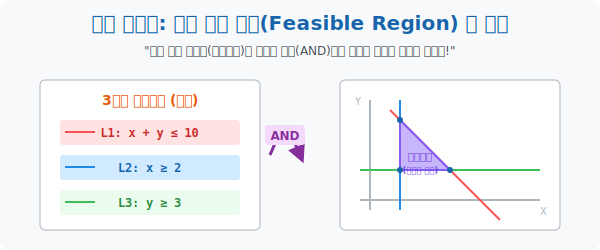

# 3. 교집합의 마법: 연립부등식의 공통 영역 (Feasible Region)

## [도입부] 학습 목표 (Learning Objectives)
- 현실 세계의 스케줄이나 생산 물량 공장 관리는 "제약 조건 하나" 로 끝나지 않으며, 돈, 사람, 시간이라는 다중 압박이 포개지는 **'연립부등식'** 에 도달해야 함을 인식합니다.
- 여러 부등식의 형광펜 영역들(조건 1, 조건 2, 조건 3)을 한 도화지 위에 모조리 겹쳐 그렸을 때, 유일하게 **모든 잉크가 겹쳐진 '다각형 안전지대(교집합)'** 를 발굴해 냅니다.
- 파이썬(Python)의 다중 `and` 조건 스캐닝을 통해 "배터리 수명도 만족하고, 카메라 화소도 만족하는" 모든 교집합 스펙 모델을 인공지능이 1초 만에 걸러내는 데이터 사이언스 기법을 체험합니다.

---

## 1. 꼬리에 꼬리를 무는 다중 제약 (연립부등식)

스타트업을 창업해서 햄버거($x$)와 피자($y$) 두 개 품목을 파는 공장을 돌려봅시다.
현실의 제약은 잔인합니다.
- **[조리 시간 한계]** 주방장이 하루 10시간 일함 $\rightarrow y \le -x + 10$ (가상)
- **[밀가루 창고 한계]** 밀가루 재고 50포대 뿐 $\rightarrow 2x + 3y \le 50$ (가상)
- **[기본 세팅값]** 햄버거 물량이 마이너스가 될 순 없음 $\rightarrow x \ge 0, y \ge 0$

이렇게 제약들이 줄줄이 비엔나처럼 엮인 것을 **'연립부등식(System of Inequalities)'** 이라고 부릅니다.
2수업에서 한 것처럼 이 세 줄짜리 방정식을 도화지에 모두 그리고 형광펜을 마구잡이로 분사합니다. 어떤 곳은 빨간색, 파란색 한 개 잉크만 칠해질 것이지만, 도화지 한가운데에는 **3가지 잉크가 완전히 겹쳐져 진하고 칙칙한 '다각형 폴리곤'** 이 생성될 것입니다.

<br>

## 2. 실현 가능 영역 (Feasible Region) 의 탄생



2차원 맵 위에 부등식 하나를 그리면 보통 화면의 절반이 칠해집니다.
그런데 공장장의 제약조건(연립 부등식) 이 3개라면 어떻게 될까요?
1. 물감 양의 제한 영토 (빨간색)
2. 인건비 제한 영토 (파란색)
3. 시간 제한 영토 (초록색)
수학자들은 3~4개의 부등식 형광펜이 모조리 겹쳐진 이 좁은 다각형(교집합) 영토를 **'실현 가능 영역(Feasible Region)'** 이라는 존칭으로 부릅니다. 
*"이 진하게 칠해진 다각형 땅덩어리 속에 찍혀있는 백만 개의 $(x,y)$ 점들은, 조리 시간도 빵셔틀도 밀가루 제약도 전부 무사통과하는 합법적이고 안전한 생산 계획들이다!"* 라는 위대한 수학적 담보가 생성되는 순간입니다.

만약 회사 임원진이 "사장님, 햄버거 20개($x$), 피자 30개($y$)를 오늘 생산합시다!" 라고 헛소리를 하면, 이 겹친 영역 바깥으로 튕겨 나간 궤도 외의 좌표이므로 "불가능한 플랜이니 기각합니다" 라고 단박에 박살을 낼 수 있게 된 것입니다.

---

## 3. 💻 파이썬(Python) 다중 교집합(AND) 안전지대 색출 엔진

수많은 제조 공장에서 ERP 프로그램을 짤 때, 파이썬의 핵심인 다중 `and` (그리고) 교합 논리 연산자는 100만 건의 주문 중에서 모든 부등식을 만족하는 공통구역의 생존자만 쏙쏙 뽑아 올립니다.

### 🐍 파이썬 예제: 스마트폰 생산 모델 스펙 합격자 스캐닝

```python
print("--- 📱 최적화 생산: 다중 제약 조건 스토리지 ---")

# (가상 데이터) 스마트폰(x), 태블릿(y) 생산 계획 후보군 세트 [x, y]
production_plans = [
    [10, 5],   # 플랜 A
    [20, 20],  # 플랜 B
    [5, 30],   # 플랜 C
    [15, 12]   # 플랜 D
]

print("▶ 판독 시작 (제약 1: 총부품수 ≤ 40 / 제약 2: 스마트폰(X) 최소 10대 보장)")
print("-" * 50)

valid_plans = []

for plan_name, (x, y) in zip(["A","B","C","D"], production_plans):
    # 🚨 부등식 1: 부품 한계 (스마트폰 부품 1개, 태블릿 부품 2개 소모)
    cond1 = (x + 2*y) <= 40
    
    # 🚨 부등식 2: 최소량 (스마트폰은 무조건 10대 이상 뽑아야함)
    cond2 = (x >= 10)
    
    # 교집합의 백미: 'and' 명령어로 두 제약이 모두 True(형광펜 겹침) 일때만 생존!
    if cond1 and cond2:
        print(f" [PASS ✅] 플랜 {plan_name} (x:{x}, y:{y}) -> 실현 가능 영역(Feasible Region) 진입!")
        valid_plans.append(plan_name)
    else:
        print(f" [FAIL 🚫] 플랜 {plan_name} (x:{x}, y:{y}) -> 제약 조건 충돌로 탈락!")

print("-" * 50)
print(f"💡 [최종 생존 계획]: {valid_plans} 플랜만이 공장장에게 결재 상신 됩니다.")

# 결과창:
# --- 📱 최적화 생산: 다중 제약 조건 스토리지 ---
# ▶ 판독 시작 (제약 1: 총부품수 ≤ 40 / 제약 2: 스마트폰(X) 최소 10대 보장)
# --------------------------------------------------
#  [PASS ✅] 플랜 A (x:10, y:5) -> 실현 가능 영역(Feasible Region) 진입!
#  [FAIL 🚫] 플랜 B (x:20, y:20) -> 제약 조건 충돌로 탈락!
#  [FAIL 🚫] 플랜 C (x:5, y:30) -> 제약 조건 충돌로 탈락!
#  [PASS ✅] 플랜 D (x:15, y:12) -> 실현 가능 영역(Feasible Region) 진입!
# --------------------------------------------------
# 💡 [최종 생존 계획]: ['A', 'D'] 플랜만이 공장장에게 결재 상신 됩니다.
```

부등식 1, 2, 3을 하나의 연립 방어망 `and` 로 합치는 이 코딩 테크닉이, 자율주행 자동차를 프로그래밍할 때 "연속 주행 10시간 미만 `and` 장애물 제로 `and` 배터리 30% 이상" 영역을 스캐닝하는 기본 알고리즘 구조입니다.

---

## [결론] 학습 정리 (Summary)

1. **현실 제약의 중첩**: 수학 문제집의 단원 하나짜리 부등식 놀이는 쓸모가 없습니다. 시간 제약, 공간 제약, 예산 제약 등 수십 개의 $x,y$ 방정식 실선들이 거미줄망처럼 그물 형태로 모니터에 포대자루처럼 쌓여야 진짜 최적화 게임이 시작됩니다.
2. **다각형(폴리곤) 영토 절단**: 레이저 선들이 우주를 자르며 교차하다 보면 필연적으로 모든 조건을 다 방어해 내는 기하학적 블록(삼각형, 사각형 오각형 등 다각형의 영토)이 도화지 센터에 오롯이 남게 됩니다.
3. **생존 구역(Feasible Region) 확보**: "여기 겹쳐진 구역 안의 점핑 지대는 안심하고 맘대로 스펙을 굴려도 아무런 버그가 터지지 않는 절대 구역이다" 라는 것을 사장님과 주주들 앞에 당당히 PPT 렌더링으로 띄우는 것이 통계학자의 위엄입니다.
