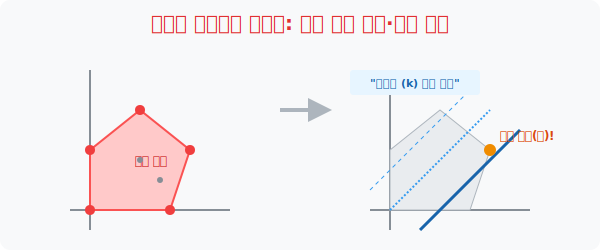

# 4. 왕관은 모서리에 꽂힌다: 부등식의 영역을 이용한 최대·최소 해결

## [도입부] 학습 목표 (Learning Objectives)
- 3수업에서 만들어진 안전한 да각형 영토(실현 가능 영역) 안에서 기업의 이익을 가장 미치도록 팽창시켜 주는 **'최댓값(Max)' 좌표 1개**를 어떻게 핀셋으로 뽑아내는지 도출법을 알아봅니다.
- "이익 계산식($y = -x + k$)을 도화지에 쓱 긋고, 막대기를 우주 끝까지 위로 평행이동 시켜 밀어 올리다가 옥상 **'꼭짓점(모서리)'** 에서 튕기며 떨어지기 직전의 위치!" 가 최대 이익의 좌표가 되는 우아한 기하학적 메커니즘을 시각화합니다.
- 파이썬(Python)의 다각형(Polygon) 교차로 좌표 연산 검색을 이용해 내부 한가운데의 무쓸모 점들은 다 갖다 버리고, 모서리(꼭짓점) 좌표들의 결괏값만 추출하여 MAX 값을 뽑는 튜닝 엔진을 맛봅니다.

---

## 1. 이익 막대기(k) 그래프 우주 끝으로 밀어 올리기 

이제 사장님의 미션이 하달됩니다. "겹쳐진 다각형 생존 구역 안에서 점을 하나 찍어 생산을 시작해라. 단, 햄버거 1개에 1만 원, 피자 1개에 2만 원이 남으니 이익이 **최대가 되는 스펙(좌표) 하나만 딱 찍어내라!**"

이익 공식은 **"총이익금($k$) = 1만 원$\cdot x$ + 2만 원$\cdot y$"** 가 됩니다. 
(방정식으로 바꾸면 $2y = -x + k \rightarrow \mathbf{y = -0.5x + k / 2}$ 의 $1$차 함수 직선 그래프가 렌더링 됩니다.)

여기서 $k$(이익)는 미지의 숫자이므로, 화면에는 길쭉한 대각선 막대기(기울기 $-0.5$) 하나가 나타납니다. 이 $k$ 값이 커질수록($100$만 원 $\rightarrow$ $1,000$만 원 $\rightarrow$ $\dots$) 직선 막대기 그래프는 도화지 상단(우주)을 향해 평행하게 점점 위로 올라갑니다(평행 이동).

그래프를 점점 위로 밀어 올려봅시다! 다각형 생존 구역 안에 막대기가 걸쳐있을 때는 아직 합법적인 생산 라인이란 뜻입니다. 더 위로 밀어 올리다가, 막대기가 다각형 건물의 옥상 **'뾰족한 모서리 꼭짓점'** 을 살짝(스치듯 접촉) 때리고 우주 허공으로 날아가기 직전의 그 찰나!! 

그 아슬아슬하게 꼭짓점에 닿아있는 순간의 막대기 고도(k)가 **우리 회사가 뽑아낼 수 있는 최대의 이익($Max$)** 이며, 그 부딪힌 모서리의 $x,y$ 점이 우리가 생산해야 할 최적의 황금 생산 스펙팅입니다.



<br>

## 2. 진리: 왕관은 모서리(Vertex)에만 씌워진다


이것이 선형계획법(Linear Programming), 줄여서 최적화 이론의 가장 중요하고 소름 돋는 진리입니다.
우리가 그린 안전지대(Feasible Region) 내부는 엄청나게 넓고 무수히 많은 X, Y 점들이 존재합니다. 
초보자들은 "저 드넓은 안전지대 땅바닥 내부 어딘가에 이윤이 가장 높은 잭팟 스팟(최댓값)이 숨어있겠지?" 라며 돋보기를 들고 내부를 이 잡듯이 뒤집습니다.각형 영토의 속살과 한가운데를 이루는 수십만 개의 귀찮은 점검 스펙($x=5, y=5$ 등)을 굳이 연산하지 않습니다. 
그 대신 **오직 다각형의 외곽 모서리(꼭짓점 좌표) 4~5개** 만 수학적으로 뽑아낸 뒤, 그 꼭짓점의 파라미터 숫자만 $k$(이익) 방정식에 하나씩 대입해서 가장 치솟는 값을 답으로 적고 퇴근해 버립니다.

---

## 3. 💻 파이썬(Python) 꼭짓점(Vertex) 최적점 스캐너 엔진

기울기 막대기를 올리든 내리든 결국 최댓값과 최솟값은 '다각형의 뾰족한 모서리(교차점)' 에서만 터진다는 이 수학의 절대 진리를 파이썬 리스트 스캐닝에 접목해 모든 뻘짓 연산을 0%로 줄여버립니다.

### 🐍 파이썬 예제: 폴리곤 모서리 좌표 최대 이익 추출 시스템

```python
print("--- ⚔️ 팩트폭격 스캐너: 왕관(Max)과 심연(Min)의 모서리 판독 ---")

# (데이터 셋) 부등식 형광펜들이 교차하며 생긴 다각형의 외곽 '꼭짓점' 4군데만 계산하여 저장!
# (x=햄버거 생산량, y=피자 생산량)
vertices_coords = [
    (0, 0),    # 꼭짓점 1 (아무것도 안만듦)
    (10, 0),   # 꼭짓점 2 
    (8, 6),    # 꼭짓점 3
    (0, 8)     # 꼭짓점 4
]

# (수익 방정식): Profit = (X * 1만원) + (Y * 2만원)
def calculate_profit(x, y):
    return (1 * x) + (2 * y)

profit_results = []

print("▶ 다각형 내부의 1억개 쩌리 점은 다 무시! 외곽 꼭짓점 4개만 타격 계산 시작!")
print("-" * 50)

for x, y in vertices_coords:
    profit = calculate_profit(x, y)
    profit_results.append(profit)
    print(f" 📍 모서리 좌표 (x:{x}, y:{y}) 분석 -> 기대 이익: {profit:2d} 만원")

max_profit = max(profit_results)
max_idx = profit_results.index(max_profit)
best_x, best_y = vertices_coords[max_idx]

print("-" * 50)
print(f"👑 [결론] 우리 회사의 기네스북 최대 이익: {max_profit}만원!")
print(f"👑 -> 황금을 낳는 기적의 옥상 꼭짓점 좌표는 (x:{best_x}, y:{best_y}) 입니다.")

# 결과창:
# --- ⚔️ 팩트폭격 스캐너: 왕관(Max)과 심연(Min)의 모서리 판독 ---
# ▶ 다각형 내부의 1억개 쩌리 점은 다 무시! 외곽 꼭짓점 4개만 타격 계산 시작!
# --------------------------------------------------
#  📍 모서리 좌표 (x:0, y:0) 분석 -> 기대 이익:  0 만원
#  📍 모서리 좌표 (x:10, y:0) 분석 -> 기대 이익: 10 만원
#  📍 모서리 좌표 (x:8, y:6) 분석 -> 기대 이익: 20 만원
#  📍 모서리 좌표 (x:0, y:8) 분석 -> 기대 이익: 16 만원
# --------------------------------------------------
# 👑 [결론] 우리 회사의 기네스북 최대 이익: 20만원!
# 👑 -> 황금을 낳는 기적의 옥상 꼭짓점 좌표는 (x:8, y:6) 입니다.
```

안에 들어있는 모든 후보 스펙을 굳이 구워삶으며 $5$년이나 테스트해 보지 않고도, 각 부등식 블록의 모서리 국경 코너 포인트 $\mathbf{(8, 6)}$ 만 타격하여 인류와 기업의 자원 최적화(Max)를 산출해 내는 이 우아한 과정! 이것이 최적화 수학의 카타르시스입니다.

---

## [결론] 학습 정리 (Summary)

1. **이익 함수를 막대선(Line)으로**: 머릿속으로 알 수 없는 최대 이익금($k$)을 $y = ax + k$ 꼴의 기울기가 확정된 1차 함수 막대기로 탈바꿈시켜 도화지에 내려놓는 상상력이 이 게임의 핵심 도트입니다.
2. **막대를 평행 이동 위쪽으로!**: 이익($k$)을 키우려면 Y축 절편인 $k$가 커져야 하므로 막대기 그래프 각도는 유지한 채 무조건 엘리베이터처럼 하늘(우주)로 쭉쭉 밀어 올리며 폴리곤의 옥상 지점을 탐색합니다.
3. **진리의 심판대 (꼭짓점 좌표)**: 지하실을 내려찍으며 무너져 내릴 때의 최솟값이든, 하늘로 발사되며 튕겨져 나가는 최댓값이든 간에 삐죽빼죽 튀어나온 최 외곽 **방파제(꼭짓점)들**이 무조건 그 충돌의 주인공(최정답)이 될 수밖에 없다는 위상 기하학의 한계를 해킹합니다.
