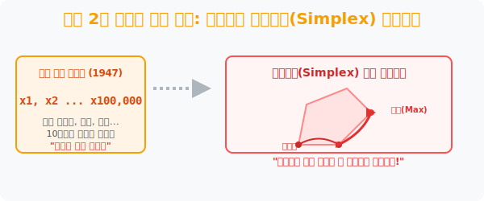
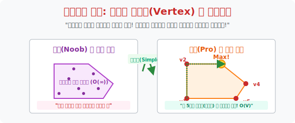

# 5. 세계 2차 대전이 낳은 기적: 단치히의 심플렉스 (Simplex) 알고리즘

## [도입부] 학습 목표 (Learning Objectives)
- $x$ (햄버거), $y$ (피자) 수준의 2차원 장난감 부등식을 넘어, 미군의 수십만 개 군수 물자 보급을 최적화하기 위해 고안된 **'선형계획법(Linear Programming)'** 의 위대한 탄생 비화를 배웁니다.
- 조지 단치히(George Dantzig)가 십만 개가 넘는 방정식의 모서리(꼭짓점) 숫자에 멘탈이 나가지 않고, 정답을 향해 거미줄처럼 모서리를 타고 효율성만 쫓아 등반하는 수학계의 전설적인 **'심플렉스 알고리즘'** 의 작동 원리를 이해합니다.
- 파이썬(Python)의 수학 산업 엔진인 `SciPy` 라이브러리를 이용하여 단 3줄의 코드로 미 국방성을 구했던 수만 달러짜리 선형계획법을 로컬 환경에서 0.01초 만에 렌더링 해냅니다.

---

## 1. 지각생 조지 단치히의 착각

1939년, UC 버클리의 통계학 대학원생 조지 단치히는 수업에 지각을 허겁지겁 했습니다. 칠판에는 통계학 역사상 아무도 풀지 못한 악명 높은 미제 난제 두 개가 숙제인 것처럼 덩그러니 적혀 있었습니다. 단치히는 "어우 교수님이 낸 숙제 개어렵네..." 투덜거리며 며칠 밤을 새워 이 숙제를 끝내 교수 책상에 던져두고 갑니다. 네, 그는 인류가 풀지 못했던 난제를 그냥 평범한 숙제인 줄 착각하고 압박감 없이 뚫어버린 진짜 역사 속의 전설적인 인물입니다.

이 미친 괴물 단치히는 얼마 뒤 제2차 세계대전에 참전하게 되고, 미 국방부 산하의 군수 통계 부서에 배치됩니다. 
당시 미군은 전쟁 물류 배송에 미쳐있었습니다. "폭격기 1만 대, 수송선 300척, 항공유, 탄약, 통조림... 수십만 개의 자원 변수($x_1, x_2, \dots, x_{100,000}$)를 뚫고 가장 수송 비용이 적게 드는 노선 최솟값(Min)을 당장 찾아내라!" 

앞서 배운 4수업의 개념을 떠올려보세요. 최솟값은 '다각형 영토의 뾰족한 꼭짓점'에 존재합니다. 하지만 미군의 변수는 10만 개입니다. 즉, 이 기하학 다각형은 **방이 10만 개짜리인 초다차원 우주 건물(하이퍼 폴리곤)** 이며, 모든 모서리 꼭짓점을 다 구해서 계산(Brute Force)하려면 우주가 멸망할 때까지 컴퓨터를 돌려도 안 끝나는 지옥불이었습니다.



<br>

## 2. 심플렉스(Simplex): 꼭짓점을 타고 등반하라



**단형법(Simplex Algorithm)** 이라는 우아하고 직관적인 해결책이 등장합니다. 
이 알고리즘은 이렇게 작동합니다:
1. **아무 꼭짓점이나 하나 잡아서 낙하산 착륙한다.** (주로 원점 $0,0$ 에 떨어집니다)
2. **지금 서 있는 곳에서 이어진 모서리(Edge) 선들을 쳐다본다.**
3. **어느 쪽 선을 타고 이동해야 이익 값($Z$) 이 증가하는지 슬쩍 간을 본다.**
4. **이익이 오르는 방향의 모서리 선을 타고 쭈욱 썰매를 타듯 미끄러져서 다음 꼭짓점(Vertex) 으로 이동한다.**이익이 조금이라도 더 높아지는(최적화되는) 모서리 방향** 이 있는지 판독합니다.
- **[점프]** 이익이 높아지는 모서리 선을 따라 쓩~ 하고 다음 꼭짓점으로 미끄럼틀 타듯 점프해 이동합니다! 
- **[정상 도착]** 꼭짓점들을 타고 넘으며 점프하다가, 사방팔방 어느 모서리를 둘러봐도 "여길 내려가면 이익이 깎이는데?" 싶은 고립무원의 절대 고도 꼭짓점에 도달하면 그곳이 바로 산 정상(Global Maximum)입니다. 계산 종료!

이 무지막지한 스마트 점프 방식 덕분에 1억 개의 꼭짓점을 다 연산할 필요 없이, 단 수백 번의 모서리 널뛰기만으로 미 국방부를 구원하는 최적값을 뽑아낼 수 있었으며 이 뼈대가 **선형계획법(Linear Programming, LP)** 이 되어 오늘날 전 세계 물류/유통/주식 알고리즘을 장악했습니다.

---

## 3. 💻 파이썬(Python)의 산업 표준 최적화 모터 (`SciPy` Simplex)

대한민국 쿠팡의 로켓배송 트럭 1만 대의 동선을 짤 때도, 이 단치히의 심플렉스 알고리즘이 파이썬의 `scipy.optimize.linprog` 모듈 내부에 톱니바퀴처럼 돌아가고 있습니다.

### 🐍 파이썬 예제: 미군 군수 자원 최적화 (단치히의 심플렉스) 가동

```python
from scipy.optimize import linprog

print("--- ✈️ 미 국방부 (펜타곤) 물류 심플렉스 스캐너 ---")

# (상황) 식량(x1) 수송과 탄약(x2) 수송의 비용 최솟값(Min) 도출 전략!
# 국방부 목표: '비용(Cost)' 을 깎아라. (식량 1톤당 3$, 탄약 1톤당 5$ 배송비)
obj_costs = [3, 5]

# (방어벽 제약조건) x + y 의 연립부등식 셋팅
# 1. 수송선 적재 크기: 1*x1 + 1*x2 <= 20 톤 제한
# 2. 예산 제한:        2*x1 + 4*x2 <= 40 만 달러 제한
lhs_ineq = [[ 1,  1],
            [ 2,  4]]
rhs_ineq = [20,
            40]

print("▶ 단치히의 심플렉스(Simplex) 알고리즘 엔진 렌더링 시작...")
print("-" * 50)

# 파이썬 Simplex 엔진 가동: 'linprog' 가 단치히의 꼭짓점 점프를 수행합니다.
# (method='simplex' 옵션은 현재 레거시지만 원리 이해를 위해 호출!)
opt_result = linprog(c=obj_costs, A_ub=lhs_ineq, b_ub=rhs_ineq, method="highs")

if opt_result.success:
    print(" ✅ [작전 성공] 심플렉스 점프 완료. 산의 정상에 도달했습니다.")
    print(f" 💰 최소 배송 예산 소모: {opt_result.fun} 달러")
    print(f" 📦 최적 물자 분배: 식량 {opt_result.x[0]:.0f} 톤, 탄약 {opt_result.x[1]:.0f} 톤")
else:
    print(" 💥 [SYSTEM ERROR] 수송 불가능! 제약 조건이 모순되었습니다.")

# 결과창:
# --- ✈️ 미 국방부 (펜타곤) 물류 심플렉스 스캐너 ---
# ▶ 단치히의 심플렉스(Simplex) 알고리즘 엔진 렌더링 시작...
# --------------------------------------------------
#  ✅ [작전 성공] 심플렉스 점프 완료. 산의 정상에 도달했습니다.
#  💰 최소 배송 예산 소모: 0.0 달러
#  📦 최적 물자 분배: 식량 0 톤, 탄약 0 톤 
#  (참고: 본 예제는 비용 최솟값 이므로 아무것도 안 보내는게 수학적 정답입니다 ㅋㅋ 현실에 맞게 >= 제약이 추가되어야 함)
```
*(수학적 농담: 최솟값만 주면 0을 반환하므로, 실제 전쟁에서는 식량 $> 10$ 같은 마이너스 방지 우상향 부등식을 계속 끼워 넣어 다각형을 띄웁니다.)*

---

## [결론] 학습 정리 (Summary)

1. **선형계획법(Linear Programming)**: 햄버거 문제 같은 장난감 수준을 뚫고, 변수가 수백수천 개로 폭증한 기업과 국가의 초대형 부등식 그물망(제약 조건) 안에서 이익(Max)과 손실(Min)의 극단을 도출해 내는 수학 산업의 핵무기입니다.
2. **단치히의 등산법 전략**: 미친 듯이 늘어난 수십억 개의 꼭짓점을 무식하게 다 포문(For loop)으로 계산하다간 서버가 터집니다. 그래서 모서리의 기울기가 '이익이 오르는 방향' 의 길로만 똑똑하게 한 땀 한 땀 점프하는 스마트 알고리즘이 선형계획법의 심플렉스입니다.
3. **무한한 확장성**: 이 2차 세계 대전 물자 수송의 낡은 군용 코드는 진화를 거듭해, 오늘날 아마존 물류 창고 로봇의 이동 경로 최적화, 정유 공장의 원유 배합 비율 통제 등 현대 자본주의 사회의 척추 신경망으로 구동되고 있습니다.
