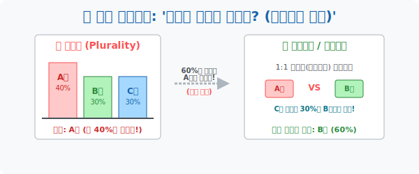

# 1. 다수결의 환상과 무너진 민주주의: '반장은 어떻게 뽑나요? (1)'

## [도입부] 학습 목표 (Learning Objectives)
- 인류가 가장 합리적이라고 믿고 있는 민주주의의 꽃, **'단순 다수결(Plurality Voting)'** 이 수학의 관점에서는 얼마나 폭력적이고 오류투성이인 의사결정 방식인지 충격적인 진실을 파헤칩니다.
- 죽은 표(사표) 와 어부지리 당선의 모순을 해결하기 위해 18세기 프랑스의 천재 수학자가 제안한 **'콩도르세 승자(Condorcet Winner)'** 와 **'결선 투표(Run-off)'** 모델의 논리를 탐구합니다.
- 파이썬(Python)의 `Dictionary(딕셔너리)` 자료구조를 활용해, 후보자별로 표를 누적(`+=`) 시키고 가장 높은 값을 찾아내는(`max()`) '다수결 투표 자동 개표기' 를 코딩해 봅니다.

---

## 1. 다수결의 치명적 버그 (Bug)

새 학기 반장 선거가 열렸습니다. 후보는 A, B, C 세 명이고, 반 학생은 100명입니다.
투표를 까봤더니 결과가 기가 막힙니다.

* **A후보**: 40표 
* **B후보**: 30표
* **C후보**: 30표

가장 많은 표를 받은 A가 반장이 되었습니다. 모두가 박수를 치며 "이것이 민주주의지!" 라고 기뻐합니다.
**하지만, 통계학자와 해커들의 눈에는 치명적인 버그(오류) 가 보입니다.**

B와 C는 성향이 아주 비슷한 착한 모범생이었고, A는 성향이 완전 반대인 일진이었습니다.
즉, B와 C를 뽑은 60명의 학생들은 사실 **"A가 반장이 되는 꼴은 절대 못 본다!"** 라고 마음속으로 외치고 있었던 겁니다.
A후보는 학급의 절반도 안 되는 지지(40%) 를 얻었을 뿐인데, B와 C로 표가 갈라진 덕분에 (어부지리) 권력을 잡았습니다. 나머지 60% 의 의견은 쓰레기통에 처박혔습니다. 이를 수학 용어로 **'사표(Dead Vote) 현상'** 이라고 부릅니다. 

과연 이게 수학적으로 집단 전체의 만족도를 높인 올바른 '최적의 의사결정' 일까요? 아닙니다. 시스템의 허점입니다.



<br>

## 2. 콩도르세의 1:1 토너먼트 (데스매치)

18세기 프랑스의 수학자 '콩도르세(Condorcet)' 백작은 이 다수결의 맹점을 폭파하기 위해 새로운 알고리즘을 제안합니다.
"다 같이 모여서 한 번에 투표하니까 표가 분산되어 이상한 놈이 당선되잖아! 철권 게임처럼 무조건 **1:1 데스매치 (쌍대 비교)** 로 붙여서 다 이기는 놈을 찾자!"

* **A vs B**: B와 성향이 비슷한 C를 지지했던 30명이 B에게 표를 던집니다. (A 40표 < B 60표) **B 승리!**
* **A vs C**: C와 성향이 비슷한 B를 지지했던 30명이 C에게 표를 던집니다. (A 40표 < C 60표) **C 승리!**

결과적으로 A는 1:1로 붙었을 때는 무조건 털리는, 반 급우들의 '공동의 적' 이었습니다. 다수결 시스템이 이 괴물을 반장으로 만들 뻔했던 겁니다. 
이처럼 1:1 로 다른 모든 후보를 박살 낼 수 있는 진정한 승자를 **'콩도르세 승자'** 라고 부르며, 프랑스나 대한민국 대통령 선거에서 1, 2등만 남겨놓고 다시 투표를 치르는 **'결선 투표제(Run-off)'** 가 바로 이 결함을 보정하기 위한 수학적 패치(Patch) 모델입니다.

---

## 3. 💻 파이썬(Python) 단순 다수결 제어 엔진 (딕셔너리 활용)

가장 원시적 형태의 '다수결 투표' 조차도, 인간이 손바른 정(正) 자를 그어가며 개표하면 잦은 에러(휴먼 에러) 가 발생합니다. 파이썬의 `딕셔너리(Dictionary)` 는 후보자 이름을 'Key' 로, 득표수를 'Value' 로 매핑하여 가장 완벽한 형태의 투표함(Ballot Box) 을 구조화합니다.

### 🐍 파이썬 예제: 투표함 데이터 파싱 및 다수결 당선자 추출기

```python
print("--- 🗳️ 자동 개표 시스템 (단순 다수결 알고리즘) 가동 ---")

# 1. 무작위로 수집된 10명의 투표 용지 원시 데이터 (List)
votes = ['A', 'B', 'C', 'A', 'B', 'A', 'A', 'C', 'B', 'A']

# 2. 개표 현황판을 딕셔너리로 초기화 준비
vote_count = {'A': 0, 'B': 0, 'C': 0}

print(f" [데이터 로드] 총 {len(votes)}장의 투표 용지를 스캔합니다...")

# 3. 개표(For) 로직: 표가 나올 때마다 해당 후보의 스코어를 1씩 덧셈(+=) 한다
for pick in votes:
    vote_count[pick] += 1  # 딕셔너리의 무서운 위력

print("-" * 50)
print(" 📊 [개표 결과 발표]")
for candidate, count in vote_count.items():
    print(f"   - 후보 {candidate}: {count}표")

# 4. 가장 표가 높은(Max) 사람 찾아내기 (알고리즘)
winner = max(vote_count, key=vote_count.get)
print("-" * 50)
print(f" 🚩 [최종 당선자] 단순 다수결 원칙에 의해 '{winner}' 후보가 당선되었습니다!")
print("    (시스템 경고: 사표가 방지되지 않은 불완전한 민주주의 결과일 수 있습니다.)")

# 결과창:
# --- 🗳️ 자동 개표 시스템 (단순 다수결 알고리즘) 가동 ---
#  [데이터 로드] 총 10장의 투표 용지를 스캔합니다...
# --------------------------------------------------
#  📊 [개표 결과 발표]
#    - 후보 A: 5표
#    - 후보 B: 3표
#    - 후보 C: 2표
# --------------------------------------------------
#  🚩 [최종 당선자] 단순 다수결 원칙에 의해 'A' 후보가 당선되었습니다!
#     (시스템 경고: 사표가 방지되지 않은 불완전한 민주주의 결과일 수 있습니다.)
```

이 단순한 로직 하나를 국가망 스케일로 키우면 대한민국의 전자개표기 시스템이 됩니다. 하지만 이 코드가 짜주는 건 단지 '가장 많은 표' 뿐이며, C를 지지했던 20%의 마음을 위로해 줄 알고리즘은 포함되어 있지 않습니다.

---

## [결론] 학습 정리 (Summary)

1. **다수결의 맹점**: 가장 많은 표를 얻은 자가 당선되는 단순 다수결은, 의견이 비슷한 후보들끼리 출마해 표를 갉아먹는 상황(표 분산) 에서는 대다수 국민의 뜻을 거스르는 괴물을 탄생시킬 위험이 큽니다.
2. **사표(Dead Vote) 현상**: 1등 진영에 던져진 표를 제외한 나머지 모든 국민의 소중한 한 표가 '죽은 표' 가 되어 쓰레기통에 버려지는 모순입니다.
3. **콩도르세의 솔루션**: 다수결의 사기극을 막고자, 모든 후보를 1:1 토너먼트로 강제로 데스매치를 붙여 진정한 실력자(모두를 압도하는 자)를 찾아내는 통계학적 결투 방식이 바로 콩도르세 승자 모델입니다.
