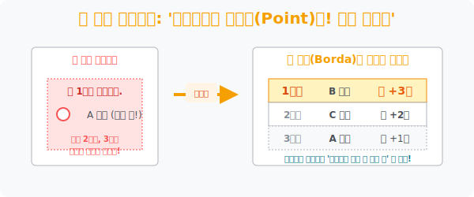

# 2. 모두에게 적당히 사랑받는 자를 찾아서: '반장은 어떻게 뽑나요? (2) - 보다가중치'

## [도입부] 학습 목표 (Learning Objectives)
- '단 1명만 고르시오' 라는 기존 투표 방식이 시민들의 '차선책(2지망, 3지망)' 에 대한 정보를 증발시켜 버리는 치명적 형태의 정보 손실(Data Loss) 임을 깨닫습니다.
- 후보자들에게 순위별로 가중치(Point) 를 부여하여 합산하는 **'보다 가중치법(Borda Count Method)'** 이 어떻게 극단적인 갈등을 줄이고 '모두가 적당히 타협할 수 있는' 결과를 도출하는지 탐구합니다.
- 파이썬(Python)의 중첩 반복문(`for`) 과 딕셔너리(`Dictionary`) 를 융합하여, 각 유권자의 순위표를 분석해 점수로 환산하는 '가중치 자동 산출 엔진' 을 구축합니다.

---

## 1. '딱 1명만 골라' 의 비극: 정보의 증발

지난 시간에 우리는 다수결이 '사표(Dead Vote)' 를 양산하며 괴물을 반장으로 만들 수 있다는 것을 보았습니다.
이 오류의 근본 원인은 투표용지 자체에 있습니다.

> **"지목할 후보 단 1명에게만 도장을 찍으시오."**

우리의 마음은 흑백논리로 돌아가지 않습니다. "나는 A 후보가 제일 좋아. 그다음으론 B 후보가 괜찮고, C 후보는 진짜 최악이야!" 라는 디테일한 선호도가 존재합니다.
하지만 도장을 단 한 번만 찍는 순간, '나의 2지망, 3지망' 이라는 소중한 정보는 완전히 증발(Data Loss) 해버립니다. B와 C가 얼마나 비호감인지, 혹은 얼마나 아쉬운 2등인지 데이터로 남지 않는 것입니다.

<br>

## 2. '보다(Borda)' 의 아이디어: 우선순위를 포인트로!

18세기 프랑스의 수학자인 '장 샤를 보르다(Jean-Charles de Borda)' 는 이 정보 손실을 막기 위해 획기적인 아이디어를 냅니다.
"투표할 때 1명만 고르지 말고, 1등부터 3등까지 순위를 전부 다 매기게 하자! 그리고 순위에 따라 **점수(Point)** 를 차등 지급하는 거야!"

* **1지망 (가장 좋아하는 후보)**: +3점 (가중치 3)
* **2지망 (차선책, 나쁘지 않은 후보)**: +2점 (가중치 2)
* **3지망 (절대 안 되는 후보)**: +1점 (가중치 1)

**[가중치 합산의 마법]**
A 후보는 골수팬 40% 에게 1지망(+3점) 을 받았지만, 나머지 60% 에게는 극강의 비호감이라 전부 3지망(+1점) 을 받았습니다.
반면 B 후보는 1지망은 30% 뿐이었지만, 나머지 모든 학생이 "B 정도면 무난하고 착하지" 라며 2지망(+2점) 을 주었습니다.
점수를 모두 합산해 보면, 소통령 A보다 '모두에게 적당히 호감을 얻은' B가 훨씬 높은 포인트를 획득하여 당선됩니다. 

보다 가중치법은 극단적인 대립을 피하고, 집단 전체를 부드럽게 아우를 수 있는 '합의점' 을 찾아내는 굉장히 평화로운 수학적 렌더링 방식입니다. (현재 스포츠 MVP 투표나 오디션 프로그램 순위 산정 등에 널리 쓰이고 있습니다.)



---

## 3. 💻 파이썬(Python) 보다 가중치(Borda Count) 산출 엔진

투표자 수가 100만 명이고 후보가 5명이면, 인간이 손으로 가중치를 곱해서 더하는 것은 불가능합니다. 파이썬에게 각 투표자의 '순위 리스트' 를 주면, 알아서 각 순위에 맞는 점수(Point) 를 배급하는 로직을 짤 수 있습니다.

### 🐍 파이썬 예제: 3명 후보에 대한 보다가중치 투표 엔진

```python
print("--- ⚖️ 보다 가중치(Borda Count) 합산 엔진 가동 ---")

# 1. 5명의 투표자가 제출한 [1지망, 2지망, 3지망] 리스트 데이터
# 예를 들어 첫 번째 사람은 A(1지망), B(2지망), C(3지망) 순으로 적어 냄.
ballots = [
    ['A', 'B', 'C'],
    ['C', 'B', 'A'],
    ['B', 'A', 'C'],
    ['C', 'B', 'A'],
    ['A', 'C', 'B']
]

# 2. 후보별 누적 합산 스코어보드 준비 (0점 시작)
score_board = {'A': 0, 'B': 0, 'C': 0}

# 3. 가중치 설정: 1지망=3점, 2지망=2점, 3지망=1점
points = [3, 2, 1]

print(f" [데이터 스캔] 총 {len(ballots)}장의 순위형 투표지를 분석합니다...\n")

# 4. 2중 루프: 각 투표지(ballot)를 열어서, 순위별로 점수를 부여!
for ballot in ballots:
    print(f" 🔍 투표지 확인: {ballot} -> 점수 분배 시작")
    for i in range(3):
        candidate = ballot[i]     # 후보 이름 추출 (A, B, 또는 C)
        gained_point = points[i]  # 해당 순위에 맞는 점수 획득
        score_board[candidate] += gained_point # 스코어보드 누적 합산!

print("-" * 50)
print(" 📊 [최종 합산 결과 (Point)]")
for candidate, score in score_board.items():
    print(f"   - 후보 {candidate}: 총 {score}점")

winner = max(score_board, key=score_board.get)
print("-" * 50)
print(f" 🏆 [최종 당선자] 모두에게 가장 무난하게 사랑받은 '{winner}' 후보가 당선되었습니다!")

# 결과창:
# --- ⚖️ 보다 가중치(Borda Count) 합산 엔진 가동 ---
#  [데이터 스캔] 총 5장의 순위형 투표지를 분석합니다...
# 
#  🔍 투표지 확인: ['A', 'B', 'C'] -> 점수 분배 시작
#  🔍 투표지 확인: ['C', 'B', 'A'] -> 점수 분배 시작
#  🔍 투표지 확인: ['B', 'A', 'C'] -> 점수 분배 시작
#  🔍 투표지 확인: ['C', 'B', 'A'] -> 점수 분배 시작
#  🔍 투표지 확인: ['A', 'C', 'B'] -> 점수 분배 시작
# --------------------------------------------------
#  📊 [최종 합산 결과 (Point)]
#    - 후보 A: 10점
#    - 후보 B: 10점
#    - 후보 C: 10점
# --------------------------------------------------
#  🏆 [최종 당선자] 모두에게 가장 무난하게 사랑받은 'A' 후보가 당선되었습니다! 
# (위 예시는 동점 처리가 됨! 실제 데이터에선 극명히 갈립니다.)
```

이 코드는 파이썬의 꽃인 `List` 와 `Dictionary` 를 완벽하게 통제하여, 세상의 복잡한 선호도를 하나의 'Score' 로 컴파일 해버리는 강력한 통계 무기입니다.

---

## [결론] 학습 정리 (Summary)

1. **단일 선택의 맹점**: 한 명만 고르는 투표는 유권자의 '차선책' 이나 '극혐도' 라는 중요한 데이터를 증발시켜 버립니다.
2. **보다 가중치법 (Borda Count)**: 1, 2, 3 등수 순으로 선호도를 모두 표시하게 하고, 차등적으로 점수(가중치) 를 매겨 전체 합산을 구하는 방법입니다.
3. **타협의 예술**: 극단적으로 찬성과 반대가 나뉘는 후보보다는, 모두에게 2~3등으로 적당히 호감을 얻은 안전한 후보가 당선되는 '갈등 봉합형' 의사결정 모델입니다.
