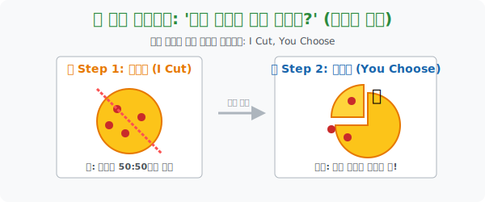

# 3. 절대 싸우지 않는 마법의 칼잡이: '공평한 분배 (1) - 분할과 선택'

## [도입부] 학습 목표 (Learning Objectives)
- 냉장고에 남은 마지막 피자 한 조각을 놓고 형제가 싸우지 않게 나누는, 의사결정이론의 가장 고전적이면서도 완벽한 솔루션인 **'분할과 선택(Divide and Choose)'** 알고리즘을 체화합니다.
- "내가 자르면, 네가 먼저 고른다." 는 단순한 규칙이 어떻게 인간의 **'이기심'** 과 **'합리성'** 을 강제하여 가장 공평한 50:50 결과를 유도해 내는지 그 수학적, 심리적 기저를 이해합니다.
- 파이썬(Python)의 `If-Else (조건문)` 를 통해, 분할자(Cutter) 가 조금이라도 꼼수를 부렸을 때 선택자(Chooser) 에게 얼마나 가혹하게 응징당하는지 시뮬레이션해 봅니다.

---

## 1. 인간의 탐욕을 제어하는 마법: "I Cut, You Choose"

엄마가 페퍼로니 피자 한 판을 사 오셨습니다. 형제가 두 명입니다. 엄마가 나간 뒤, 남겨진 두 형제는 눈치싸움을 시작합니다. 서로 조금이라도 더 크고 페퍼로니가 많이 박힌 조각을 먹고 싶기 때문입니다.
누가 칼질을 할 것이며, 잘려진 두 조각 중 누가 먼저 고도권을 가질까요? 이 유혈 사태를 막기 위해 수학자들은 세상에서 가장 아름다운 의사결정 규칙을 하나 제안합니다.

> **"한 명이 자른다. 그러면 남은 한 명이 먼저 고른다." (분할과 선택 모형)**

이 알고리즘이 완벽한 이유는 인간의 '선한 마음' 에 기대지 않고, 철저히 **'인간은 이기적이다'** 라는 전제하에 돌아가기 때문입니다.

1. **형 (분할자, I Cut)**: 피자에 칼을 대는 역할입니다. 형의 머릿속은 복잡하게 돌아갑니다.
   * *"만약 내가 내 쪽을 60% 로 크게 자르고, 저쪽을 40% 로 작게 자른다면?"*
   * *"동생 녀석이 당연히 눈이 뒤집혀서 먼저 60% 짜리 큰 조각을 낼름 가져가겠지!"*
   * *"결국 나는 40% 짜리 찌꺼기만 먹게 될 거야. 안 돼!!!"*
2. **최적의 행동 (Optimal Strategy)**: 형은 꼼수를 부리려다 자기가 망할 것을 직감하고 어쩔 수 없이 눈물을 머금고 피자를 자 대고 그린 듯 **정확히 50:50, 페퍼로니 개수까지 완벽히 반반**으로 나눌 수밖에 없게 됩니다.
3. **동생 (선택자, You Choose)**: 동생 입장에서는 칼자루를 쥔 형을 의심할 필요가 전혀 없습니다. 형이 썰어 놓은 두 조각 중 조금이라도 자기 눈에 커 보이는 것을 쏙 집어가면 끝이니까요.

이처럼 쌍방이 각자의 이기심을 최대한 발휘했을 때 도달하게 되는 '절대 불만이 없는 균형점' 을 수학적으로 도출하는 것이 분배 이론의 핵심입니다.



<br>

## 2. 💻 파이썬(Python) 분할-선택 생존 시뮬레이션

형(Cutter) 이 자른 피자 조각의 비율을 배열(`List`) 로 입력받으면, 동생(Chooser) 가 무조건 자비 없이 가장 큰 값을 뺏어가버리는 잔혹성을 코드(`If-Else, Max`) 로 구현해 봅시다.

### 🐍 파이썬 예제: 형의 칼질 실수(에러) 에 대한 동생의 응징

```python
print("--- 🍕 'I Cut, You Choose' 공평 분배(Fair Division) 시뮬레이터 ---")

# 시나리오: 형이 욕심을 부려서 피자를 60% / 40% 로 쪼개어 놓았다.
pizza_slices = [60, 40]  # 형이 자른 두 조각의 크기 (백분율)

print(f" 🔪 [형의 분할]: 피자를 {pizza_slices[0]}% 와 {pizza_slices[1]}% 크기로 분할했습니다.")

# 동생(Chooser) 의 최적화된 행동 알고리즘: "무조건 젤 큰 거 내 놔!"
# 파이썬 내장함수 max() 는 리스트 안에서 가장 큰 숫자를 자비 없이 골라냅니다.
brother_choice = max(pizza_slices)

# 동생이 뺏어간 조각을 전체 피자 리스트에서 제거함 (list.remove)
pizza_slices.remove(brother_choice)

# 남은 1조각은 꼼수를 부린 형의 차지 ㅠㅠ
my_leftover = pizza_slices[0]

print("-" * 50)
print(f" ✋ [동생의 선택]: 가장 큰 {brother_choice}% 조각을 낼름 가져갔습니다!")
print(f" 😭 [형의 최후]: 꼼수를 부리다 남은 {my_leftover}% 조각만 먹게 되었습니다. 패배!")

# 결과창:
# --- 🍕 'I Cut, You Choose' 공평 분배(Fair Division) 시뮬레이터 ---
#  🔪 [형의 분할]: 피자를 60% 와 40% 크기로 분할했습니다.
# --------------------------------------------------
#  ✋ [동생의 선택]: 가장 큰 60% 조각을 낼름 가져갔습니다!
#  😭 [형의 최후]: 꼼수를 부리다 남은 40% 조각만 먹게 되었습니다. 패배!
```

형(분할자) 이 살 수 있는 유일한 솔루션은 `pizza_slices = [50, 50]` 을 입력하는 것뿐입니다. 그래야만 동생이 50을 가져가고 자신도 50을 방어할 수 있습니다. 

---

## [결론] 학습 정리 (Summary)

1. **공평한 분배의 정의**: 남의 떡이 내 떡보다 절대 커 보이지 않는(Envy-Free) 상태를 수학적으로 달성하는 것을 의미합니다.
2. **분할과 선택 (I Cut, You Choose)**: 한 명에게는 물건을 마음대로 자를 '권력' 을 주고, 상대방에게는 그중 하나를 먼저 고를 수 있는 '우선권' 을 줌으로써, 권력의 남용을 시스템적으로 틀어막는 가장 단순하고 아름다운 절차입니다. 
3. 이 알고리즘은 현재 국제 해저 자원 분할, 이혼 시 재산 분할, 기업의 인수합병 등 목숨 걸린 협상 테이블에서 광범위하게 쓰이고 있습니다.
