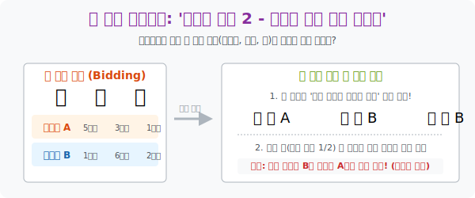

# 4. 강아지는 반으로 자를 수 없잖아!: '공평한 분배 (2) - 위대한 유산'

## [도입부] 학습 목표 (Learning Objectives)
- 피자나 영토처럼 '칼로 예쁘게 자를 수 있는(연속적)' 재화가 아닌, 강아지 한 마리, 명화 한 점처럼 물리적으로 '쪼갤 수 없는(이산적)' 물건들을 평화롭게 나누는 방법을 연구합니다.
- 각자가 해당 물건에 대해 느끼는 '내면의 가치(돈)' 를 겉으로 꺼내어, **"가장 높게 평가한 사람에게 물건을 몰아주고, 나머지는 현금으로 정산한다(독립 채점법)"** 는 자본주의적 분배 로직을 이해합니다.
- 파이썬(Python)의 다차원 배열(2D Array/리스트) 을 통해 각자의 가치 평가액을 저장하고, 합계(`sum()`) 와 평균(`/N`) 을 이용해 공평한 정산금(현금) 을 계산해 주는 '회계 봇' 을 구축합니다.

---

## 1. 쪼갤 수 없는 유산의 딜레마

아버지가 돌아가시면서 세 가지 유산을 남기셨습니다. 상속자는 A, B 두 명입니다.
유산 목록: 『귀여운 반려견 🐶』, 『오래된 스포츠카 🚗』, 『할아버지의 낡은 그림 🖼️』 

저번 시간에 배운 피자 자르기 모형("I Cut, You Choose") 을 여기에 적용할 수 있을까요? 
강아지를 반으로 가르고, 자동차를 톱으로 썰어서 나누면 그 즉시 가치가 0원(쓰레기) 이 되어버립니다. 이렇게 쪼갤 수 없는 물건(이산적 재화) 을 나눌 때는 완전히 다른 수학적 접근이 필요합니다.

<br>

## 2. 해결책: '가치 평가' 와 '현금 박치기' (독립 채점법)

서로 다른 매력을 가진 이 물건들을 어떻게 나눌까요? 사람마다 물건에 느끼는 가치는 다릅니다. A는 동물을 사랑하고, B는 자동차 매니아입니다.
이제 두 사람은 서로 대화하지 않고, 비밀리에 각 물건에 대한 **자신만의 금전적 가치(평가액)** 를 종이에 적어 냅니다.

* **상속자 A의 평가서**: 강아지(5천만), 스포츠카(3천만), 그림(1천만) $\rightarrow$ A가 생각하는 전체 유산 가치 = **총 9천만 원**
* **상속자 B의 평가서**: 강아지(1천만), 스포츠카(6천만), 그림(2천만) $\rightarrow$ B가 생각하는 전체 유산 가치 = **총 9천만 원** (계산의 편의상 총합을 똑같이 맞췄습니다.)

**[1단계: 권리의 '공평 몫' 산정]**
전체 유산 가치가 9천만 원이고 상속자가 2명이므로, A와 B는 "나는 최소한 **4,500만 원어치**(9000/2) 는 무조건 챙겨야 억울하지 않아!" 라는 **'공평 몫(Fair Share)'** 의 기준점을 갖게 됩니다.

**[2단계: 가치를 알아주는 자에게 물건 몰아주기]**
각 물건은 두 사람 중 **가장 비싸게 가격을 부른 사람(Max)** 에게 낙찰됩니다.
* **강아지 🐶**: A(5천) > B(1천) $\rightarrow$ **A 당첨!**
* **스포츠카 🚗**: A(3천) < B(6천) $\rightarrow$ **B 당첨!**
* **그림 🖼️**: A(1천) < B(2천) $\rightarrow$ **B 당첨!**

**[3단계: 현금 징수 및 보상 (핵심!)]**
물건(현물) 분배가 끝났습니다. 이제 내가 받은 물건의 덩치와 나의 권리(공평 몫)를 비교하여 현금으로 쿨하게 차액을 정산합니다.

* **A의 정산**: A는 4,500만 원(공평 몫) 어치를 받아야 하는데, 5,000만 원짜리 강아지를 타갔습니다. (500만 원 초과 이득!) 
  $\rightarrow$ $\Rightarrow$ **A는 공동 금고에 현금 500만 원을 토해내야(납부) 합니다.**
* **B의 정산**: B는 4,500만 원(공평 몫) 어치를 받아야 하는데, 스포츠카(6천) + 그림(2천) = 8,000만 원어치를 싹쓸이했습니다. (3,500만 원 초과 이득!)
  $\rightarrow$ $\Rightarrow$ **B 역시 공동 금고에 현금 3,500만 원을 토해내야 합니다.**

이렇게 모인 잉여금(현금 풀) 은 나중에 다시 $1/N$ 로 똑같이 나누어 가지면 게임 끝! 아무도 불평할 수 없는 완벽한 자본주의적 분할이 완성됩니다.



---

## 3. 💻 파이썬(Python) 유산 상속 현금 자동 정산기

이 복잡한 뺄셈과 덧셈을 파이썬 스크립트 하나로 깔끔하게 정리해 봅시다.

### 🐍 파이썬 예제: A의 정산액 자동 계산기

```python
print("--- ⚖️ 쪼갤 수 없는 유산(Discrete Fair Division) 정산 엔진 ---")

# A가 평가한 세 가지 물건의 가치 (단위: 만 원)
value_A = [5000, 3000, 1000]

# 1. A가 생각하는 부모님 유산의 총 가치(합산)
total_value_A = sum(value_A)
print(f" [자산 분석] A가 측정한 총 유산의 가치: {total_value_A}만 원")

# 2. 형제가 2명이니, A가 억울하지 않게 받아야 할 '공평 몫' (1/N)
people_count = 2
fair_share_A = total_value_A / people_count
print(f" [권리 획득] A가 무조건 보장받아야 하는 몫: {fair_share_A}만 원")

# 3. A가 낙찰받은 물건(강아지) 의 총합 계산
# (로직상 A가 제일 높게 부른 물건의 합이 5000만 원이라 가정)
received_items_value = 5000 

print("-" * 50)
print(f" 🎁 A가 실제로 가져간 물건의 가치: {received_items_value}만 원")

# 4. 현금 정산(Settlement): (내가 받은 물건 가치) - (나의 공평 몫)
# 결과가 양수(+)면 내가 물건을 과하게 가져갔으니 현금을 토해내야 함.
# 결과가 음수(-)면 내가 물건을 적게 가져갔으니 현금을 보상받아야 함.
settlement = received_items_value - fair_share_A

if settlement > 0:
    print(f" 💸 [최종 정산] A는 물건을 보장된 몫보다 덜컥 많이 가져갔습니다.")
    print(f"    -> 금고(공탁소) 에 현금 [{int(settlement)}만 원]을 납부하세요!")
elif settlement < 0:
    print(f" 💰 [최종 정산] A는 물건을 보장된 몫에 비해 너무 못박았습니다.")
    print(f"    -> 금고에서 현금 [{int(abs(settlement))}만 원]을 보상(입금)받습니다!")
else:
    print(" 🤝 완벽하게 몫과 딱 떨어집니다! 정산액 0원.")
```

이 모델은 모든 분쟁을 돈(화폐 단위) 으로 환산하여, 양측이 자신이 평가한 '공평 몫' 이상의 가치를 (물건+현금 조합으로) 챙겨가는 마법을 부립니다.

---

## [결론] 학습 정리 (Summary)

1. **연속 vs 이산**: 피자나 토지처럼 자투리로 쪼개어 무게를 맞출 수 있는 재화를 다룰 때와, 강아지나 자동차처럼 자르면 파괴되는 재화를 나눌 때는 분할 알고리즘이 달라야 합니다.
2. **독립 채점법**: 내가 좋아하는 물건에 가장 큰 금전적 가치를 베팅하고, 최고가를 부른 사람이 그 물건을 가져갑니다. 이는 각자에게 가장 효용성(만족도) 이 높은 물건이 배급되는 최고의 매칭 시스템입니다.
3. **더하기와 빼기의 평화**: 덩치 큰 물건을 욕심내어 많이 가져간 사람은 반드시 그만큼의 현금을 뱉어내게 하여, 물건을 못 받은 나머지 사람에게 현금으로 위로를 해주는 완벽하게 균형 잡힌 수학적 금융 시스템입니다.
