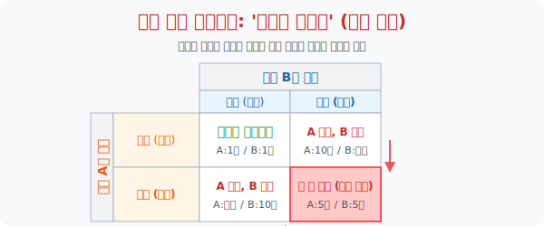

# 5. 인간의 배신 본능과 내쉬 균형: '죄수의 딜레마'

## [도입부] 학습 목표 (Learning Objectives)
- 상대방의 선택에 따라 나의 운명이 좌우되는 상황에서, '가장 합리적인 개인의 이기적 선택' 이 오히려 '조직 전체의 파멸' 로 이어질 수 있다는 게임 이론(Game Theory) 의 최고 명작 **'죄수의 딜레마(Prisoner's Dilemma)'** 를 이해합니다.
- 서로 통신이 단절된 상황에서 인간은 왜 '협력' 보다 '배신' 을 선택할 수밖에 없는지, 노벨 경제학상을 수상한 존 내쉬(John Nash) 의 **'내쉬 균형(Nash Equilibrium)'** 을 통해 수학적으로 증명해 봅니다.
- 파이썬(Python)의 `Dictionary` 기반 2D 매트릭스(행렬) 를 활용하여 죄수들의 선택에 따른 형량(결과값) 을 자동 매칭해 주는 시뮬레이터를 코딩해 봅니다.

---

## 1. 지옥의 심문실: 수사관의 제안

은행 강도 용의자 A와 B가 잡혀서 경찰서에 왔습니다. 경찰은 두 사람을 **완전히 분리된** A취조실과 B취조실에 가둬놓고 심문합니다. 두 사람은 서로 텔레파시를 보낼 수 없습니다.
경찰이 각각의 방에 들어가서 이렇게 속삭입니다. 

> "너희 둘 다 끝까지 발뺌(침묵/협력) 하면 증거 불충분으로 가벼운 **1년** 징역만 살게 될 거야.
> 근데 만약 네가 **먼저 자백(배신)** 하고 쟤가 침묵하면, 너는 즉시 **무죄 석방**이고 쟤 혼자 **10년** 독박이야.
> 아, 물론 너희 둘 다 서로 배신하고 찌르면, 둘 다 **5년**씩 살게 될 거야. 선택해!"

자, 용의자 A는 깊은 고민(수학적 경우의 수 계산) 에 빠집니다.

* **가스라이팅 경로 1 (B가 영리하게 침묵한다면?)**: 내가 침묵하면 1년이지만, 배신(자백) 하면 무죄(0년) 석방이다. $\rightarrow$ **(배신이 이득!)**
* **가스라이팅 경로 2 (B가 나를 찌르고 자백한다면?)**: 내가 멍청하게 침묵하면 나 혼자 10년 독박이다. 나도 찌르면 5년으로 줄어든다. $\rightarrow$ **(배신이 이득!)**

**[내쉬 균형(Nash Equilibrium)의 도달]**
결론이 났습니다. 상대방이 천사(침묵) 든 악마(자백) 든 상관없이, **나의 이기적인 최선의 선택은 무조건 '자백(배신)' 하는 것입니다.**
용의자 B의 머릿속에서도 똑같은 계산이 돌아갑니다. 결국 두 사람은 원래의 최고 시나리오(둘 다 침묵해서 각 1년씩 사는 해피엔딩) 를 버리고, 상대방의 뒤통수를 치기 위해 둘 다 자백하여 5년씩 감옥에서 썩는 **[파멸의 사분면]** 에 도달하게 됩니다.
아무리 발버둥 쳐도 빠져나올 수 없는 이 이기적 수학의 늪을 '내쉬 균형' 이라고 부릅니다.



<br>

## 2. 💻 파이썬(Python) 페이오프(Payoff) 매트릭스 시뮬레이터

게임 이론 전문가들은 두 사람의 액션(선택) 을 조합하여 결과값(형량) 이 떨어지는 이 표를 '보상 행렬(Payoff Matrix)' 이라고 부릅니다. 파이썬의 중첩 딕셔너리로 이 매트릭스 구조를 완벽하게 재현할 수 있습니다.

### 🐍 파이썬 예제: 게임 이론 시뮬레이터 (IF-ELSE 조합)

```python
print("--- ⚖️ 게임 이론: 죄수의 딜레마(Prisoner's Dilemma) 시뮬레이터 ---")

# (A의 선택, B의 선택) 에 매핑된 (A의 형량, B의 형량) 딕셔너리
payoff_matrix = {
    ('침묵', '침묵'): (1, 1),    # 해피엔딩
    ('침묵', '자백'): (10, 0),   # B만 석방
    ('자백', '침묵'): (0, 10),   # A만 석방
    ('자백', '자백'): (5, 5)     # 둘 다 파멸 (내쉬 균형)
}

# 시뮬레이션: 두 죄수가 모두 이기적인 판단(자백) 을 내렸다고 가정
A_choice = '자백'
B_choice = '자백'

# 딕셔너리에서 두 사람의 선택 조합을 Key로 던져 결과를 받아옴!
A_penalty, B_penalty = payoff_matrix[(A_choice, B_choice)]

print(f" [상황 로그] A의 선택: '{A_choice}' / B의 선택: '{B_choice}'")
print("-" * 50)
print(f" 🚨 [선고 결과] A: 징역 {A_penalty}년, B: 징역 {B_penalty}년")

# 결과 해석
if A_choice == '자백' and B_choice == '자백':
    print(" 💡 [시스템 분석] 두 이기적인 개체(Human)가 최선의 선택을 하려다")
    print("    가장 멍청한 결과를 낳은 '내쉬 균형' 상태에 도달했습니다.")
elif A_penalty == 1 and B_penalty == 1:
    print(" 🕊️ [파레토 최적] 상호 신뢰가 만들어 낸 완벽한 협력 모델입니다.")
```

이 모델은 단순히 범죄자들의 이야기가 아닙니다. "미국과 소련이 결국 핵무기 군비 경쟁을 할 수밖에 없었던 이유", "치킨 게임을 하던 대기업들이 가격 단합을 깨버리는 이유" 등 실물 경제와 냉전 시대 정치 역학을 해독하는 마스터키로 작용합니다.

---

## [결론] 학습 정리 (Summary)

1. **게임 이론 (Game Theory)**: 혼자 무인도에서 최적의 해답을 구하는 것이 아니라, 상대방의 대응에 따라 나의 수익이 춤을 추는 '상호 작용 상태(게임)'에서의 수학적 전략을 연구하는 학문입니다.
2. **죄수의 딜레마**: 집단을 위한 '공동의 최고 이익' 은 서로 협력할 때 발생하지만, '개인의 최선의 이익' 을 좇으면 배신이 절대 유리하기 때문에, 상호 소통과 신뢰 구조가 없는 조직은 결국 무조건 서로를 배신하며 같이 폭망한다는 역설입니다.
3. **내쉬 균형**: 어떤 플레이어도 단독으로 현재의 전략을 바꿀 동기(이득) 가 없는 안정된 고착화 상태를 뜻합니다. (영화 '뷰티풀 마인드'의 존 내쉬가 증명함) 
