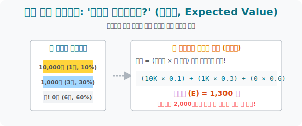

# 6. 도박장이 절대 망하지 않는 수학적 이유: '기댓값(Expected Value)'

## [도입부] 학습 목표 (Learning Objectives)
- 카지노 룰렛과 길거리 제비뽑기상, 복권 위원회가 어떻게 사람들의 '허황된 꿈(가짜 정보)' 을 이용해 합법적으로 돈을 빨아들이는지 **'기댓값(Expected Value)'** 의 개념으로 폭로합니다.
- 복잡한 불확실성의 세계(미래) 를 단 1개의 '평균 수치' 계산으로 압축해 내어, 우리가 특정한 도박(또는 투자, 보험) 에 참여하는 것이 이득인지 호구 잡히는 것인지 수학적으로 감별해 냅니다.
- 파이썬(Python)의 리스트 기반 반복문(`For`, `Zip`) 을 이용해, 확률 모형의 수익금을 곱하고 무한 덧셈을 구현하는 초고속 '기댓값 산출 알고리즘' 을 완성합니다.

---

## 1. 1,000원짜리 제비 뽑기의 유혹

학교 축제에서 길거리 뽑기 부스를 만났습니다. 참가비는 딱 **2,000원**입니다.
상자에 들어있는 쪽지(10장)의 보상 목록을 보면 숨이 멎을 듯합니다.

* ✨ 초대박: **10,000원** (총 1장) - 확률 10%
* 🥈 중대박: **1,000원** (총 3장) - 확률 30%
* 💥 꽝!: **0원** (총 6장) - 확률 60%

당신의 머릿속 호구 마인드가 작동합니다. *"와, 10% 확률로 1만 원 터지면 2천 원 내고 8천 원 버는 셈이네? 꽝 걸려도 1,000원짜리가 3장이나 있고! 무조건 고(Go) 다!"*

수학의 계산기(기댓값) 를 두드려 이 환상을 파괴해 보겠습니다.

**[수학적 기대 수익량 (기댓값) 계산법]**
기댓값은 **(얻게 될 상금 $) \times (그 상금을 얻을 확률 \%)$** 을 전부 곱해서 더하는 아주 단순한 렌더링 방식입니다. 당신의 분신 10만 명을 만들어서 이 게임을 끝없이 돌렸을 때 평균적으로 받게 될 1회당 수익입니다.

* 10,000원 $\times$ 0.1 = 1,000점(원)
* 1,000원 $\times$ 0.3 = 300점(원)
* 0원 $\times$ 0.6 = 0점
* **기댓값 합산 = 1,300원**

놀랍지 않나요? 당신이 한 판 게임을 할 때마다 시스템 보상 체계는 당신에게 평균적으로 '1,300원'을 쥐어주도록 세팅되어 있습니다. 
그런데 참가비 입장료가 얼마였죠? **2,000원**입니다. 도박장은 이 게임을 열 때마다 고객 1명당 가만히 앉아서 (2,000 - 1,300) = **700원**의 확정 수익금을 복사방패처럼 가져가는 수학적 호구 사냥 시스템을 짠 것입니다.



<br>

## 2. 💻 파이썬(Python) 합법적 겜블 확률 분석기 (`Zip` 함수 활용)

이론적 확률과 상금을 파이썬 리스트 2개에 부어주면, 알아서 기댓값을 계산하고 '참여해도 될 도박인지' 경고창을 띄워주는 AI 코드를 짜봅시다.

### 🐍 파이썬 예제: 행사 부스 수익성 평가(기댓값) 모듈

```python
print("--- 🎲 블랙잭/복권 수학적 기댓값(E) 판독기 가동 ---")

# 도박장이 제시한 상금액 리스트
prize_amounts = [10000, 1000, 0]

# 각 상금별 당첨 확률 리스트 (0.1 = 10%)
probabilities = [0.1, 0.3, 0.6]

# 참여자가 내야 할 판돈(입장료)
ticket_price = 2000

# 1. 두 리스트를 나란히 묶어서 곱하고 전부 덧셈 기호로 몰아넣자! (Zip 함수 활용)
# zip() 은 두 배열을 왼쪽부터 짝지어줍니다.
expected_value = 0
for prize, prob in zip(prize_amounts, probabilities):
    expected_value += (prize * prob)

print(f" [데이터 분석] 한 판 평균 스캔 기대 수익: {expected_value}원")
print(f" [입장 요금] 게임 참여 베팅 금액: {ticket_price}원")

print("-" * 50)
if expected_value > ticket_price:
    print(" 🤑 [강력 추천] 수학적으로 플레이어에게 유리한 미친 게임입니다! 대출 풀 매수!")
elif expected_value == ticket_price:
    print(" 🤔 [본전] 참여자가 시간만 버리고 이득도 손해도 안 보는 페어 게임입니다.")
else:
    print(f" 💀 [호구 경보] 기댓값이 입장료보다 {ticket_price - expected_value}원이나 낮습니다.")
    print("    판을 돌릴수록 주최측(카지노) 의 지갑만 채워주는 사기 구조입니다!")

# 결과창:
# --- 🎲 블랙잭/복권 수학적 기댓값(E) 판독기 가동 ---
#  [데이터 분석] 한 판 평균 스캔 기대 수익: 1300.0원
#  [입장 요금] 게임 참여 베팅 금액: 2000원
# --------------------------------------------------
#  💀 [호구 경보] 기댓값이 입장료보다 700.0원이나 낮습니다.
#     판을 돌릴수록 주최측(카지노) 의 지갑만 채워주는 사기 구조입니다!
```

**[금융 공학의 씨앗]**
이 단순한 곱셈 구조 위에서 보험회사가 파산하지 않는 보험료가 역산되고, 카지노의 블랙잭, 텍사스 홀덤의 확률 베팅 로직이 동작하며, 월스트리트 주식 시장의 옵션 파생상품 가격이 산출됩니다.

---

## [결론] 학습 정리 (Summary)

1. **불확실성의 예측**: 기댓값(Expected Value) 은 미래에 일어날 여러 불확실한 사건들(A사건 10%, B사건 50%...) 을 단 하나의 평균적 숫자로 압축시켜 주는 결정적인 도구입니다.
2. **카지노 불패의 법칙**: 세상의 모든 복권, 카지노 슬롯머신은 이 '기댓값' 이 베팅액보다 무조건 작도록 수학적 설계가 되어 있습니다. (로또의 기댓값은 천 원이 아니라 오백 원 남짓입니다.)
3. **참다운 의사결정**: 도박에서 운 좋게 하루 이틀 돈을 딸 수는 있으나, 시행 횟수가 무한대로 반복(대수의 법칙) 될수록 내 주머니 잔고는 이 기댓값의 가혹한 중력을 벗어날 수 없음을 아는 것이 '수학적 의사결정' 의 종착역입니다.
