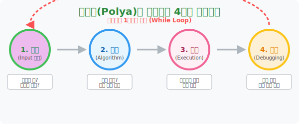

# 1. 어떻게 문제를 풀어야 할까? (How to Solve It)

## [도입부] 학습 목표 (Learning Objectives)
- 무작정 공식을 대입하려는 습관을 버리고, 헝가리의 천재 수학자 **조지 폴리아(George Pólya)** 가 제창한 **'문제 해결 4단계'** 구조를 뇌에 장착합니다.
- 복잡한 현실의 텍스트 문제를 컴퓨터 프로그램의 작동 원리인 **Input $\rightarrow$ Algorithm $\rightarrow$ Execution $\rightarrow$ Debugging** 의 흐름과 완벽히 매칭하여 논리적으로 분해하는 능력을 키웁니다.
- 파이썬(Python)의 `try-except` 예외 처리 및 `while` 루프 구조를 통해, 문제를 풀고 틀렸을 때 다시 계획 단계로 돌아가는 '반성(디버깅)' 알고리즘을 코드로 구현해 봅니다.

---

## 1. 수학을 넘어선 알고리즘: 폴리아의 4단계

수학 문제를 받아 들고 "어떤 공식(=식)을 써야 하지?" 하고 빈 공간만 노려보는 것은 가장 최악의 습관입니다. 학교 시험지 뿐만 아니라 나중에 구글, 네이버 같은 IT 기업에 입사하여 거대한 시스템 버그(문제)를 만났을 때도 우리는 이 폴리아 할아버지의 4단계를 무의식적으로 밟게 됩니다. 이것은 단순한 수학 풀이가 아닌 **"사고력의 프레임워크"** 입니다.

### 🧠 폴리아의 마법 4단계 스텝

1. **문제의 이해 (Understanding the problem)**: 
   - *컴퓨터 공학적 관점: Input 데이터 파악*
   - 무엇을 구하라고 하는가? (Target) 나에게 주어진 조건(Data)은 무엇인가? 
2. **계획 수립 (Devising a plan)**: 
   - *컴퓨터 공학적 관점: Algorithm (알고리즘) 설계*
   - 이 데이터들을 어떻게 요리할 것인가? 과거에 비슷한 문제를 푼 적이 있는가? (그림 그리기, 표 만들기, 식 세우기 등 전략 선택)
3. **계획 실행 (Carrying out the plan)**: 
   - *컴퓨터 공학적 관점: Code Execution (실행)*
   - 세워둔 알고리즘대로 계산(코딩)을 흔들림 없이 밀어붙이는 막노동 단계입니다. 중간에 연산 오류가 없도록 꼼꼼히 체크합니다.
4. **반성 (Looking back)**: 
   - *컴퓨터 공학적 관점: Testing & Debugging (검증 및 디버깅)*
   - 구한 답이 상식적으로 말이 되는가? (예: 자동차 속력이 시속 10,000km 가 나오진 않았나?) 혹시 다른 더 우아하고 빠른 치트키 해법은 없었을까? 틀렸다면 쿨하게 1단계로 되돌아간다.



<br>

## 2. 식(Equation) 세우기 강박증에서 벗어나라!

한국 수학 교육의 가장 큰 비극은 무조건 $x$ 와 $y$ 를 설정하고 방정식(식)을 세우게끔 훈련받는다는 것입니다. 하지만 폴리아는 말합니다. **"식 세우기는 수백 가지 전략 중 하나일 뿐이다!"**
앞으로 우리는 식을 세우지 않고도 그림을 쓱쓱 그리거나, 표를 찍찍 그어서 복잡한 확률이나 사물 배열의 극한 문제들을 초등학생처럼 풀어내는 8가지 해킹 스킬들을 하나씩 마스터할 것입니다.

---

## 3. 💻 파이썬(Python)의 `While` 루프와 디버깅 4단계 시스템

실제 컴퓨터 프로그래머들이 코드를 짤 때 겪는 사이클은 폴리아의 4단계와 소름 돋게 똑같습니다. 파이썬의 `while` 무한 루프와 `try-except` 블록을 이용해 "틀리면 다시 위로 돌아가서 생각하는(반성)" 인공지능 해답 탐색기의 뼈대를 짜봅시다.

### 🐍 파이썬 예제: 폴리아 4단계 루프 시뮬레이터

```python
import random

print("--- 🧠 폴리아 알고리즘 가동: 1부터 100 사이의 비밀번호 맞추기 ---")

secret_target = 73 # 1. 이해: 우리가 구해야 할 최종 불변의 타겟값
plan_count = 0

# 4단계 (반성) 에서 실패할 경우 계속 1단계로 되돌려 보내는 무한 While 루프!
while True:
    plan_count += 1
    
    # 2. 계획 수립 (Algorithm): "램덤하게 찍기" 라는 아주 원초적인 전술 채택
    my_guess = random.randint(1, 100)
    print(f"[시도 {plan_count}] 전략 실행 중... 예측값: {my_guess} 발사!")
    
    # 3. 계획 실행 및 4. 반성 (Debugging)
    if my_guess == secret_target:
        print(" ✅ [반성 통과] 정답을 찾았습니다! 폴리아 4단계 종료.")
        break # 정답이면 루프 탈출 (문제 해결 끝!)
    else:
        # 논리적 검증 (반성에 실패하면 피드백을 주고 루프 처음으로 회귀)
        feedback = "UP⬆️" if my_guess < secret_target else "DOWN⬇️"
        print(f" ❌ [반성 실패/오답] 상식 검증 결과: {feedback}. 1단계(이해) 로 돌아갑니다.\n")
        
# 결과창 (예시):
# --- 🧠 폴리아 알고리즘 가동: 1부터 100 사이의 비밀번호 맞추기 ---
# [시도 1] 전략 실행 중... 예측값: 45 발사!
#  ❌ [반성 실패/오답] 상식 검증 결과: UP⬆️. 1단계(이해) 로 돌아갑니다.
# 
# [시도 2] 전략 실행 중... 예측값: 82 발사!
#  ❌ [반성 실패/오답] 상식 검증 결과: DOWN⬇️. 1단계(이해) 로 돌아갑니다.
# ...
# [시도 N] 전략 실행 중... 예측값: 73 발사!
#  ✅ [반성 통과] 정답을 찾았습니다! 폴리아 4단계 종료.
```

코드가 증명하듯, **"한 번에 공식을 떠올려 맞추지 못해도 괜찮습니다."** 
폴리아의 위대함은 프로그래밍의 디버깅 루프처럼, 틀렸을 때 그 오답의 결과(`UP` 또는 `DOWN`의 피드백 데이터)를 들고 다시 계획표로 돌아가는 꺾이지 않는 무한 탐색의 마음가짐을 수학에 심어준 것입니다.

---

## [결론] 학습 정리 (Summary)

1. **식 세우기는 만능이 아니다**: 중,고등학교의 모든 킬러 수학 문제는 공식을 쑤셔 넣는다고 풀리지 않습니다. 문제의 본질을 먼저 파헤치는 '전략적 사색' 이 필요합니다.
2. **폴리아의 4단계 프레임워크**: `문제 이해 $\rightarrow$ 계획 수립 $\rightarrow$ 계획 실행 $\rightarrow$ 반성` 의 사이클은 챗GPT 같은 AI가 대규모 데이터를 처리하는 알고리즘과 본질적으로 같습니다.
3. **가장 중요한 4단계 (반성)**: 답을 맞췄다고 바로 다음 문제로 넘어가지 마십시오. "더 짧게 푸는 코딩길(알고리즘)은 없었을까?" 묻는 순간 여러분의 뇌는 일반인에서 엔지니어로 진화합니다.
