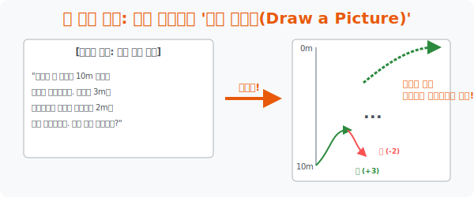

# 2. 직관의 폭발: 뇌를 해킹하는 '그림 그리기 (Draw a Picture)'

## [도입부] 학습 목표 (Learning Objectives)
- 텍스트 덩어리로 뭉쳐진 복잡한 정보를 뇌가 한눈에 알아볼 수 있도록 **2D 공간에 시각화(Visualization)** 하는 가장 위대한 치트키 전략, '그림 그리기' 의 강력함을 체험합니다.
- 달팽이의 우물 탈출 문제처럼 "식(Equation)" 으로 억지로 융합하려다 치명적인 논리적 함정에 빠지는 문제들을 그림 하나로 무참히 박살 내는 과정을 훈련합니다.
- 파이썬(Python)의 `turtle` 그래픽 모듈이나 상태 추적 시각화 코드를 통해, 백 마디 글보다 한 줄의 그래프 렌더링이 문제의 버그를 어떻게 빠르게 잡아내는지 증명합니다.

---

## 1. 수식보다 강한 무기: 시각화(Visualization)

여러분 앞에 끔찍하게 긴 문단으로 이루어진 수학 문제가 놓여 있습니다. 길이나 속도, 방향, 사람들이 악수를 몇 번 했는지 등의 조건이 난무합니다.
이걸 보고 $x, y$ 로 방정식을 세우려는 순간 여러분의 뇌는 과열되어 파업을 선언합니다.

**"인간의 뇌는 텍스트를 처리하는 데는 느리지만, 이미지(그림)를 처리하는 렌더링 속도는 슈퍼컴퓨터 급입니다."**

문제의 핵심 정보를 선, 동그라미, 화살표 같은 단순한 기호로 쓱쓱 바꿔서 종이에 배치하는 행위 자체가 훌륭한 **알고리즘 매핑(Mapping)** 입니다. 그림을 그리면 텍스트 속에 은폐되어 있던 상호 관계나 치명적인 예외 사항(Edge case) 들이 마치 X-ray 촬영을 한 것처럼 훤히 드러나게 됩니다. 



<br>

## 2. 개구리 우물 탈출 사고 실험

아주 고전적이고 유명한 함정 문제입니다.
> "우물의 깊이는 10m 입니다. 개구리는 낮에 3m 점프해서 올라가지만, 밤이 되면 미끄러워서 2m 를 다시 떨어집니다. 개구리는 며칠 째에 이 우물을 완전히 탈출할까요?"

방정식을 세우는 모범생의 파멸 과정:
1. 낮에 $+3$, 밤에 $-2$ 니까 하루(24시간) 최종 전진하는 속도는 $1m$ 네? (식 세우기 발동!)
2. "하루에 $1m$ 전진 $\times x$일 $= 10m$ 목표 달성"
3. 정답! 10일!

**[삐익! 오답입니다!!]**
이 텍스트를 그림(수직선 화살표)으로 쭉 그려봅시다. 위아래로 선을 긋고 화살표를 올렸다 내렸다 해보면 충격적인 버그가 발견됩니다.
- 개구리가 7일 동안 고생해서 $7m$ 높이까지 다다랐습니다. (7일 밤이 끝난 시점)
- 8일째 낮이 떴습니다! 여기서 개구리는 낮의 스펙 $+3m$ 점프를 시전합니다!
- $7m + 3m = 10m$. **개구리는 8일째 낮에 이미 우물 바깥 땅 위로 착지해 버렸습니다.**
- 이미 탈출했는데, 밤이 되었다고 2m 미끄러질 마찰력이 세상에 어디 있습니까?

방정식은 "밤에 미끄러진다" 라는 조건이 마지막 날엔 예외 처리로 삭제된다는 **현실적 제약사항**을 알지 못하는 바보 계산기에 불과합니다. 그림 그리기는 방금 이 무서운 예외(버그)를 눈으로 1초 만에 해킹해 낸 것입니다.

---

## 3. 💻 파이썬(Python) 상태 추적(State Tracking) 시각화 엔진

위의 개구리 우물 문제를 파이썬 코드로 `while` 반복문으로 짜보면 그날그날 개구리의 $Y$ 좌표 상태를 컴퓨터가 하루 스텝마다 디버깅 추적하면서, 절대로 10일이 나올 수 없음을 완벽히 증명해 냅니다.

### 🐍 파이썬 예제: 개구리 탈출 로그 데이터 시각화 스크립트

```python
print("--- 🐸 시각화 모니터: 개구리의 Y축 좌표 추적기 ---")

well_depth = 10    # 우물 깊이
current_height = 0 # 개구리 초기 위치
days_passed = 0

print(" [진입] 개구리가 0m 바닥에 있습니다.")

# While 무한루프: 탈출할 때까지 돌린다!
while current_height < well_depth:
    days_passed += 1
    
    # 1. 낮의 생존 스크립트 발동
    current_height += 3
    print(f" ☀️ {days_passed}일차 낮: 점프! (현재 높이: {current_height}m)")
    
    # [방어 로직 (그림으로 발견한 예외 상황)]
    # 낮에 수직 상승해서 우물 깊이를 뚫어버렸다면, 밤 스크립트를 안 돌리고 즉시 루프 탈출!!
    if current_height >= well_depth:
        print(f" 🚀 [System] 탈출 성공! 땅을 밟았습니다. 밤이 와도 안떨어집니다!")
        break
        
    # 2. 밤의 패널티 스크립트 발동
    current_height -= 2
    print(f" 🌙 {days_passed}일차 밤: 미끄럼... (현재 높이: {current_height}m)")

print("-" * 50)
print(f" ✅ [최종 결과] 개구리는 정확히 {days_passed} 일차에 우물을 탈출했습니다.")

# 결과창:
# --- 🐸 시각화 모니터: 개구리의 Y축 좌표 추적기 ---
#  [진입] 개구리가 0m 바닥에 있습니다.
#  ☀️ 1일차 낮: 점프! (현재 높이: 3m)
#  🌙 1일차 밤: 미끄럼... (현재 높이: 1m)
#  ☀️ 2일차 낮: 점프! (현재 높이: 4m)
#  ... (중략) ...
#  ☀️ 7일차 낮: 점프! (현재 높이: 9m)
#  🌙 7일차 밤: 미끄럼... (현재 높이: 7m)
#  ☀️ 8일차 낮: 점프! (현재 높이: 10m)
#  🚀 [System] 탈출 성공! 땅을 밟았습니다. 밤이 와도 안떨어집니다!
# --------------------------------------------------
#  ✅ [최종 결과] 개구리는 정확히 8 일차에 우물을 탈출했습니다.
```

그림을 그리는 수학 전략은 파이썬 코딩에서 매 루프(Loop) 상태마다 결과값(`current_height`) 을 `print()` 터미널 창에 찍어서 데이터의 흐름을 시각적으로 모니터링하는 **'디버깅 로그 추적'** 기법과 완전히 일치하는 위대한 습관입니다.

---

## [결론] 학습 정리 (Summary)

1. **시각 피부 이식**: 글은 구체적이지 않으면 뇌에서 미끄러집니다. 하지만 점을 찍거나 화살표를 그려 놓은 그림 데이터는 논리의 뼈대를 강풍 앞에서도 고정시켜주는 기초 공사입니다.
2. **환상과 함정의 분쇄**: 식만 세우면 인간이 무의식적으로 놓치는 현실과 수학의 괴리(우물 뚜껑에 닿으면 이벤트가 종료된다는 팩트)를 단번에 잡아낼 수 있는 유일한 직관 장치입니다.
3. **거칠어도 괜찮다**: 미술 학원처럼 예쁘게 그릴 필요가 없습니다. 관계를 점령할 '노드(Node: 동그라미 점)' 와 상호작용을 나타낼 '에지(Edge: 이어진 선)' 만 있다면 뇌는 이미 문제를 풀어낸 상태가 됩니다.
