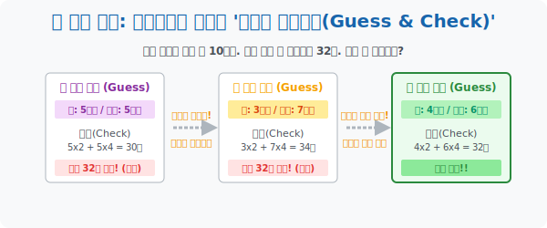

# 3. 브루트 포스 공격: 일단 던지고 보는 '예상과 확인하기 (Guess and Check)'

## [도입부] 학습 목표 (Learning Objectives)
- 정답을 구하는 완벽한 공식을 파악하지 못했음에도 불구하고, 대충 "이쯤이 답 아닐까?" 하고 아무 숫자라 냅다 던진 뒤 그 오류를 통해 정답의 포위망을 좁혀 나가는 **'예상과 확인하기'** 전략의 실용성을 배웁니다.
- 닭과 돼지 우유 문제 같은 연립방정식 전용 텍스트 수학을, 식一つ 없이 초등학생의 찍기 논리만으로 해킹해 내는 사고방식을 장착합니다.
- 파이썬(Python)의 핵심 크래킹(Cracking) 알고리즘인 `Brute-force(무차별 대입)` 룰과 $O(n)$ 반복문 탐색 구조를 코드로 구동하여 컴퓨터가 찍기 신공을 얼마나 빠르게 해치우는지 구경합니다.

---

## 1. 찍기도 과학이다! 체계적인 찍기 기술

"찍어서 맞췄다" 고 하면 보통 수학 선생님들께 혼나기 십상입니다. 하지만 수학 고수들과 구글 컴퓨터 엔지니어 집단에서는 **"논리적으로, 체계적으로 찍는 행위"** 야말로 가장 훌륭한 알고리즘(Algorithm) 설계라고 우대합니다. 이것이 폴리아의 세 번째 필살기 **[예상과 확인하기]** 입니다.

* "음, 식이 안 떠오르네. 그럼 대충 한가운데 값으로 때려 넣어볼까?" (예상: Guess)
* "넣고 계산해보니까 목표치보다 5나 넘어가네? 아하! 그럼 방금 넣은 숫자보다 더 작은 데이터로 찌그러트려서 다시 던져야겠다!" (확인: Check 및 논리적 좁히기)

이 방식은 수수께끼 같은 암호를 푸는 해커가 쓰는 논리와 완전히 동일합니다. 틀린 답은 그저 실패가 아니라, **"정답이 어느 방향에 숨어 있는지 화살표를 제공하는 소중한 힌트 데이터"** 로 작용합니다.



<br>

## 2. 닭과 돼지 해킹 (연립방정식의 파괴)

가장 악명 높은 초/중등 함정 문제 중 하나를 해킹해 봅시다.
> "어느 농장에 닭과 돼지가 섞여 있습니다. 대가리를 다 세어보니 10마리인데, 다리를 다 세어보니 합쳐서 총 32개입니다. 닭과 돼지는 각각 몇 마리인가요?"

$X + Y = 10, 2X + 4Y = 32$... 가감법 어쩌고 대입법 어쩌고... 텍스트만 봐도 멀미가 납니다. 이럴 때 찍기 신공을 시전해 봅시다.

1. **[예상 1]**: "모르겠고, 10마리니까 공평하게 반반 섞자. 닭 5마리, 돼지 5마리 고!"
2. **[확인 1]**: (닭 다리 $5 \times 2=10$) + (돼지 다리 $5 \times 4=20$) = **총 30개**. 
   - *피드백*: 앗! 목표 32개보다 다리가 2개 부족합니다! 다리를 늘려 펌핑시키려면? 다리가 4개 달린 뚱뚱보 **돼지의 마릿수를 늘려야겠네!**
3. **[예상 2]**: "돼지를 확 늘려보자! 닭 3마리, 돼지 7마리 고!"
4. **[확인 2]**: (닭 $3 \times 2=6$) + (돼지 $7 \times 4=28$) = **총 34개**.
   - *피드백*: 앗! 이번엔 다리가 너무 많아! 아까 돼지를 5마리로 했을 땐 부족했고, 7마리로 했더니 넘치네? 
5. **[예상/확인 결론]**: **돼지 6마리, 닭 4마리! (다리: $24 + 8 = 32$. 완벽 빙고!)**

방정식 공식을 까먹어도 문제를 부숴버리는 이 사이다 같은 해법이 '예상과 확인'의 진정한 쾌감입니다.

---

## 3. 💻 파이썬(Python) Brute-Force(무차별 대입) 탐색 스캐너

인간 머리로 찍기(For Loop)를 3번, 4번 하는 건 귀찮지만, 컴퓨터는 1초에 1억 번의 `Guess & Check` 찍기 공격을 던질 수 있습니다. 비밀번호 크랙 시스템이나 최적화 문제를 푸는 프로그래머들의 궁극기 `Brute-force` 무차별 대입 코드를 짜서 저 농장의 비밀을 0.001초 만에 앗아옵시다.

### 🐍 파이썬 예제: 암호 해킹 방식의 닭/돼지 물량 찾기 스크립트

```python
print("--- 💻 무차별 대입(Brute-Force) 해킹 스캐너 작동 ---")

total_heads = 10
target_legs = 32

# 인간은 5부터 찍었지만, 멍청하고 무식하게 빠른 컴퓨터는 범위 내의 모든 가능성을 모조리 쑤셔본다!
# 닭(chickens) 이 0마리일때 부터 10마리 일때까지 전부 하나하나 확인(Guess and Check)!
for chickens in range(total_heads + 1):
    
    # 닭 마릿수를 예상(Guess)하면, 남은 머리는 자동으로 돼지 마릿수가 됨!
    pigs = total_heads - chickens
    
    # 다리 개수 산출(Check)
    calculated_legs = (chickens * 2) + (pigs * 4)
    print(f" [스캔 {chickens}번째] 닭 {chickens}마리, 돼지 {pigs}마리 예상 -> 산출 다리 수: {calculated_legs}개")
    
    # 목표 다리 수량과 완벽히 일치하는 순간 루프망을 찢고 해킹 완료 선언!
    if calculated_legs == target_legs:
        print("-" * 50)
        print(" 🔓 [해킹 성공] 빙고!! 목표 타겟을 찾았습니다.")
        print(f"    ▶ 최종 정답: 닭 {chickens}마리 & 돼지 {pigs}마리")
        break

# 결과창:
# --- 💻 무차별 대입(Brute-Force) 해킹 스캐너 작동 ---
#  [스캔 0번째] 닭 0마리, 돼지 10마리 예상 -> 산출 다리 수: 40개
#  [스캔 1번째] 닭 1마리, 돼지 9마리 예상 -> 산출 다리 수: 38개
#  [스캔 2번째] 닭 2마리, 돼지 8마리 예상 -> 산출 다리 수: 36개
#  [스캔 3번째] 닭 3마리, 돼지 7마리 예상 -> 산출 다리 수: 34개
#  [스캔 4번째] 닭 4마리, 돼지 6마리 예상 -> 산출 다리 수: 32개
# --------------------------------------------------
#  🔓 [해킹 성공] 빙고!! 목표 타겟을 찾았습니다.
#     ▶ 최종 정답: 닭 4마리 & 돼지 6마리
```

고급 수학 공식이나 복잡한 최적화 알고리즘 덩어리가 1도 들어가지 않은 순수 $100\%$ 원시인 수준의 `For 반복문` 입니다. 모든 경우의 수 데이터를 다 때려 넣어 맞는지 틀렸는지(If 조건문) 확인만 하는 이 직관적 코드는 IT 실무에서도 가장 신뢰성 높은 최상급 테크닉 부류에 속합니다.

---

## [결론] 학습 정리 (Summary)

1. **찍는 것도 실력이다**: 식이 안 떨어오면 일단 포기하고 책을 덮는 나약한 모범생보다, 대충 중간값을 쑤셔 넣고 나오는 오차를 보고 다시 영점을 조절하는 백 스트리트 파이터 기질이 수학에선 유리합니다.
2. **양방향 피드백 루프**: 찍기 실패 결과는 틀린 답안지가 아니라 **"조금 더 수를 키워봐!"** 혹은 **"조금 더 줄여!"** 라는 친절한 이정표 화살표 내비게이션 데이터로 활용됩니다.
3. **컴퓨터의 가장 무서운 무기 (Brute-Force)**: 머리를 똑똑하게 쓰려다가 오히려 더 헤매는 경우가 잦은 IT 실무 바닥에서는 "컴퓨터의 연산 속도" 를 믿고 이 예상-확인 방식을 범용 폭탄처럼 욱여넣는 방식을 가장 선호합니다.
