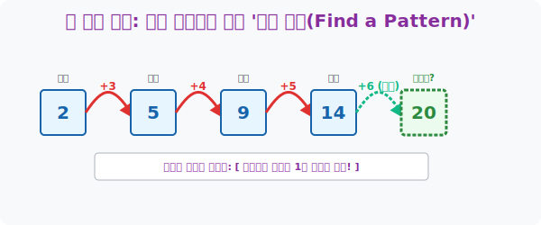

# 4. 암호 해독가의 시선: 숨겨진 뒷골목 룰, '규칙 찾기 (Find a Pattern)'

## [도입부] 학습 목표 (Learning Objectives)
- 수많은 숫자나 도형 데이터가 무작위로 나열된 듯 보일 때, 그 데이터들의 밑바닥에 흐르는 **'보이지 않는 일관된 규칙(Pattern)'** 을 찾아내는 암호 해독 수학의 기초를 다집니다.
- 가우스가 1부터 100까지의 합을 순식간에 구했던 일화처럼, 100번째나 1000번째 결과를 일일이 계산하지 않고도 뒷골목 규칙 하나로 미래 데이터를 지배하는 패턴 예측력을 기릅니다.
- 파이썬(Python)의 리스트(List)와 반복문 구조를 이용하여, 인간이 발견해 낸 단순한 증가 규칙(Pattern)을 컴퓨터 수식 로직으로 이식하여 자동화된 예측기(Predictor)를 코딩해 봅니다.

---

## 1. 노가다의 종말: 규칙이 곧 미래다

수학 문제 중에 "첫째 항은 2, 둘째는 5, 셋째는 9... 그럼 100번째에 올 숫자는 무엇인가?" 같은 무식한 질문들이 있습니다.
이걸 진짜 100번째까지 공책에 적으면서 노가다(Brute-force)를 뛰는 학생은 문제를 푸는 게 아니라 벌을 서는 중입니다.
이때 필요한 네 번째 폴리아 전략이 바로 **[규칙 찾기]** 입니다. 

* 앞의 데이터와 뒤의 데이터 사이에 어떤 '차이' 가 발생했는가?
* 2에서 5가 될 때 $+3$ 이 늘어났고, 5에서 9가 될 때 $+4$ 가 늘어났다면? 
* 유레카! **"더해지는 징검다리 숫자가 1씩 커지고 있구나!"**

이 간단한 패턴(Pattern) 하나를 해킹해 내는 순간, 나는 10번째든 100번째든 우주 끝에 있는 데이터도 순식간에 예측할 수 있는 예지력을 얻게 됩니다. 복잡한 수열 공식인 $a_n$ 따위를 외우기 전에, 내 눈으로 숫자 사이의 틈새(차이)를 노려보며 규칙을 캐내는 것이 모든 수열(Sequence)의 절대적 출발점입니다.



<br>

## 2. 블록 탑 쌓기 문제 (도형의 패턴)

숫자가 아닌 도형 그림으로 패턴 문제가 나올 때도 마찬가지입니다.
> "1단계: 블록 1개, 2단계: 다이아몬드 형태로 4개, 3단계: 9개... 10단계 피라미드에는 블록이 총 몇 개 들어갈까?"

* 1단계: $1$개 ($1 \times 1$)
* 2단계: $4$개 ($2 \times 2$)
* 3단계: $9$개 ($3 \times 3$)

그림의 크기를 눈대중으로 세는 사람은 평생 정답을 못 찾습니다. 하지만 각 단계별 블록 개수를 숫자 데이터로 뽑아내어 일렬로 배열하는 순간, **"아하! 각 단계 번호의 거듭제곱(제곱, $x^2$) 이 블록의 개수구나!"** 라는 숨겨진 함수 패턴이 백일하에 드러납니다.
그러므로 10단계 아파트에는 당연히 $10 \times 10 = 100$개의 블록이 들어갈 것임을 단 1초 만에 알 수 있습니다.

---

## 3. 💻 파이썬(Python) 반복문을 통한 패턴(Pattern) 미래 예측기

인간이 "더해지는 값이 1씩 증가한다" 는 룰을 찾았다면, 이 룰을 파이썬 `for` 반복문 엔진에 이식해 봅시다. 컴퓨터는 피로를 모르기 때문에 100번째는 물론 10,000번째 미래 데이터도 0.001초 만에 산출해 냅니다.

### 🐍 파이썬 예제: N번째 수열(Sequence) 자동 예측 시스템

```python
print("--- 🔍 패턴 해킹 시스템: 수열의 N번째 미래 예측 ---")

# (타겟 수열) 2, 5, 9, 14, 20 ... 처럼 앞 숫자와의 차이가 3, 4, 5, 6 으로 점점 커지는 패턴
# 인간이 찾아낸 룰: "N번째 항으로 넘어갈 때, (N+1) 만큼을 이전 숫자에 더한다!"

target_term = 100  # 우리가 알아내고 싶은 미래 (100번째 항)
current_value = 2  # 첫 번째 숫자(Start Point)

print(f" [데이터 로드] 첫 번째 숫자: {current_value}")
print(f" [목표] {target_term}번째 숫자를 연산합니다...")

# 2번째(i=2) 부터 100번째(target_term) 까지 패턴 룰을 반복(for)해서 돌려버린다!
for i in range(2, target_term + 1):
    # 패턴 발동: (방금 전 숫자) + (현재 순서 i + 1)
    jump_size = i + 1
    current_value = current_value + jump_size
    
    # 5번째까지만 샘플 로그 출력
    if i <= 5:
        print(f"   -> {i}번째 숫자: {current_value} (점프: +{jump_size})")

print("   ... (중략: 컴퓨터가 초광속으로 노가다 중) ...")
print("-" * 50)
print(f" 🔮 [미래 예측 완료] 대망의 {target_term}번째에 등장할 거대한 숫자는: {current_value} 입니다!")

# 결과창:
# --- 🔍 패턴 해킹 시스템: 수열의 N번째 미래 예측 ---
#  [데이터 로드] 첫 번째 숫자: 2
#  [목표] 100번째 숫자를 연산합니다...
#    -> 2번째 숫자: 5 (점프: +3)
#    -> 3번째 숫자: 9 (점프: +4)
#    -> 4번째 숫자: 14 (점프: +5)
#    -> 5번째 숫자: 20 (점프: +6)
#    ... (중략: 컴퓨터가 초광속으로 노가다 중) ...
# --------------------------------------------------
#  🔮 [미래 예측 완료] 대망의 100번째에 등장할 거대한 숫자는: 5150 입니다!
```

코드가 증명하듯이 패턴을 찾아내는 것은 인간의 직관(Insight) 몫이지만, 찾아낸 패턴 규칙(`current_value + jump_size`)을 무한 반복(Loop) 하여 미래를 산출해 내는 것은 컴퓨터 프로그래밍 세계의 특기입니다. 수학과 코딩의 완벽한 역할 분담입니다.

---

## [결론] 학습 정리 (Summary)

1. **부분으로 전체를 보는 혜안**: 눈앞에 던져진 데이터 3~4개(부분) 의 단서만을 조합하여, 무한히 뻗어나갈 전체 수열의 우주적 흐름(규칙)을 지배하는 가장 지능적인 전략입니다.
2. **함수의 어머니**: "입력값(순서) 이 변함에 따라 출력값(숫자) 이 어떤 일관된 룰로 반응하는가?" 를 묻는 규칙 찾기는 훗날 고등학교 수학의 꽃인 **'함수(Function)'** 단원으로 가는 직행 티켓입니다.
3. **규칙 찾기 팁**: 갑자기 숫자가 폭발적으로 늘어나면 곱하기 룰($\times 2, \times 3$) 을 의심하고, 찔끔찔끔 늘어나면 더하기 룰을 의심하세요. 숫자 사이의 틈(간격 차이)을 빼기 연산으로 나열해 보는 것이 해커의 기본 수칙입니다.
