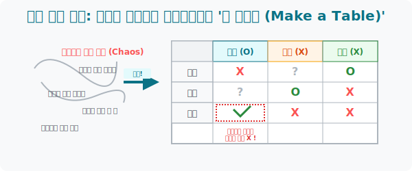

# 5. 혼돈을 제어하는 매트릭스: 흩어진 정보 조립 설명서, '표 만들기(Make a Table)'

## [도입부] 학습 목표 (Learning Objectives)
- 텍스트 속성상 머릿속을 맴돌며 증발해버리는 수많은 '조건(단서)' 들을 격자무늬 매트릭스(Matrix) 칸 안에 가두어, 빈 공간을 논리적으로 추론해 내는 **'표 만들기(Data Structuring)'** 전략을 마스터합니다.
- "A는 사과를 싫어하고, B는 바나나를 좋아하며..." 식의 복잡한 논리 퀴즈가 표를 만나는 순간 게임의 빙고판처럼 단순화되는 엑셀식 데이터 정리의 힘을 체험합니다.
- 파이썬(Python)의 `Dictionary/List` 혹은 `Pandas DataFrame` 같은 2차원 데이터 구조체를 코딩해 봄으로써, 컴퓨터가 복잡한 경우의 수를 어떻게 깔끔한 2D 표 배열로 관리하는지 이해합니다.

---

## 1. 꼬여버린 실타래를 푸는 격자무늬 해킹

탐정 소설에서 형사는 칠판에 용의자의 사진과 시간대별 알리바이를 표로 그려 넣습니다. 수학 문제에서도 똑같습니다. 변수 3~4개가 얽힌 문제를 머릿속에서 돌리려고 하면 뇌 회로가 타버립니다.

> **예시 퀴즈**: "철수, 영희, 민수, 수진 4명은 각각 축구, 야구, 농구, 배구 중 하나만 좋아합니다. 철수는 축구를 싫어하고, 영희는 야구를 좋아하며, 수진이는 축구 광팬입니다. 민수가 좋아하는 것은 무얼까요?"

텍스트만 읽으면 "그래서 누가 뭘 한다는 거야?" 싶지만, 가로축엔 [철수, 영희, 민수, 수진], 세로축엔 [축, 야, 농, 배] 를 적어 **'표(Table)'** 를 그리는 순간 엄청난 논리 마법이 작동합니다.

* 수진이가 [축구] 칸에 'O' 도장을 찍었네? 
* $\rightarrow$ **[추론 폭발]** 그럼 수진의 가로줄(다른 운동)은 전부 'X'! 축구의 세로줄(다른 사람)도 전부 'X' 자동 렌더링!!
* 영희가 [야구] 칸에 'O' 도장을 찍었네?
* $\rightarrow$ 그럼 남은 칸 중 치거를 거치고 빈칸으로 남은 곳이 당연히 민수의 몫이 되는 겁니다.

표는 흩어진 단서 파편들을 정해진 슬롯(Slot)에 장착시켜, **"나머지 빈칸의 정답 수치가 무엇일 수밖에 없는가"** 를 강제로 압박하여 추론해 내는 궁극의 데이터베이스입니다.



<br>

## 2. 함수와 좌표계의 조상

중학교 1학년 함수 단원에 들어가면, $y = 2x + 1$ 같은 식을 배우면서 무조건 $x$가 1일 때 $y$는 3, $x$가 2일 때 $y$는 5... 처럼 $x$와 $y$를 짝지어 표로 그리는 훈련을 맹렬히 반복합니다.

표 만들기는 그 자체로 단순한 퀴즈 풀이 스킬이 아닙니다. 두 개의 변량 데이터(사람 vs 취미, $x$값 vs $y$값) 간의 **매핑(Mapping, 대응 관계)** 을 시각화하는 수학의 뼈대 기술입니다. 행과 열(Row & Column) 로 정보를 분리하는 엑셀(Excel) 프로그램이 지구상에서 가장 위대한 발명품이 된 이유도 인간 뇌 구조가 '표 본능' 에 최적화되어 있기 때문입니다.

---

## 3. 💻 파이썬(Python)으로 구현하는 2차원 Matrix 데이터 매핑

컴퓨터 프로그래밍 실무에서 '표' 를 그리는 행위는 흔히 **'2차원 배열(2D Array)'** 이나 파이썬 데이터 조작의 끝판왕 라이브러리인 **`Pandas Dataframe`** 을 세팅하는 작업과 완벽히 오버랩됩니다.

### 🐍 파이썬 예제: 딕셔너리를 활용한 논리 퍼즐 표 조립 스캐너

```python
print("--- 📊 엑셀 빙의 매트릭스: 취미 논리 퍼즐 표 자동 렌더링 ---")

# 사람들이 좋아할 수 있는 모든 운동 후보 (세로줄)
sports = ["축구", "야구", "농구", "배구"]

# 뇌를 비우고 텍스트 단서들을 파이썬 딕셔너리(표의 뼈대)로 매핑!
table_data = {
    "철수": ["알수없음", "알수없음", "알수없음", "알수없음"],
    "영희": ["알수없음", "O", "알수없음", "알수없음"],  # 영희는 야구(1번인덱스) 확실히 좋아함!
    "민수": ["알수없음", "알수없음", "알수없음", "알수없음"],
    "수진": ["O", "알수없음", "알수없음", "알수없음"]   # 수진이는 축구(0번인덱스) 확실히 좋아함!
}

# (자동 추론 로직 1) 수진이가 축구('O') 니까, 철수나 민수는 절대 축구를 할 수 없어! (세로줄 X 처리)
table_data["철수"][0] = "X"
table_data["민수"][0] = "X"
table_data["영희"][0] = "X"

# (자동 추론 로직 2) 영희가 야구('O') 니깐, 나머지 사람들은 야구 절대 못해! (세로줄 X 처리)
table_data["철수"][1] = "X"
table_data["민수"][1] = "X"
table_data["수진"][1] = "X"

# 터미널에 아름다운 데이터 표(Table) UI 화면 출력
print(f"이름   | {sports[0]}\t | {sports[1]}\t | {sports[2]}\t | {sports[3]}")
print("-" * 55)

for person, data_list in table_data.items():
    print(f"{person}   | {data_list[0]}\t | {data_list[1]}\t | {data_list[2]}\t | {data_list[3]}")

print("-" * 55)
print(" 💡 [해커의 시선] 철수의 축구/야구가 'X'로 필터링 되면서,")
print("    철수의 진짜 취미는 [농구] 나 [배구] 중 하나로 자동 색출망이 좁혀졌습니다!")

# 결과창:
# --- 📊 엑셀 빙의 매트릭스: 취미 논리 퍼즐 표 자동 렌더링 ---
# 이름   | 축구	 | 야구	 | 농구	 | 배구
# -------------------------------------------------------
# 철수   | X	 | X	 | 알수없음	 | 알수없음
# 영희   | X	 | O	 | 알수없음	 | 알수없음
# 민수   | X	 | X	 | 알수없음	 | 알수없음
# 수진   | O	 | X	 | 알수없음	 | 알수없음
# -------------------------------------------------------
#  💡 [해커의 시선] 철수의 축구/야구가 'X'로 필터링 되면서,
#     철수의 진짜 취미는 [농구] 나 [배구] 중 하나로 자동 색출망이 좁혀졌습니다!
```

이렇듯 흩어져서 둥둥 떠다니는 말장난 텍스트 조각들을, 컴퓨터가 인식할 수 있는 깔끔한 리스트(배열) 표 격자 칸에 때려 넣고 X 와 O 를 채우면 오리무중이던 정답의 남은 빈자리(Null Value) 가 스스로 자신을 노출합니다.

---

## [결론] 학습 정리 (Summary)

1. **지우개 신공 (배제성의 원리)**: 표 전략의 진정한 파괴력은 정답을 한 번에 맞추는 것이 아닙니다. 조건 하나가 채워질 때마다 가로/세로축의 나머지 오답 칸들을 'X' 로 그어 지워버리며 정답의 용의 선상을 극단적으로 축소시키는 매직입니다.
2. **복합 데이터 제어 마술**: 변수가 3~4개씩 동시에 출현하여 사람을 농락하는 문제를 마주했다면 무조건 연필을 들고 가로축 세로축 선부터 긋고 빈칸 박스(표)를 만드는 훈련을 반복하십시오.
3. **엑셀의 지배자**: 세상을 지배하는 데이터 과학과 통계 표의 본질이 바로 이 단순한 빈칸 빙고판 게임에서 출발했다는 통찰을 잊지 마세요.
