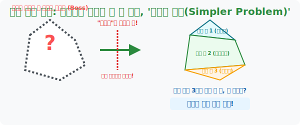

# 6. 보스 몬스터 조각내기: 단순화 도끼질, '간단히 하여 풀기 (Solve a Simpler Problem)'

## [도입부] 학습 목표 (Learning Objectives)
- 한눈에 파악할 수 없을 만큼 거대하고 복잡하게 뒤엉킨 킬러 문항 몬스터를 만났을 때, 겁먹지 않고 문제의 볼륨을 내가 아는 수준의 미니 조각으로 쪼개서 각개격파하는 **'문제 단순화(Decomposition)'** 전략을 익힙니다.
- 기괴한 5각형의 넓이 도출법이나 소수점이 100개 붙어있는 미친 계산을 마주했을 때, 쉬운 도형이나 1의 자리 계산으로 다운사이징 렌더링 하는 스킬을 습득합니다.
- 파이썬(Python)의 핵심 아키텍처 중 하나이자 메가톤급 시스템을 레벨 1짜리 잘게 쪼개진 단위 함수(Function) 들의 연합 조립으로 풀어내는 "Divide and Conquer (분할 정복)" 로직을 경험합니다.

---

## 1. 겁먹지 마라, 수학은 조립식 블록일 뿐이다!

시험지 마지막 페이지에서 "생전 처음 보는 기괴하게 찌그러진 오각형" 의 넓이를 구하라는 킬러 문항을 마주쳤습니다. 머릿속엔 오각형의 넓이를 구하는 공식 따위는 없습니다. 순간 패닉이 오고 백기를 듭니다.

하지만 고수들은 빙그레 웃으며 상상 속의 가위(가상 선분)를 꺼내 듭니다. 
"오각형 넓이 공식은 나도 몰라! 하지만 오각형 한가운데 평행선을 쓱쓱 두 번만 그어버리면? 어, 내가 아는 **[쉬운 삼각형 3개]** 로 갈기갈기 찢어지잖아?"

이것이 여섯 번째 필살기 **[간단히 하여 풀기]** 입니다. 한 방에 먹으려 들면 체하지만, 문제를 삼키기 좋은 미니 조각 사이즈로 칼질(Decomposition) 하여 **내가 아는 만만한 기초 공식들의 합**으로 치환해 버리는 무서운 마술 도끼입니다.



<br>

## 2. 계산기 마비 해킹: 100제곱의 일의 자리

극단적인 숫자로 멘탈을 붕괴시키는 함정 문제의 예시입니다.
> **문제**: "$3$을 100번 곱한 숫자(즉, $3^{100}$) 의 맨 마지막 1의 자리 숫자는 무엇일까요?"

계산기로 쳐도 화면 창 폭발 오류가 나는 천문학적인 우주 레벨 스케일의 괴물 숫자입니다. 이걸 진짜 100번 다 곱하실 겁니까? 문제를 **어린이 수준(단순화)** 으로 확 줄여 봅시다. 일단 무식하게 1승, 2승, 3승... 한 자릿수까지만 패턴이 터질 때까지만 몰래 훔쳐보는 겁니다.

* $3^1 = 3$ (1의 자리는 **3**)
* $3^2 = 9$ (1의 자리는 **9**)
* $3^3 = 27$ (1의 자리는 **7**)
* $3^4 = 81$ (1의 자리는 **1**)
* $3^5 = 243$ (다시 1의 자리가 **3** 으로 돌아왔다!!)

보이십니까? $3^{100}$ 이라는 무시무시한 보스 몬스터가 10초 만에 분석되었습니다. 끝자리 숫자는 **[ 3, 9, 7, 1 ]** 이라는 4단계 콤보가 무한 반복 루프를 도는 하찮은 장난감이었습니다.
100제곱이니, 이 4개의 콤보 굴레를 정확히 25바퀴( $100 \div 4 = 25$ ) 회전하고 끝나겠네요. 
$\rightarrow$ "따라서 $3^{100}$ 의 마지막 숫자는 4콤보의 마지막 순서인 **[1]** 이 백 퍼센트 확실합니다!"

---

## 3. 💻 파이썬(Python) 분할 정복(Divide and Conquer) 함수 조립기

거대한 프로그램을 짜는 구글 엔지니어들도 1억 줄의 코드를 한 번에 타자 치지 못합니다. 
복잡한 수식을 거대한 덩어리가 아니라 `def (함수)` 기능으로 1) 삼각형 넓이 구하는 코딱지만 한 함수, 2) 사각형 넓이 구하는 꼬마 함수로 쪼개놓고, 마지막에 이걸 합채 시키는 **'Divide and Conquer (분할 정복)'** 구조야말로 폴리아 전략의 파이썬식 구현체입니다.

### 🐍 파이썬 예제: 거대 다각형 면적을 미니 함수(Function) 로 분열 조립

```python
print("--- ⚔️ 분할 정복 엔진: 기괴한 괴물 다각형 해체 및 넓이 연산 ---")

# 보스로 등장한 이상한 5각형의 넓이를 구하라? 공식 따위 모른다.
# [방어 전략]: 내가 아는 단위(Unit)인 [삼각형] 2개와 [사다리꼴] 1개로 도끼로 쪼갰다고 상상하자.

# 1. 쪼개진 단위 몬스터1 (삼각형) 이격 처리 함수
def get_triangle_area(base, height):
    return 0.5 * base * height

# 2. 쪼개진 단위 몬스터2 (사다리꼴) 이격 처리 함수
def get_trapezoid_area(base_top, base_bottom, height):
    return 0.5 * (base_top + base_bottom) * height

print(" [System] ⚠️ 보스몹 다각형 출현!! 형태를 알 수 없습니다.")
print(" [System] 🪓 분할 도끼 발동! 다각형을 3조각으로 갈갈이 찢었습니다.")

# 조각 1번 (삼각형 부분 넓이 산출)
part1_area = get_triangle_area(base=10, height=5)
print(f"   -> 1번 꼬마 조각 (삼각형) 넓이 해킹: {part1_area}")

# 조각 2번 (사다리꼴 부분 넓이 산출)
part2_area = get_trapezoid_area(base_top=8, base_bottom=10, height=4)
print(f"   -> 2번 꼬마 조각 (사다리꼴) 넓이 해킹: {part2_area}")

# 조각 3번 (또 다른 삼각형 면적 역산)
part3_area = get_triangle_area(base=8, height=3)
print(f"   -> 3번 꼬마 조각 (삼각형2) 넓이 해킹: {part3_area}")

# 마지막: 쪼개진 3개의 꼬마 단위 파편들을 합집합(Sum) 으로 융합!
boss_total_area = part1_area + part2_area + part3_area

print("-" * 50)
print(f" 💣 [공략 완료] 3조각의 단순 합체 렌더링으로 거대 다각형의 총 면적을 뽑아냈습니다!")
print(f"    ▶ 보스 다각형의 절대 면적: {boss_total_area} 제곱 픽셀")

# 결과창:
# --- ⚔️ 분할 정복 엔진: 기괴한 괴물 다각형 해체 및 넓이 연산 ---
#  [System] ⚠️ 보스몹 다각형 출현!! 형태를 알 수 없습니다.
#  [System] 🪓 분할 도끼 발동! 다각형을 3조각으로 갈갈이 찢었습니다.
#    -> 1번 꼬마 조각 (삼각형) 넓이 해킹: 25.0
#    -> 2번 꼬마 조각 (사다리꼴) 넓이 해킹: 36.0
#    -> 3번 꼬마 조각 (삼각형2) 넓이 해킹: 12.0
# --------------------------------------------------
#  💣 [공략 완료] 3조각의 단순 합체 렌더링으로 거대 다각형의 총 면적을 뽑아냈습니다!
#     ▶ 보스 다각형의 절대 면적: 73.0 제곱 픽셀
```

절대적인 한방 킬러 공식(오각형 넓이 구하기)을 만들려고 머리를 쥐어뜯지 않고, 가장 기초적인 `삼각형_구하기()`, `사다리꼴_구하기()` 라는 레고 블록 단위의 **심플한 파이썬 모듈(Module)** 들을 이어 붙이는 것만으로 그 어떤 복잡한 아키텍처도 무너뜨릴 수 있다는 철학입니다.

---

## [결론] 학습 정리 (Summary)

1. **덩치에 압도되지 마라**: 100제곱, 1000번째 나열, 외계인처럼 생긴 입체도형 문제의 겉포장지는 수험생의 멘탈을 도발하기 위한 속임수일 뿐입니다.
2. **다운사이징 (Down-Sizing)**: 문제의 구조를 깨뜨리지 않는 선에서 숫자 100개를 "1, 2, 3" 3개 스케일로 확연히 줄여서 (단순화하여) 모델링 해보는 용기가 필요합니다. 내가 아는 수준의 미니 게임에서 터지는 실마리가 곧 보스의 약점 패턴과 일치합니다.
3. **알고리즘 분할 사상**: 해결할 수 없는 거대 버그를 만나면, 전체를 고치려 들지 말고 시스템을 작은 A부품, B부품 단위로 분해해서 따로따로 고친 뒤 나사로 다시 합체시키는 역설 엔지니어의 자세입니다.
