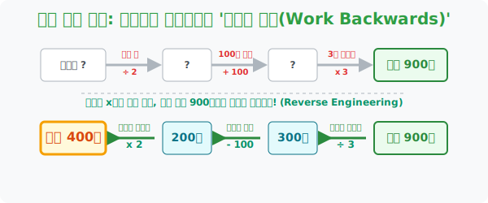

# 7. 타임머신 역추적: 결과로 원인을 파헤치는 '거꾸로 풀기 (Work Backwards)'

## [도입부] 학습 목표 (Learning Objectives)
- 사건의 결말(최종 결과값) 이 이미 노출된 상황에서 억지로 미지수 $X$ 를 세워 정방향으로 연산하려는 고집을 버리고, 시간을 거슬러 반대로 연산하는 **'거꾸로 풀기(Reverse Engineering)'** 전략을 익힙니다.
- "어떤 수에서 5를 빼고, 3을 곱했더니 15가 되었다" 같은 초등 연산 함정에서 $+$, $-$, $\times$, $\div$ 의 이항 원리가 왜 탄생했는지 본질을 깨닫습니다.
- 파이썬(Python)의 리스트 조작(`reversed()`, `.pop()`) 이나 스택(Stack) 후입선출(LIFO) 자료구조를 활용하여, 실행된 연산의 역순(Undo)을 코드가 어떻게 메모리에서 추적하는지 체험합니다.

---

## 1. 리버스 엔지니어링 (Reverse Engineering) 의 세계

컴퓨터 해커들이 남이 만든 게임이나 프로그램을 해킹할 때 치는 가장 첫 번째 장난이 바로 리버스 엔지니어링, 일명 **"완성품 뜯어보고 뼈대 역추적하기"** 입니다.
수학에서도 똑같이 적용되는 일곱 번째 폴리아 전략, **[거꾸로 풀기]** 입니다.

> **예시**: "철수가 주머니에 [어떤 돈]을 들고 나갔습니다. 오락실에서 절반을 썼고, 길을 걷다 100원을 주웠으며, 마지막에 친구가 가진 돈을 딱 3배로 불려주어 지갑엔 최종적으로 **900원**이 들어있습니다. 철수가 처음에 들고나온 돈은 얼마일까요?"

모범생의 정방향 멍청한 식 세우기:
"어떤 수를 $X$ 라 하자. $(X \div 2 + 100) \times 3 = 900$... 어휴 분배법칙하고 $X$ 계산하기 귀찮네."

**해커의 거꾸로 풀기 (타임머신 전략)**:
"과거로 돌아가자! 
최종 900원이잖아. 친구가 3배 불려주기 직전엔 얼마였겠어? 거꾸로 $900 \div 3 = 300$원!
100원 줍기 직전엔? 거꾸로 $300 - 100 = 200$원!
오락실에서 절반 쓰기 직전엔? 거꾸로 안 썼다 치면 2배니까 $200 \times 2 = 400$원!"

어떤 수 $X$ 에서 출발하여 곱하기 3을 했다고 수식에 묶여있을 필요가 없습니다. 최종 목적지(900)에 도착한 발자국을 뒤로 걸어가며 뺄셈은 덧셈으로, 곱셈은 나눗셈으로 **역연산(Inverse Operation)** 해버리면 초등학생도 5초 만에 암산으로 최초의 기원(400원) 을 타격할 수 있습니다. 



<br>

## 2. 미로 찾기의 필살기: 출구에서 출발하기

신문 뒷면에 있는 복잡한 미로 찾기를 할 때, 입구에서 출발하면 헛갈리는 갈림길이 너무 많아 백이면 백 막다른 길에 갇힙니다.
하지만 꼼수를 부려 **[도착 지점(Exit)]** 에 펜을 대고 거꾸로 입구를 향해 역진입해 보십시오. 갈림길에서 함정으로 빠지는 곁가지가 모두 차단된 채 오직 1개의 절대 경로(True Path) 만이 모세의 기적처럼 뚫리게 됩니다.

결과가 명확하고 시작이 모호한 모든 문제는 '거꾸로 풀기' 가 진리입니다.

---

## 3. 💻 파이썬(Python) Undo (되돌리기) 스택 엔진 시스템

우리가 문서 작업을 하다 실수했을 때 흔히 누르는 `Ctrl + Z (실행 취소)` 기능이 바로 이 '거꾸로 풀기' 를 컴퓨터가 대신해 주는 것입니다. 파이썬에서는 가장 나중에 들어온 행동 로그를 제일 먼저 거꾸로 꺼내어 상쇄시키는 **스택(Stack) 형 `리스트` 구조**를 통해 이 리버스 엔지니어링을 코딩합니다.

### 🐍 파이썬 예제: 트랜잭션 역추적 (거꾸로 연산하기) 시뮬레이터

```python
print("--- ⏪ 타임머신 역추적 시스템: 거꾸로 풀기 연산 작동 ---")

# 철수의 하루 일과 연산 로그 (순방향으로 겪은 사건들)
# 리스트 요소를 (연산기호, 수치) 형태의 튜플로 기록
events = [
    ("/", 2),     # 절반 씀
    ("+", 100),   # 100원 주움
    ("*", 3)      # 3배 뻥튀기
]

final_money = 900
current_money = final_money

print(f" [초기 상태] 현재 철수의 최종 금액: {current_money}원")
print(" [시스템] 스택 로그를 역순(Reverse) 으로 되감습니다...\n")

# 리스트를 reversed() 해버리면? 가장 최근에 발생한 사건부터 꺼내게 된다! (시간 거스르기)
for operation, value in reversed(events):
    
    # 겪은 사건과 완전히 "정반대(Inverse)" 의 거꾸로 연산을 컴퓨터에 명령한다
    if operation == "*":
        current_money = current_money / value
        print(f" ⏳ 되감기 [곱셈(*{value}) 무효화] -> 거꾸로 나누기(/{value}): {current_money}원")
    elif operation == "+":
        current_money = current_money - value
        print(f" ⏳ 되감기 [덧셈(+{value}) 무효화] -> 거꾸로 빼기(-{value}): {current_money}원")
    elif operation == "/":
        current_money = current_money * value
        print(f" ⏳ 되감기 [나눗셈(/{value}) 무효화] -> 거꾸로 곱하기(*{value}): {current_money}원")

print("\n" + "-" * 50)
print(f" 🎯 [역추적 성공] 타임머신 연산 결과, 처음에 들고 나간 진짜 돈은: {int(current_money)}원")

# 결과창:
# --- ⏪ 타임머신 역추적 시스템: 거꾸로 풀기 연산 작동 ---
#  [초기 상태] 현재 철수의 최종 금액: 900원
#  [시스템] 스택 로그를 역순(Reverse) 으로 되감습니다...
# 
#  ⏳ 되감기 [곱셈(*3) 무효화] -> 거꾸로 나누기(/3): 300.0원
#  ⏳ 되감기 [덧셈(+100) 무효화] -> 거꾸로 빼기(-100): 200.0원
#  ⏳ 되감기 [나눗셈(/2) 무효화] -> 거꾸로 곱하기(*2): 400.0원
# 
# --------------------------------------------------
#  🎯 [역추적 성공] 타임머신 연산 결과, 처음에 들고 나간 진짜 돈은: 400원
```

수학의 등식 성질(양변에 같은 수를 더하거나 뺀다) 역시 이항이라는 귀찮은 암기가 아니라, **"넘어갔으니 원래 상태로 되돌리기 위해 거꾸로(반대 기능을 하는) 폭탄을 떨어뜨린다"** 는 논리적 직관의 산물입니다.

---

## [결론] 학습 정리 (Summary)

1. **시간 화살표 비틀기**: 항상 문제의 맨 첫 문장($X$) 부터 출발하여 마지막 결론까지 흘러가야 한다는 고정관념을 파괴하세요. 이미 결론 단서가 넘친다면 끝에서 시작점으로 헤엄치는 것이 100배 쉽습니다.
2. **이항 사상의 근원**: 중학생이 되어 $+5$ 를 방정식 우변으로 넘기면 $-5$ 가 된다고 외우는 이항 논리의 근본 원리가 바로 결과에서 원인 쪽으로 타임 리프를 타느라 성질이 정반대로 꺾이는 현상입니다.
3. **디버깅 1원칙**: 내가 코딩한 결과물이 에러(900 출력 오류) 가 났을 때, 코드 1째줄부터 읽는 개발자는 없습니다. 결과 에러가 뿜어진 가장 밑바닥 라인부터 한 줄씩 위로 거슬러 오르는 스킬이 실무입니다.
