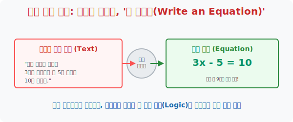

# 8. 최종 진화형 번역기: 일상어를 컴퓨터 모국어로, '식 세우기(Write Equation)'

## [도입부] 학습 목표 (Learning Objectives)
- 앞선 7가지의 다채로운 전략(그림, 표, 찍기 등) 을 거쳐 문제의 뼈대를 간파했다면, 이제 가장 정제된 학문적 압축기인 **'방정식(Equation) 세우기'** 를 통해 문제를 해치우는 논리적 완결성을 확보합니다.
- 식을 세운다는 것은 "구하고 싶은 불확실한 대상에 $x$ 라는 미지수 이름표(도메인) 를 부착한 뒤, 한국어를 숫자와 기호라는 글로벌 언어로 번역하는 행위" 임을 증명합니다.
- 파이썬(Python)의 핵심 기능인 `SymPy(심파이)` 모듈 내장 대수학(Algebra) 기능을 활용하여, 인간이 번역해 낸 식($3x - 5 = 10$) 만 던져주면 컴퓨터가 알아서 $x$ 값을 해체 및 도출해 내는 마법을 감상합니다.

---

## 1. 최후에 꺼내는 성검, 방정식(Equation) 

학교에서는 여러분에게 "자, 무조건 $x$ 놓고 식부터 세워!" 라고 억압했습니다. 하지만 폴리아 할아버지는 식 세우기를 앞의 7가지 전략보다도 뒤인 맨 나중에 8번째로 가르칩니다.
**"문제를 그림을 그리고 쪼개어 이해하지도 못한 상태에서, 무턱대고 세우는 식은 암호와 다를 바 없는 독이 든 성배입니다."**

모든 과정을 거쳐 문제의 생리가 머릿속에 투명하게 그려졌다면 굳이 주먹 구구식 거꾸로 풀기나 표를 그리지 않아도 됩니다. 

* 한국어: "어떤 모르는 숫자를 세 배로 불린 뒤에 거기서 5를 뺐더니, 딱 10이 나오더라." 
* 수학 번역기 작동: "모르는 숫자? 변수 $x$ 창설. 세 배? $3x$. 5를 빼? $3x - 5$. 결과가 10? $= 10$."

단 24개의 글자와 띄어쓰기로 이루어진 한국어 텍스트 문장이, 수학이라는 만국 공통어 **[$3x - 5 = 10$]** 단 9글자의 심플한 뼈대 코드로 완벽하게 컴파일(Compile) 되었습니다. 이것이 방정식을 다룰 줄 아는 자가 얻는 압도적 지능의 우위입니다.



<br>

## 2. 식별과 네이밍(Naming)의 파워

프로그래머들이 꼽는 가장 어려운 개발 업무 1위가 무엇인지 아십니까? 버그 고치기? 아닙니다. 바로 **[변수 이름 짓기]** 입니다.
수학에서 "구하고자 하는 것을 미지수 $x$ 라 두자!" 라고 외치는 행위는, 무형의 개념 정보에 데이터 접근 권한을 부여하는 가장 거룩한 '네이밍' 의식입니다.
- 연속하는 세 숫자 문제? $\rightarrow$ "$x-1, x, x+1$ 로 이름표를 붙이자!"
- 나이 차이가 3살 나는 형제? $\rightarrow$ "동생을 $x$, 형을 $x+3$ 으로 매핑하자!"

변수(Variable) 설정이 끝나는 순간 식 세우기 퀘스트의 80% 가 종료됩니다. 나머지는 $=$ 기호를 센터에 두고 양팔 저울의 균형을 맞추듯 한국어를 기호로 치환하는 노동일 뿐입니다.

---

## 3. 💻 파이썬(Python)의 대수학(Algebra) 연산자

만약 완벽하게 번역을 마쳐서 훌륭한 식 [$2x + 7 = 3x - 1$] 을 세웠다 한들, 학생 본인의 손 조작(사칙연산) 능력이 딸려서 $x$ 값을 구하다 틀리면 얼마나 억울하겠습니까?
파이썬 머신은 식(Equation) 만 던져주면, 이항을 하든 나누기를 하든 1초 만에 깔끔한 $x$ 해답(Root) 을 뱉어냅니다. 우리에게 필요한 건 컴퓨터에게 넘겨줄 "완벽한 식을 세우는 능력" 뿐입니다.

### 🐍 파이썬 `SymPy` 예제: 인간은 식만 세워라, 계산은 컴퓨터가 한다!

```python
import sympy as sp

print("--- 🤖 인공지능 방정식 풀이 엔진: Sympy 작동 ---")

# 1. 미지수 X 의 창조 (네이밍 선언)
# "컴퓨터야, 지금부터 x 라는 건 그냥 영어 알파벳 문자가 아니라 미지수 기호(Symbol)란다."
x = sp.Symbol('x')

# 2. 인간의 한국어 -> 수학 식 번역
# 문제: "나의 모르는 돈(x) 에 3을 곱하고 5를 뺀 값이 10 이랑 똑같다."
# (주의: 파이썬의 SymPy 에서는 방정식의 양변이 같다는 기호로 sp.Eq 를 씁니다)
my_equation = sp.Eq(3 * x - 5, 10)

print(f" [인간의 번역 결과] 세워진 방정식 뼈대: {my_equation}")
print("   -> 컴퓨터에게 이 방정식 타래를 풀라고 명령합니다...\n")

# 3. 컴퓨터의 연산 렌더링 (solve 함수)
# 파이썬아, 이 방정식(my_equation) 을 미지수 x 에 대해서 풀어(solve) 줘!
answer = sp.solve(my_equation, x)

print("-" * 50)
print(f" 🎯 [컴퓨터 연산 완료] 미지수 x 의 정답은: {answer[0]}")

# 결과창:
# --- 🤖 인공지능 방정식 풀이 엔진: Sympy 작동 ---
#  [인간의 번역 결과] 세워진 방정식 뼈대: Eq(3*x - 5, 10)
#    -> 컴퓨터에게 이 방정식 타래를 풀라고 명령합니다...
# 
# --------------------------------------------------
#  🎯 [컴퓨터 연산 완료] 미지수 x 의 정답은: 5
```

이 압도적인 코드는 미래 시대 수학이 가야 할 이정표를 제시합니다.
"덧셈, 뺄셈, 이항 연산하는 기계적인 암기 계산력은 컴퓨터(AI)에 맡기십시오. 인간 여러분은 문장을 읽고 **[어떤 변수에 $x$ 를 할당하여, 식을 어떻게 디자인할 것인가]** 라는 프로그래머의 관점만 마스터하면 됩니다."

---

## [결론] 학습 정리 (Summary)

1. **최고위 압축 파일 (.zip)**: 텍스트 1,000자를 단어 5개의 조합($2x=10$) 으로 압축시켜 내는 식 세우기야말로 수학이 가진 언어적 효율성의 끝판왕입니다.
2. **미지수 $x$ 창조의 위대함**: $x$는 정답을 모른다는 뜻이 아닙니다. 모르는 자리에 들어갈 빈센트 박스(메모리 공간)를 미리 예약해 두고, 이 박스가 우주에 존재하는 모든 숫자들과 어떻게 연산 결합을 맺는지 권한을 부여하는 행위입니다.
3. **인간과 기계의 분업**: 미래에는 식을 세울 줄 아는 인간이 지배자가 되고, 세워진 식을 죽도록 푸는 노예 역할은 컴퓨터의 CPU 가 대체하게 될 것입니다.
