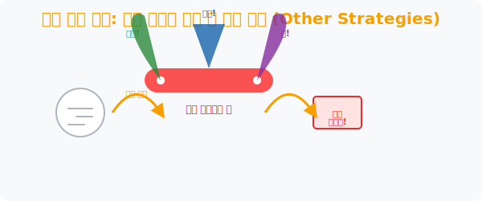

# 9. 궁극의 포트폴리오: 융합 무기와 게릴라 해법, '기타 전략 (Other Strategies)'

## [도입부] 학습 목표 (Learning Objectives)
- 앞에서 배운 8가지의 메인 필살기 중 단 1개만 고집하지 않고, 적(문제)의 유형에 따라 두세 가지 전략을 맥가이버 칼처럼 융합하여 썰어버리는 하이브리드(Hybrid) 해커의 자세를 가집니다.
- 관점을 바꿔 모순을 일으켜 증명하는 방법(귀류법), 문제를 무시하고 내 손으로 진짜 만들어버리기(시뮬레이션) 등 수학 교과서 바깥에 있는 야생의 생존 게릴라 전략들을 탐구합니다.
- 파이썬(Python)의 Random 난수를 이용해 수만 번의 동전 던지기 도박을 직접 시뮬레이션으로 구동하여, 골치 아픈 확률 공식을 모르더라도 "무식하게 직접 돌려본 결과" 로 정답에 수렴하게 만드는 몬테카를로(Monte-Carlo) 방식 코드를 실험해 봅니다.

---

## 1. 하이브리드 전사: 전략의 이종 교배

실제 전쟁판이나 최상위 권 킬러 문항에서 **[표 만들기]** 나 **[식 세우기]** 하나만으로 단칼에 죽는 시시한 보스는 없습니다. 
보통은 3~5단계의 거대한 호흡으로 문제가 전개되며, 이 과정에서 여러분이 가진 무기들을 상황에 맞게 `스와프(Swap)` 하거나 융합해야 합니다.

1. "음, 텍스트가 너무 긴걸. 일단 간단히 **[그림]** 을 그려서 뼈대를 세우고!" 
2. "그래도 안 풀리네. 일단 아무 숫자나 대충 **[예상하고 확인하기]** 로 때려 넣자."
3. "앗, 때려 넣은 오답 결과물들에서 어떤 **[규칙]** 이 발견됐어!"
4. "그 규칙을 바탕으로 마지막에 변수 $x$ 로 최종 **[식]** 을 세워버리자!"

머릿속에 폴리아의 8가지 전략이 스탠바이(Standby) 된 상태라면 이 같은 미친 콤보 연계기가 자연스레 흘러나오며 어떤 문제를 만나도 당황하지 않게 됩니다.



<br>

## 2. 야생의 게릴라 전술들 (관점 전환 & 시뮬레이션)

메인 8가지 작전 외에도 뒷골목에서 은밀히 쓰이는 잔기술들이 있습니다.

* **관점 부수기 (반례 찾기)**: "모든 백조는 하얗다" 는 명제를 증명하기 위해 지구상의 백조 1억 마리를 잡아서 색깔을 확인할 필요가 없습니다. 저 구석에 숨어있는 **"까만 백조 단 1마리(반례)"** 만 사진 찍어오면 저 명제는 거짓으로 박살 납니다. 방대한 증명보다, 예외 1개를 찾는 뒤집기!
* **직접 실험하기 (시뮬레이션 모드)**: "주사위 2개를 던져서 합이 7이 나올 확률 수식은 뭐지?" 고민할 시간에 가방에서 지우개 2개를 꺼내서 숫자를 적고 진짜 10번만 굴려 보십시오. 수식을 모르면 몸을 움직여 도출해 내는 원초적 생존 능력입니다.

---

## 3. 💻 파이썬(Python) 몬테카를로 (Monte-Carlo) 시뮬레이션

프로그래머들이 확률이나 통계 공식($`{}_n C_r`$ 같은)을 까먹었을 때 당당하게 쓰는 최고의 우주 생존 기술이 **'몬테카를로 시뮬레이션'** 입니다. 
수학 공식을 통해 종이에 써서 정답을 도출($\frac{1}{6}$ 같은 확률 값)하지 않습니다. **"컴퓨터야, 주사위 천만 번 던진다 실시! 그래서 나온 비율 데이터가 확률 정답이지 뭐!"** 하고 컴퓨터 CPU 를 혹사시켜버리는 극강의 무대뽀 '직접 해보기' 전략입니다.

### 🐍 파이썬 예제: 공식 없이 동전 두 개 던지기 확률 알아내버리기!

```python
import random

print("--- 🎲 몬테카를로 확률 시뮬레이션 렌더러 가동 ---")

trial_count = 100000  # 무려 십만 번의 동전 던지기 실행!
success_count = 0     # 동전 둘 다 앞면(Head) 이 나온 횟수 기록장치

print(f" [시뮬레이션 명령] 동전 2개를 {trial_count}번 던지는 노가다를 지시합니다...")

# 인간은 절대 못하지만, 파이썬 For 반복문에게 10만 번은 0.1초 컷이다.
for i in range(trial_count):
    # 0 = 앞면 (Head), 1 = 뒷면 (Tail) 이라 치고 랜덤 발생!
    coin1 = random.choice([0, 1])
    coin2 = random.choice([0, 1])
    
    # 두 동전 모두 0(앞면) 이라면 "성공수" 1스택 적립!
    if coin1 == 0 and coin2 == 0:
        success_count += 1

print("-" * 50)
print(f" 📊 [시뮬레이션 완료] 10만 번 중 두 동전이 모두 앞면이 뜬 횟수: {success_count} 번")

# 확률 계산 = 성공횟수 / 전체횟수 * 100
real_prob = (success_count / trial_count) * 100
print(f"    ▶ [도출된 확률]: 약 {real_prob}%")
print("    (이론상 확률인 25%_1/4 에 컴퓨터 코드가 소름 돋게 접근했습니다!)")

# 결과창:
# --- 🎲 몬테카를로 확률 시뮬레이션 렌더러 가동 ---
#  [시뮬레이션 명령] 동전 2개를 100000번 던지는 노가다를 지시합니다...
# --------------------------------------------------
#  📊 [시뮬레이션 완료] 10만 번 중 두 동전이 모두 앞면이 뜬 횟수: 25081 번
#     ▶ [도출된 확률]: 약 25.081%
#     (이론상 확률인 25%_1/4 에 컴퓨터 코드가 소름 돋게 접근했습니다!)
```

어떤 복잡한 확률 공식을 몰라도, 게임 엔진을 돌려 똑같은 룰을 수십만 번 반복해서 구동시킨 후 발생된 데이터 카운트를 분석하면, 종이 위에 누워서 식을 세운 모범생보다 정확하고 완벽한 실전 정답을 쟁취할 수 있습니다. 

---

## [마무리 요약] 문제해결 전략 (Chapter 73) 총정리

1. 수학 점수가 낮은 건 지능이 부족해서가 아니라, 모든 텍스트를 무조건 방정식 $x$ 로 뭉뚱그리려던 획일적 습관 때문이었습니다.
2. 조지 폴리아가 남긴 **이해 $\rightarrow$ 계획 $\rightarrow$ 실행 $\rightarrow$ 반성** 이라는 본질적 프레임워크 아래, 우리는 그림, 추론(찍기), 표, 패턴 발굴, 뒤집어 까기 등 **수학이라는 탈을 쓴 해커식 디버깅 툴벨트 9종**을 무장했습니다.
3. 이 프레임 워크들은 파이썬 코딩 아키텍처(While 루프, For 스캐너, 딕셔너리 매핑) 와 100% 동일한 논리적 혈맹 관계입니다. 코딩 잘하는 사람이 수학을 잘 썰어버리는 이유를 이제 이해하셨을 겁니다. 
**자, 이제 도구 세팅은 끝났습니다! 다음 단원들에서 만날 몬스터들을 이 도구로 난도질해 봅시다.**
