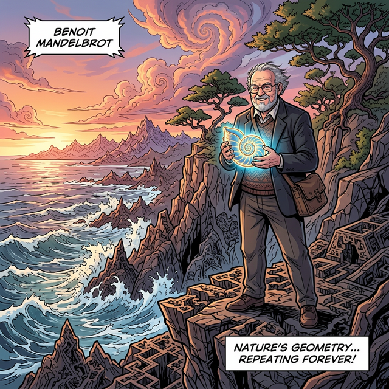

# 00. 도입 - 구름은 구가 아니고, 산은 원뿔이 아니다

인류가 수학을 발명한 이래, 우리는 세상을 모사하기 위해 **유클리드 기하학(Euclidean Geometry)**이라는 완벽한 자와 컴퍼스에 의존해 왔습니다. 유클리드는 별을 원으로, 피라미드를 삼각형으로, 집을 사각형으로 묘사하며 우주를 깔끔한 선과 각도로 쪼개려 했습니다.

하지만 인간이 만든 반듯한 도시를 벗어나 거친 대자연 앞에 섰을 때, 수천 년간 믿어왔던 유클리드의 완벽한 기하학은 순식간에 무너져 내립니다.

---

## 1. 자연을 묘사할 수 없는 수학의 한계

하늘에 떠 있는 뭉게구름을 보십시오. 구름이 컴퍼스로 그린 매끄러운 '구(Sphere)' 모양인가요?
저 멀리 솟아있는 험준한 산맥을 보십시오. 산이 완벽하게 깎인 '원뿔(Cone)' 이나 '삼각형(Triangle)' 인가요? 
나무껍질은 평면이 아니고, 번개는 선분이 아니며, 해안선은 곡선이 아닙니다. 자연의 모든 것은 톱니처럼 거칠고, 무한히 쪼개지며, 예측할 수 없을 만큼 울퉁불퉁합니다. 

기존의 수학은 이 "거칠고 무질서한 자연의 형태" 앞에서는 완전히 침묵할 수밖에 없었습니다. 자연을 그리기엔 유클리드의 자와 컴퍼스는 너무도 '매끄러웠던' 것입니다.

## 2. 브누아 만델브로트 (Benoit Mandelbrot)의 깨달음

1970년대, IBM 연구소에서 일하던 수학자 **브누아 만델브로트**는 슈퍼컴퓨터를 이용해 잡음(Noise)과 통신 에러 데이터를 분석하다가 기괴한 패턴을 하나 발견합니다. 짧은 에러 신호의 모양을 현미경처럼 확대해 보니, 전체 에러 곡선과 똑같이 생긴 모양이 그 작은 곡선 안에 그대로 숨어있었던 것입니다!

그는 당장 컴퓨터 화면을 끄고 밖으로 나가 자연을 현미경 같은 눈으로 새롭게 바라보기 시작했습니다.

  

* **나뭇가지**: 큰 나뭇가지에서 여러 갈래로 작은 가지가 뻗어 나오는데, 그 작은 가지 하나를 똑 부러뜨려 돋보기로 보면 전체 나무의 모습과 소름 돋게 똑같았습니다.
* **해안선**: 영국 서부의 울퉁불퉁한 곶을 하늘에서 인공위성으로 내려다본 모양은, 그 곶에서 주운 1미터짜리 거친 바윗덩어리의 모양과 완벽하게 겹쳐졌습니다.

만델브로트는 드디어 유클리드 기하학을 무너뜨릴 자연의 진정한 기하학, 무한히 반복되는 괴물의 궤적인 **'프랙탈(Fractal)'**을 세상에 선포합니다.

> "구름은 구가 아니고, 산은 원뿔이 아니며,
> 해안선은 원이 아니고, 
> 나무껍질은 밋밋하지 않으며 번개는 직선으로 치지 않는다." 
>  — 브누아 만델브로트 (Benoit Mandelbrot, 1924~2010)

## V3.1 학습 가이드
이 단원에서는 세상 밖으로 나온 '거친 자연의 기하학', 프랙탈의 미친 해상도 메커니즘을 배웁니다. 코흐 눈송이와 시어핀스키 삼각형을 그려내고, 차원이 1도 아니고 2도 아닌 $1.26$차원으로 소수점 분할(Fractional Dimension)되는 충격적인 결과를 계산식을 통해 증명할 것입니다.
무엇보다도 파이썬(Python)의 핵심 논리 중 하나인 **'재귀 함수(Recursion)'**—함수가 자기 자신을 끝없이 호출하는 무한 루프—를 통해 프랙탈이 단순한 그림이 아닌 컴퓨터 프로그래밍 세계의 완벽한 거울상임을 프로그래밍 코드로 직접 확인합니다.
