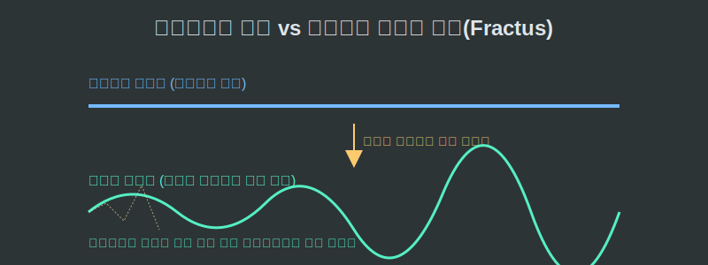
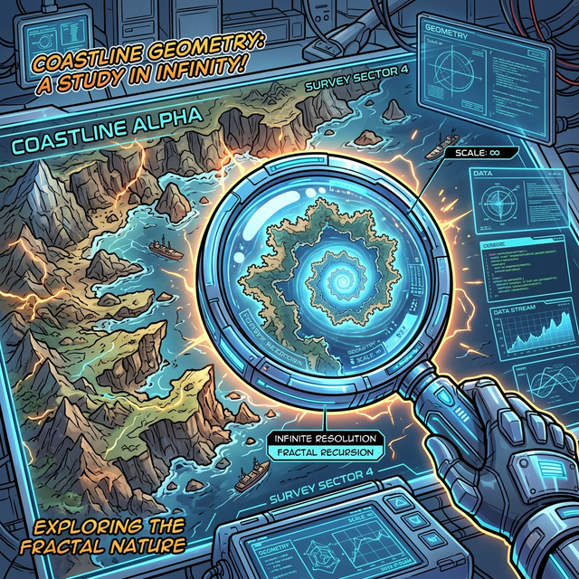

# 01. 첫 번째 수업: 프랙탈이란? (What is a Fractal?)

여러분은 유클리드 기하학의 도형들을 확대(Zoom-in) 해 본 적이 있나요?
컴퓨터 화면에 완벽한 동그라미(원)를 하나 그리고, 가장자리 선을 1,000배 확대해 봅시다. 둥글었던 선은 끝없이 확대할수록 결국 아무 굴곡이 없는 **단순하고 평평한 '직선'**으로 변해버립니다. 유클리드의 세계는 가까이 갈수록 단순해집니다.
그렇다면 프랙탈은 어떨까요?

---

## 학습 목표
* 쪼개다(Fractus)라는 어원을 지닌 '프랙탈(Fractal)'의 기본 개념을 이해합니다.
* 유클리드 기하학과 프랙탈 기하학이 크기(Scale)의 변화에 따라 결정적으로 달라지는 정보량을 비교합니다.
* 컴퓨터 그래픽스(CG)가 어떻게 무한한 해상도의 텍스처를 자연에서 렌더링해내는지 원리를 이해합니다.

## 1. 쪼개진 파편의 기하학: Fractus

**프랙탈(Fractal)**이라는 용어는 라틴어인 **'Fractus'**에서 유래했습니다. 이 단어는 "부서진", "불규칙한", "조각난" 이라는 뜻을 담고 있습니다. 이름 그대로 평범하고 매끄러운 선분이나 면이 무참히 부서져 무한히 많은 톱니나 돌기로 변해가는 괴물 같은 도형들을 지칭하기 위해 만델브로트가 직접 만든 신조어입니다.

<div align="center">
  
</div>

프랙탈 도형의 가장 엄청난 특징은 **'해상도의 무한성'**입니다.
가장 복잡해 보이는 톱니바퀴 같은 돌기를 1,000배 확대해 보아도, 절대 유클리드 기하학처럼 평평한 직선으로 변하지 않습니다. 확대된 구멍 속에서 방금 전과 똑같이 더 복잡한 톱니 요철들이 또다시 끝없이 발견됩니다! 1,000배든 100만 배든, 끝없이 줌아웃을 하든, 프랙탈은 그 무한한 정보의 복잡성을 그대로 유지하는 오싹한 디테일을 보여줍니다.

## 2. 확대(Scale)에 저항하는 정보량

스마트폰 카메라로 아주 낮은 해상도의 강아지 사진을 찍었다고 칩시다. 
이 픽셀 쪼가리를 수압으로 강제 확대하면(유클리드 방식), 사진은 픽셀이 다 깨져서 거대한 네모난 바둑판 모양의 잡음(Noise)만 보일 뿐 아무런 털의 결도 보이지 않게 됩니다. 해상도의 끝을 보았기 때문입니다.

<div align="center">
  
</div>

하지만 프랙탈은 **수학 공식 단 '한 줄'**로 창조된 우주입니다.
단 하나의 수학 공식이 무한정 자기 자신을 반복하는 재귀 계산을 돌고 있기 때문에, 아무리 줌인을 당겨도 파이썬이나 C++ 컴퓨터 엔진이 즉석에서 그 공간을 메꾸는 더 미세한 '잔털'들을 실시간으로 새로 파생시키며 그려냅니다! 이것이 오늘날 마인크래프트나 오픈월드 게임에서 끝없이 산맥과 동굴이 무작위로 생성(Procedural Generation)되더라도 데이터 용량이 폭발하지 않는 핵심 엔진의 비밀입니다. 단지 '산맥을 그려라'라는 프랙탈 방정식 코드 몇 줄이면 충분하니까요.

## 3. 유클리드(정수) vs 프랙탈(실수)

우리가 아는 차원(Dimension)은 이렇습니다:
* 1차원 (선)
* 2차원 (면)
* 3차원 (입체)

이들은 모두 1, 2, 3으로 딱 떨어지는 정수(Integer)의 세계입니다. 
하지만 구불구불한 구름의 테두리나 브로콜리의 잎사귀 표면은 단순한 2차원 평면(종이장)은 아니면서, 그렇다고 속이 꽉 찬 3차원 공(Sphere)도 아닙니다. 평면보다 훨씬 많이 꾸깃꾸깃 접혀 공간을 채우려고 발버둥 치는 어떤 **중간 상태**에 있습니다.

그래서 만델브로트는 프랙탈을 "2.7차원", "1.26차원" 과 같이 **소수점(Float) 차원**을 가진 차원계의 이단아로 규정했습니다! 

```python
# [Python 비교 검증] 정수계 유클리드 스케일링 vs 프랙탈 스케일링의 메모리 사용 원리 비교

print("=== 1. 유클리드 (정적 데이터) ===")
# 해상도 4짜리 단순 선분을 렌더링
euclid_line = [1, 1, 1, 1]
print(f"최초 형태: {euclid_line}")
# 유클리드 줌(Zoom): 억지로 2배 늘렸더니 화질 파괴 발생 (동일한 픽셀 복사)
zoomed_euclid = [1, 1, 1, 1, 1, 1, 1, 1] 
print(f"강제 확대: {zoomed_euclid} -> 화질은 늘지 않고 용량만 2배 차지함.\n")

print("=== 2. 프랙탈 (재귀적 실수 데이터) ===")
def generate_fractal(depth):
    # 단지 깊이(depth) 숫자 하나만 넘겨받았지만, 재귀 함수를 돌면?
    if depth == 0:
        return "___"   # 가장 미세한 기본 형태
    
    # 내 안에서 나침반을 둘로 쪼개어 다시 나를 호출 (디테일 무한 파생!)
    return f"{generate_fractal(depth-1)}/\\{generate_fractal(depth-1)}"

print(f"1단계 확대: {generate_fractal(1)}")
print(f"2단계 확대: {generate_fractal(2)}")
print(f"3단계 확대: {generate_fractal(3)}")
print("결과: 프랙탈은 확대할 때마다 기존에 없던 '새로운 뾰족한 구조(/\\)'를 무한히 실시간 렌더링해버림!")
```

## 학습 정리
1. **프랙탈(Fractal)**: '부서진(Fractus)'이라는 어원을 가지며, 거칠고 쪼개져 무한한 복잡성을 지닌 대자연 특유의 기하학적 형태.
2. **해상도 무한 생성**: 유클리드 도형은 확대를 거듭하면 평평한 곡선(직선)으로 환원되지만, 프랙탈은 끝없이 확대해도 원본과 동일한 극악의 복잡도를 끊임없이 재생산해 낸다.
3. 데이터 생성 컴퓨터 알고리즘 입장에서, 프랙탈 방정식은 적은 메모리(몇 줄의 산식)만으로 끝없이 광활하고 디테일 넘치는 3D 모델(Procedural Generation)을 창조해 낼 수 있는 궁극의 압축 기술이다.
