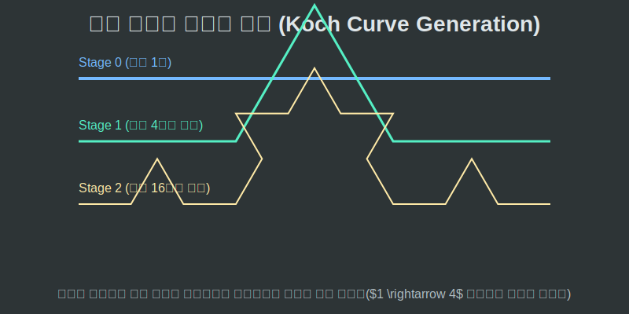

# 03. 세 번째 수업: 코흐의 눈송이와 시어핀스키 삼각형

프랙탈 도형을 머리로만 상상하지 않고 직접 그려내기 시작한 수학자들이 등장합니다. 그들의 이름을 딴 두 개의 위대한 геометри(기하) 괴물, 가장 아름다운 얼음 결정인 **코흐 곡선(Koch Curve)**과 공간을 무섭게 파먹어 들어가는 **시어핀스키 삼각형(Sierpinski Triangle)**을 소개합니다.

---

## 학습 목표
* 선분을 무한히 쪼개어 돌기 모양을 키워가는 '코흐 눈송이'의 생성 루프(Generation Loop)를 파악합니다.
* 면적을 무한히 도려내어 결국 넓이가 0으로 수렴하는 '시어핀스키 텅 빈 삼각형'의 모순을 이해합니다.
* 파이썬의 `turtle` 그래픽 모듈 코드로 코흐의 눈송이를 직접 그려내는 재귀 함수 실행 흐름을 코딩합니다.

## 1. 코흐(Koch)의 눈송이: 무한한 둘레, 유한한 면적

1904년 스웨덴의 수학자 코흐는 직선을 혐오했습니다. 그는 선분을 아주 기괴하게 부러뜨리는 다음과 같은 규칙 하나를 제안했습니다.

> **[코흐 곡선의 단 1가지 규칙]**
> 1. 직선을 3등분 한다.
> 2. 가운데 토막을 지우고, 그 자리에 원래 길이와 똑같은 '정삼각형의 지붕(뾰족한 각)'을 세운다.

* **[세대 0]**: 그냥 평범한 일자 `__` 직선입니다.
* **[세대 1]**: 가운데가 뾰족 솟아오른 `_/\_` 가 됩니다. (길이가 $\frac{4}{3}$ 배로 늘어났습니다!)
* **[세대 2]**: 저 부서진 4개의 선분에 또다시 규칙을 적용합니다. 톱니에 또 작은 톱니들이 생겨납니다.
* **[세대 $\infty$]**: 무한대 세대로 가면? 이 곡선의 둘레 길이는 **진짜로 '무한대($\infty$)'로 길어집니다!** 하지만 넓이는 손바닥만 한 원장을 절대 벗어나지 못합니다. "유한한 면적 안에 갇힌 무한한 선"이라는 프랙탈의 역설이 탄생합니다.

이 코흐 곡선 3개를 이어 붙이면 세상에서 가장 정교하고 뾰족한 눈 결정 모양인 **코흐의 눈송이(Koch Snowflake)**가 완성됩니다.

<div align="center">
  
</div>

## 2. 시어핀스키(Sierpinski) 삼각형: 넓이가 0이 되는 저주

코흐가 선분을 늘려갔다면, 폴란드의 수학자 시어핀스키는 반대로 꽉 찬 면적을 **미친 듯이 파먹어 들어가는** 규칙을 짰습니다.

> **[시어핀스키 삼각형의 단 1가지 규칙]**
> 정삼각형의 정가운데에 뻥 구멍을 뚫는다. (정확히는 4등분 해서 가운데를 잘라내어 버린다)

가운데가 뚫리고 나면 작은 삼각형 3개가 검게 남습니다. 이 작은 3마리에게 저 규칙을 또 적용합니다! 그러면 구멍이 $1 \rightarrow 3 \rightarrow 9 \rightarrow 27 \dots$ 개로 제곱수로 늘어나며 치즈처럼 구멍이 숭숭 뚫립니다.
최종 무한대 단계에 도달하면 선(테두리뼈대)들의 길이는 코흐처럼 무한대로 길어지는데, 잉크가 칠해진 종이의 진짜 **넓이(Area)는 완전히 0으로 소멸**해버리는 무시무시한 괴물이 탄생합니다.

<div align="center">
  
</div>

## 3. Python 거북이(`Turtle`): 코흐 곡선 코딩 공장

놀랍게도 인간은 5세대 이상 코흐 곡선을 손으로 절대 그릴 수 없지만(선이 수백만 개!), 컴퓨터 공학에서는 파이썬의 `turtle` 모델과 **재귀(Recursion)** 루프만 있다면 1초 만에 10만 세대의 프랙탈을 그릴 수 있습니다.

```python
# 파이썬 Turtle(거북이) 라이브러리를 이용한 코흐 곡선 프랙탈 생성기

import turtle

def draw_koch_curve(turtle_pen, length, depth):
    """
    눈송이 한 변을 그리는 프랙탈 재귀 함수.
    depth(세대)가 0이 될 때까지 나 자신 안으로 파고들어 톱니바퀴 4개를 그려냅니다.
    """
    
    # 1. 종료 조건 (Base Case)
    # 0세대가 되면 붓을 멈추고 그냥 '직진'만 한 뒤 빠져나옵니다.
    if depth == 0:
        turtle_pen.forward(length)
        return

    # 2. 다음 세대의 뼈대는 현재 길이의 딱 '3분의 1' 사이즈로 쪼개집니다.
    new_length = length / 3.0
    
    # 3. 마법의 프랙탈 증식 모터 가동! 코흐의 '_/\_' 4단계 분열 로직
    # 첫 번째 토막 그리기
    draw_koch_curve(turtle_pen, new_length, depth - 1)
    
    # 위로 60도 꺾기 (산등성이 올라가기)
    turtle_pen.left(60)
    draw_koch_curve(turtle_pen, new_length, depth - 1)
    
    # 아래로 120도 꺾기 (산등성이 내려가기)
    turtle_pen.right(120)
    draw_koch_curve(turtle_pen, new_length, depth - 1)
    
    # 다시 위로 60도 꺾어 원래 방향 맞추고 마지막 토막 그리기
    turtle_pen.left(60)
    draw_koch_curve(turtle_pen, new_length, depth - 1)

# 제어탑
screen = turtle.Screen()
t = turtle.Turtle()
t.speed(0)  # 최고 속도로 세팅!

# 코흐 곡선 지시: 300픽셀 길이로, 분열 심도 3단계(depth=3) 렌더링 시작!
draw_koch_curve(t, 300, 3)

turtle.done()
```

보이십니까? `draw_koch_curve` 함수 안에서 자기 자신을 무려 $4$번이나 연속으로 호출하고 있습니다! 이것이 유클리드 기하학을 박살 내고, 컴퓨터만이 연산할 수 있었던 자연의 재귀 생성(Procedural Generation) 코드의 결정판입니다.

## 학습 정리
1. **코흐 눈송이(Koch Curve)**: 선분을 $\frac{1}{3}$로 쪼개고 가운데 정삼각형 지붕을 올리는 것을 무한 반복하여, 유한한 손바닥 면적 안에 무한대 길이의 테두리를 욱여넣은 얼음결정 파편.
2. **시어핀스키 삼각형(Sierpinski Triangle)**: 가운데 면적을 무한히 도려내어 테두리는 무한히 뻗어나가지만, 진짜 내부 면적은 $0$이 되어버리는 공허의 삼각형.
3. 인간이 그리는 데 평생이 걸릴 프랙탈 $100$세대를 **파이썬의 절차적 재귀 로직**을 사용하면 $X, Y$ 좌표의 복잡도를 무시하고 단 $20$줄의 조건 분기 코드로 빛의 속도로 렌더링해 낼 수 있다.
