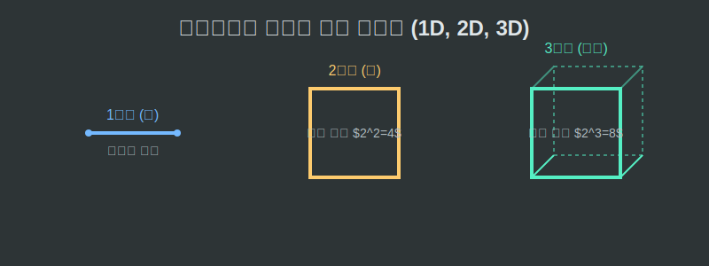

# 04. 네 번째 수업: 차원이 다른, 프랙탈의 차원 계산법

우리는 점을 0차원, 선을 1차원, 정사각형 같은 면을 2차원이라 부르는 세상에 살고 있습니다.
그렇다면 면적이 점점 0으로 사라져 가는 시어핀스키 텅 빈 삼각형은 몇 차원일까요? 선이 끝없이 꼬불꼬불해져서 종이 공간을 미친 듯이 메우려는 코흐 곡선은 1차원 선일까요, 아니면 2차원 면일까요?

---

## 학습 목표
* 1차원, 2차원, 3차원을 가르는 **확장 계수와 등분(쪼개기) 개수의 로그(Log) 공식**을 배웁니다.
* 프랙탈 도형의 차원을 계산하면 절대 딱 떨어지는 정수가 아닌 $1.2618...$ 같은 이상한 소수점 실수(`Float`)로 쪼개진 차원이 도출됨을 확인합니다.
* 차원이 높은 프랙탈일수록 그래픽 엔진에서 더 심하게 화면을 칠해버리는 밀도(Density) 효과를 유발한다는 것을 이해합니다.

## 1. 유클리드의 온전한 차원계 (1, 2, 3)

물체의 길이를 정확히 **절반($\frac{1}{2}$)**으로 축소했다고 칩시다.
* **1차원 공간(직선 선분)**: 1미터짜리 밧줄을 길이가 절반이 되게 자르면? $\rightarrow$ 똑같은 축소 밧줄이 **2개** 만들어집니다. ($2^1 = 2$)
* **2차원 공간(정사각형 종이)**: 가로세로를 각각 절반으로 자르면 십자가 모양으로 잘리며 $\rightarrow$ 똑같은 색종이가 **4개** 만들어집니다. ($2^2 = 4$)
* **3차원 공간(루빅스 큐브 덩어리)**: 가로/세로/높이를 절반으로 자르면 깍두기처럼 $\rightarrow$ 똑같은 축소 블록이 **8개** 만들어집니다. ($2^3 = 8$)

<div align="center">
  
</div>

수학자들은 여기서 아름다운 차원 공식 $D$ (Dimension)를 뽑아냈습니다.
축소 비율을 $r$, 생성된 동일 복제본의 개수를 $N$이라고 할 때:
$$N = r^D$$
이 식에 고등학교 수학인 **로그(Logarithm)**를 씌우면 차원 $D$를 구하는 치트키가 됩니다.
$$D = \frac{\log(N)}{\log(r)}$$

## 2. 괴물의 차원: 소수점으로 깨져버린 차원 (Fractional Dimension)

이제 이 마법의 로그 공식을 무한 루프를 도는 프랙탈 괴물들에게 집어넣어 봅시다.

**[코흐 곡선의 신체검사]**
코흐 곡선은 1개의 선분을 **3등분**으로 축소($r=3$) 시킨 후 가운데를 접어올려 똑같이 생긴 짧은 톱니 뼈대 **4개**($N=4$)를 만들어 냅니다.
* 차원 $D = \frac{\log(4)}{\log(3)} = 1.26185...$ 차원

코흐 곡선은 1차원(단순한 선)보다 뚱뚱합니다! 선이 하도 꼬불꼬불하게 진동해서 1.26차원만큼이나 종이 면적을 공격적으로 차지하며 꿈틀거린다는 뜻입니다.

**[시어핀스키 삼각형의 신체검사]**
색종이를 가로세로 **2등분** 축소($r=2$) 시킵니다. 가운데 구멍 파편을 버리고 났더니 축소된 삼각형 복제본이 **3개**($N=3$) 남습니다.
* 차원 $D = \frac{\log(3)}{\log(2)} = 1.58496...$ 차원

시어핀스키는 2차원(색종이 면)보다는 부실합니다! 0.41차원만큼 구멍이 숭숭 뚫려 공간을 도려먹혔다는 증거입니다.

## 3. Python 차원 분석기: 수학 라이브러리 `math.log()`

컴퓨터 과학과 AI 분야에서 어떤 자연 데이터 사진이 들어왔을 때, 컴퓨터는 이 사진의 복잡도를 이 '로그 차원' 공식으로 스캐닝하여 분류합니다. (예: 폐암 엑스레이 혈관 사진이 1.7차원 이상으로 복잡해지면 암세포 종양 증식으로 판별)

```python
# 파이썬 수학 라이브러리를 동원한 프랙탈 차원(Dimension) 계산기

import math

def calculate_fractal_dimension(split_ratio, clone_pieces):
    """
    확대/축소 비율(r)과 그때 튀어나오는 복제본 개수(N)를 입력받아 
    이 기괴한 도형이 우주에서 몇 차원(Float 차원)을 차지하는 밀도인지 판별합니다.
    """
    
    # 파이썬 마법의 함수 math.log()
    dimension = math.log(clone_pieces) / math.log(split_ratio)
    
    return dimension

print("=== 프랙탈 차원 스캐너 가동 ===")

# 테스트 1: 코흐 곡선 (3배 축소했을 때 조각이 4개 튀어나옴)
koch_dim = calculate_fractal_dimension(3, 4)
print(f"❄️ 자기를 4번 부수며 증식하는 코흐(Koch)의 차원: {koch_dim:.4f} D (1차원 선보다 뚱뚱함)")

# 테스트 2: 멩거 스폰지 (3D 큐브 프랙탈. 3배 축소시 조각이 20개 남음)
menger_dim = calculate_fractal_dimension(3, 20)
print(f"🧽 가운데가 텅 빈 무한 큐브, 멩거 스폰지의 차원: {menger_dim:.4f} D (3차원보다 가벼움)")
```

파이썬의 `math.log()` 소수점 실수(`Float`) 연산을 통해 우리는 인류가 오랫동안 믿어왔던 "$1, 2, 3$ 정수 차원"의 고정관념을 박살 내고, 자연 만물이 그 형태의 복잡도(방정식 해상도)에 따라 $1.2$차원, $2.7$차원 등 실수 형태의 부피와 질량을 가지고 렌더링 됨을 확인할 수 있습니다.

## 학습 정리
1. **차원의 공식 식별**: 축소 분할의 비율을 밑(Base)으로, 튀어나온 복제 형상의 개수를 진수(Argument)로 씌워버린 마법의 비율 로직 $\frac{\log(N)}{\log(r)}$ 이 차원 계수기이다.
2. **Fractal Dimension (조각난 실수 차원)**: 코흐 곡선은 1.26차원, 시어핀스키는 1.58차원. 1차원 선도 아니고 2차원 평면도 아닌 그 중간 생태계 어딘가를 채우고 있는 징그러운 정보량의 중간 지대들.
3. 파이썬 **`math.log()` 라이브러리**는 이 차원 계산을 단 한 줄의 `float` 반환값으로 산출해 버리며, 딥러닝에서 의료 영상 혈관의 암세포 프랙탈 증식 여부를 판독하는 알고리즘의 뼈대가 되기도 한다.
