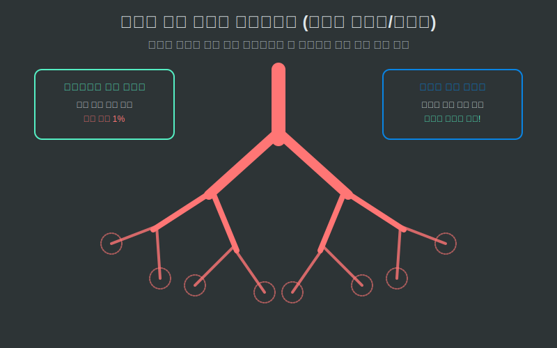
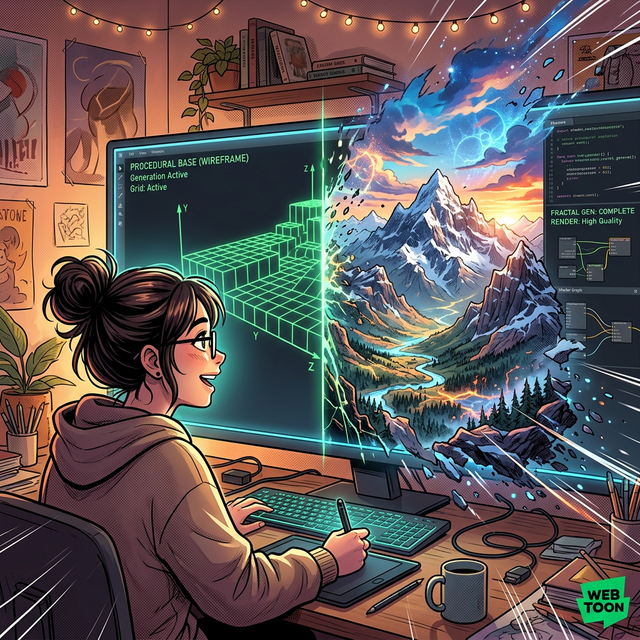

# 05. 다섯 번째 수업: 자연 속 기하학의 승리 (Fractals in Nature)

자연은 컴퓨터도 딥러닝 엔진도 없던 수억 년 전부터 프랙탈 기하학의 위대함을 피와 살로 증명해 낸 천재 엔지니어입니다. 우리는 왜 우리 몸속 장기와 잎사귀, 우주의 은하계가 저 수식같이 자기 유사성(재귀 패턴)을 띠고 진화할 수밖에 없었는지 마지막으로 조망해 봅니다.

---

## 학습 목표
* 뇌의 주름, 인간의 폐혈관, 소장 융모가 왜 유클리드 원형 파이프가 아닌 무한 프랙탈 분열을 선택했는지 **'표면적의 극한 최적화'** 원리로 깨우칩니다.
* 컴퓨터 그래픽스 모델러들이 어떻게 이 자연의 프랙탈 방식을 흡수하여 오픈월드 무작위 생성(Procedural Generation) 맵을 만들어 냈는지 확인합니다.

## 1. 생존을 위한 최고의 파이프라인: 흡수 효율성 극대화

인간의 가슴 공간(갈비뼈 내부)은 아주 한정된 좁은 방입니다. 이 좁은 방통 안에 파이프를 박아 넣고 우리가 코로 들이마신 산소를 피 속으로 모조리 흡수시켜야 합니다.

  

만약 유클리드의 매끈하고 예쁜 직립 원통 파이프 $2$개를 폐로 박아넣었다면 어떨까요? 산소는 매끄러운 원통 벽면만 살짝 스치고 내려가므로 접촉하는 표면적(Surface Area)이 치명적으로 부족해 폐활량 부족으로 인간은 달리지도 못하고 멸종했을 것입니다.

자연은 코흐의 눈송이처럼 차원을 $2.7$차원, $2.9$차원 등 거의 고체 직전까지 밀어붙이는 프랙탈 분열을 선택했습니다! 
성대의 굵은 기관지 파이프가 $2$개로 갈라지고, 그것이 가지를 쳐서 얇디얇은 수백만 개의 모세기관지(허파꽈리)로 무한 무한 증식 복제(재귀, Recursion)합니다.
**그 결과 제한된 한 뼘짜리 갈비뼈 부피 안에, 다 펼쳐 펴면 '테니스장만 한 면적(Surface Area)'의 거대한 해상도 텍스처를 구겨 넣는 물리적 혁명이 성공합니다.** 포유류의 뇌 주름(Surface), 소장의 흡수 융모(Villi)도 동일한 프랙탈 방어 시스템의 산물입니다.

## 2. 자연의 무작위 엔진과 3D 절차적 맵 생성 (Procedural Generation)

우리가 하늘을 쳐다볼 때 구름 텍스처가 매일 다르고 수십만 개의 깎아지른 바위산 골짜기를 보는 데 지루하지 않은 이유 역시 프랙탈의 끝없는 잡음(Noise 변위) 덕분입니다. 

  

현대 컴퓨터 게임 제작자(`마인크래프트(Minecraft)`, `노 맨즈 스카이`, 언리얼 엔진 지형 툴 등)들은 이 자연의 프랙탈 공식을 파이썬이나 C++ 수학 모듈로 그대로 복사해 냈습니다.
* **유클리드 노멀 모드 시대**: 과거 게임들은 디자이너가 맵 데이터의 나무와 바위 텍스처를 일일이 손으로 그려서 렌더링했습니다 (CD 용량 $600$MB 꽉 참). 
* **프랙탈 생태계 시대**: 현대 알고리즘은 **"거친 퍼린 노이즈(Perlin Noise) 값을 가진 프랙탈 삼각형 분열 함수를 1,000단계 실행하라 (재귀 루프 가동!)"** 라는 코드 $30$줄만 던져줍니다. 게임을 켤 때마다 그래픽 카드(GPU)는 빛의 속도로 이 재귀 로직을 돌아 즉석에서 한 번도 본 적 없는 행성 크기의 무한 해상도 바위산과 해안선을 자동으로 부수어가며 렌더링해 냅니다. 메모리 용량은 단 몇 KB면 충분합니다.

## 3. Module 06 최종 정리 

자연은 직각과 원을 그리지 않습니다. 대자연은 오직 **가장 효율적인 무한 데이터 압축 기술, 프랙탈 방정식**으로 세상을 렌더링하고 있을 뿐입니다.

* [01. 프랙탈] **무한한 텍스처 해상도**: 아무리 확대하고 줌 인을 외쳐도 매끈해지는 선분이 아닌 끊임없이 톱니바퀴 디테일 파편을 창조해 내는 괴물 도형 집단.
* [02. 자기 유사성] **파이썬 재귀 함수(`Recursion`)의 원형**: 부분 속에 전체가 똑같이 아로새겨진 유전자 복제 체계. "내 함수 안에서 크기(Scale) 인자파라미터값만 절반($/2$)으로 줄이고 나 자신을 다시 폭발시켜라"라는 무한 루프 코딩 그 자체.
* [03. 코흐와 시어핀스키] **면적 소멸과 둘레 무한팽창**: 파이썬 `turtle` 그래픽이 각도($60^\circ, 120^\circ$)와 분열 축소비(`length/3`)만으로 증명한 유한 공간 속 무한 디테일.
* [04. 소수점 차원] **Dimension = $\log(N)/\log(r)$ 공식**: 정보의 분열 개수와 확장의 뼈대 비율에 로그 함수(파이썬 `math.log`)를 걸면 이 세계가 정수가 아닌 $1.58$차원, $2.7$차원으로 이루어짐을 적발하는 스캐너 기술. 

이것으로 인간이 그린 컴퓨터 수학의 결정판이자, 자연이 창조한 가장 변태적이면서도 아름다운 렌더링 아트, 프랙탈 모듈을 모두 마칩니다. 
