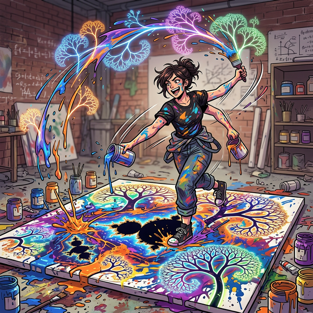
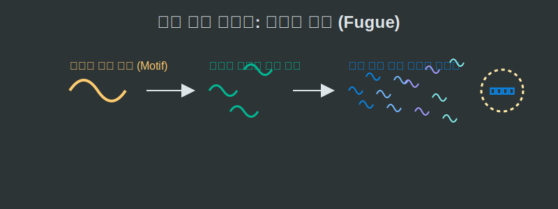

# 06. 여섯 번째 수업: 예술 속의 프랙탈

프랙탈은 단지 딱딱한 수학 공식이나 컴퓨터 그래픽에만 머물지 않습니다. 자연의 거칠고 무한한 형태를 닮아있기 때문에, 본능적으로 자연을 동경하는 인간의 미술과 음악 속에도 프랙탈적인 '자기 유사성'은 깊숙이 스며들어 있습니다.

---

## 학습 목표
* 미술 작품 속에 숨겨진 프랙탈(점묘법, 잭슨 폴록의 드리핑 기법) 패턴을 발견합니다.
* 음악의 구조(바흐의 푸가, 현대 대중음악의 후렴구) 속에서 부분과 전체가 유사한 재귀적 선율을 이해합니다.
* 파이썬을 이용해 무작위(Random) 변수를 섞어 예술적인 프랙탈을 그려내는 프랙탈 아트의 기본 코드를 확인합니다.

## 1. 캔버스 위에 흩뿌려진 자기 유사성

1940년대 추상표현주의의 거장 **잭슨 폴록(Jackson Pollock)**은 붓으로 정교한 그림을 그리는 대신, 거대한 캔버스를 바닥에 눕혀놓고 물감을 흩뿌리는 '액션 페인팅(드리핑 기법)'을 창시했습니다.

<div align="center">
  
</div>

놀랍게도 수십 년 뒤 물리학자들이 폴록의 그림을 컴퓨터로 분석해 보니, 그가 마구잡이로 뿌린 물감 궤적 속에서 완벽한 **프랙탈 차원(1.5 ~ 1.7차원)**이 계산되어 나왔습니다! 

* 그림 전체를 넓게 볼 때 나타나는 물감의 거친 얽힘 패턴이, 그림의 특정 10cm 부분을 돋보기로 확대해 보았을 때 나타나는 미세한 얽힘 패턴과 통계적으로 완전히 똑같았(Self-similar)던 것입니다. 
* 인간의 손이 '자연이 가지는 무작위성과 자기 유사성'의 움직임을 본능적으로 캔버스에 렌더링한 예술적 기적이었습니다.

## 2. 음악 속의 프랙탈 구조 (바흐의 푸가)

눈에 보이는 미술뿐만 아니라, 귀로 듣는 선율에도 프랙탈이 있습니다.
음악의 아버지 요한 제바스티안 바흐(Bach)가 작곡한 **'푸가(Fuga)'** 형식을 들어보면, 하나의 짧고 단순한 기본 멜로디(주제)로 곡이 시작됩니다.

<div align="center">
  
</div>

* 이 짧은 멜로디가 조금 지나면 피치가 한 단계 높아지거나 낮아진 상태로 **다른 악기(성부)에서 똑같이 반복**됩니다.
* 이들이 겹겹이 쌓이면서 곡의 덩치는 거대해지지만, 본질적으로는 "가장 작은 1마디의 멜로디 테마"가 곡 전체의 거대한 흐름을 지배하며 무한 루프처럼 엮여 나가는 구조입니다.
* 현대의 팝송이나 EDM 음악에서도 코러스(후렴구)가 메인 비트 안에서 쪼개지며 끝없이 프랙탈처럼 진동(Looping)하는 방식을 흔히 씁니다.

## 3. Python 캔버스: "프랙탈 아트 (Fractal Art)" 코딩

현대의 미디어 아트 예술가들은 이제 물감 대신 **파이썬 그래픽 처리 코드**를 씁니다. 삼각함수(`sin`, `cos`)와 재귀(`recursion`) 함수에 파이썬의 `random` 라이브러리를 약간 섞어주면, 기계적인 눈송이가 아닌 진짜 살아 숨 쉬는 '나무나 번개' 같은 예술적 프랙탈이 모니터에 터져 나옵니다.

```python
# 파이썬 Turtle(거북이) 라이브러리를 이용한 프랙탈 아트 (Random Tree) 시뮬레이션

import turtle
import random

def draw_artistic_tree(branch_length):
    """
    무작위 확률(Random)을 수학 공식에 주입하여
    자연스럽게 비틀어지는 잭슨 폴록 스타일의 예술적 프랙탈 나무를 그립니다.
    """
    # 1. 뼈대가 너무 작아지면 분열(재귀)을 멈춘다
    if branch_length < 5:
        return

    # 2. 나무 줄기를 그린다
    turtle.forward(branch_length)

    # 3. 우측으로 잔가지를 뻗기 위해 각도를 틀어 뻗어 나간다.
    # 단, 똑같은 각도가 아니라 15도 ~ 30도 사이의 랜덤(Random)한 각도로 비틀어 자연스러움을 준다!
    angle = random.randint(15, 30)
    turtle.right(angle)
    
    # 내 안에서 나침반 스케일(크기)을 줄여서 나 자신을 다시 폭발시킨다 (자기 유사성)
    draw_artistic_tree(branch_length - random.randint(10, 20))

    # 4. 좌측 잔가지도 마찬가지로 랜덤하게 비틀며 분열을 예약한다
    turtle.left(angle * 2)
    draw_artistic_tree(branch_length - random.randint(10, 20))

    # 본래 나뭇가지 위치와 각도로 복귀
    turtle.right(angle)
    turtle.backward(branch_length)

# 예술가 거북이 세팅 및 가동!
turtle.speed(0)
turtle.left(90) # 뿌리가 위를 향하게 세우기
draw_artistic_tree(100) # 길이 100짜리 프랙탈 아트 나무 렌더링 시작!
```

유클리드의 완벽하게 대칭된 수학 방정식에 이처럼 약간의 **통계적 무작위성 잡음(Random Noise)**만 섞어주면, 예술가들은 단독으로 코딩 몇 줄을 써서 아름답고 거친 황야의 고목나무를 캔버스(화면)에 끝없이 대량 생산해낼 수 있습니다.

## 학습 정리
1. **잭슨 폴록의 액션 페인팅**: 무작위로 뿌려진 물감의 궤적 안보이는 곳에, 전체의 패턴이 부분의 패턴과 일치하는 1.5 ~ 1.7차원의 통계적 프랙탈 구조가 코딩되어 있었다.
2. **음악적 프랙탈 (바흐의 푸가)**: 하나의 아주 짧은 오디오 테마(모티프) 파편이 크기와 스케일, 박자만 변형(재귀)된 채 곡 전체를 꽉 채우는 자기 유사성 교향곡.
3. 인간의 예술적 감성은 무의식중에 자연이 수억 년간 채택해 온 '무작위성 프랙탈 (Randomize Fractal)' 패턴을 모방하고 있으며, 오늘날 이는 **Python의 난수(`Random`) 라이브러리와 물리 엔진 배열**을 통해 디지털 아트로 복원되고 있다.
