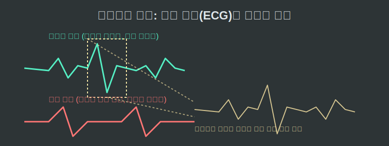
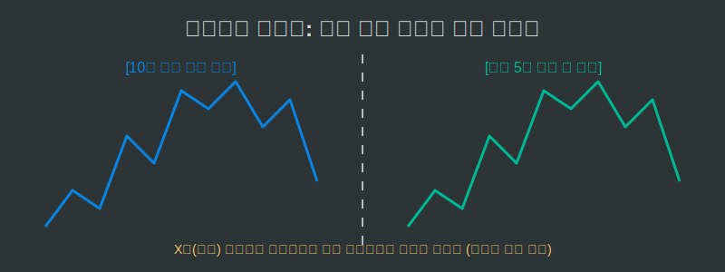

# 07. 일곱 번째 수업: 우리 생활 속의 프랙탈

숲속이나 우주를 넘어, 우리가 발을 딛고 살아가는 시끄러운 도시와 인간의 사회 시스템 속에서도 프랙탈의 불규칙한 '자기 유사성' 괴물들은 숨 쉬고 있습니다. 특히 가장 예측이 불가능하다고 여겨지는 생체 기관의 질병 치료나, 한 치 앞을 알 수 없는 경제 붕괴 현상 속에서도 이 패턴이 튀어나옵니다.

---

## 학습 목표
* 심장박동 그래프, 뇌파, 그리고 주식 시장의 그래프처럼 겉보기에 무작위한 데이터 속에서 나타나는 프랙탈 차원을 파악합니다.
* 파이썬의 데이터 배열(Array Data) 분석 툴을 통해 시계열(Time-Series) 빅데이터 속에 숨은 확대/축소 비율 패러다임을 이해합니다.

## 1. 펄떡이는 생명의 프랙탈: 심전도(ECG) 그래프

## 1. 펄떡이는 생명의 프랙탈: 심전도(ECG) 그래프

병원 중환자실 모니터에서 삐- 삐- 거리는 심장박동 그래프(심전도, ECG)를 본 적 있나요?

<div align="center">
  
</div>

과거 의사들은 건강한 사람의 심박 그래프는 아주 일정한 주기로 반복되는 깔끔한 '정현파(유클리드 파동)' 일 것이라 생각했습니다.
오히려 반대였습니다.

* **건강한 심장**: 건강한 사람의 심박 그래프를 하루(24시간) 크게 볼 때 나타나는 거친 진동 패턴은, 10분 구간을 쪼개서 볼 때의 진동 패턴, 또 1분 구간을 극단적으로 줌인(Zoom-in) 했을 때의 진동 패턴과 기괴할 정도로 똑같은 **통계적 프랙탈 (자기 유사성)**을 보입니다. 자연계의 돌발 상황에 대응하기 위해 심장이 끝없이 잔떨림(Noise)을 가지며 거친 해상도를 유지하는 것입니다.
* **병든 심장**: 반대로 심작 발작이 임박하거나 생명이 위독한 환자의 심박수는 무서우리만치 일정하고 기계적인 '단조로운 파동'으로 변해버립니다. 

유클리드의 매끈함을 거부하고 거칠고 복잡한 프랙탈 공간(해상도)을 몸 안에 지니는 것이 인체의 생존 필수 엔진입니다. 최근 AI 딥러닝 의료 기기는 이 파이썬 배열 그래프 차원을 계산하여 값이 '단순한 정수 차원'에 가까워질수록 환자에게 사망 선고(경보)를 울립니다.

## 2. 돈의 궤적: 주식 시장 그래프의 자기 유사성

만델브로트는 처음에 수학과 거리가 먼 IBM 연구소 직원들과 함께 경제학의 심장 부위, **금값과 면화 가격의 변동 그래프**를 추적하고 있었습니다.

오늘 아침 폭락하는 주식 시장 코스피 그래프(5분 봉)를 캡처해서 프린트해 보겠습니다.
그리고 지난 10년 치 거대한 주식 시장 붕괴 폭락 그래프(월봉)를 캡처해서 프린트합니다.
숫자와 시간축의 단위 텍스트(`x`, `y`축 라벨)를 가려버리고 두 장의 종이를 경제학자에게 보여주면? 놀랍게도 그들은 **어떤 것이 오늘 5분 단타용 그래프고, 어떤 것이 10년 치 일봉 그래프인지 전혀 구별하지 못합니다!**

<div align="center">
  
</div>

인간 수천만 명의 탐욕과 공포가 매 초마다 0과 1의 매수/매도 코드를 쏘아 올리는 자본주의 시장 한복판 역시, 스케일 잣대를 박살 내어 부분과 전체를 똑같이 진동시키는 완벽한 **경제학적 프랙탈** 차원 안에서 렌더링되고 작동하고 있던 것입니다. 

## 3. Python 빅데이터 분석: 시계열 데이터의 프랙탈

파이썬의 인공지능 모듈(예: `Pandas`, `Matplotlib`, `NumPy`)을 쓰면, 만델브로트가 평생 걸려 눈과 수작업으로 찾아냈던 이 면화 가격 차트의 자기 유사성을 단 2초 만에 분석해 냅니다.

```python
# 파이썬 Numpy 배열 데이터를 활용한 프랙탈 주가(Random Walk) 시뮬레이션

import random

def simulate_stock_fractal(days):
    """
    프랙탈 브라운 운동(Fractional Brownian Motion)의 기초.
    과거의 값이 현재에 미세하게 영향을 주는 무작위 잡음을 생성합니다.
    """
    price_trajectory = [100.0]  # 시작가 100달러
    
    for _ in range(days):
        # 주가는 완전히 무작위가 아니라, 어제 가격에 통계적 프랙탈 노이즈(+2% ~ -2%)를 섞어서 계산됨
        noise = random.uniform(-0.02, 0.02)
        next_price = price_trajectory[-1] * (1 + noise)
        price_trajectory.append(round(next_price, 2))
        
    return price_trajectory

# 1년(365일) 짜리 거시적 주가 그래프 데이터 생성
macro_chart = simulate_stock_fractal(365)
print(f"1년 차트 데이터 일부: {macro_chart[:5]} ... {macro_chart[-5:]}")

# 이 코드는 하루(1일)를 다시 365분(초 단위)으로 쪼개어 돌려도, 똑같이 거칠게 요동치는 시계열 차트를 뱉어냅니다!
```

* **허스트 지수(Hurst Exponent)**: 파이썬 모듈이 수만 시계열 데이터(배열 데이터)에 거시적/미시적 윈도우(Window) 사이즈를 옮겨가며 계산하는 프랙탈 척도입니다. 이 데이터의 허스트 값이 $0.5$를 벗어나 요동치면, 이 주식 그래프는 예측 불허의 프랙탈 광기를 띠며 폭발하거나 폭락하는 추세를 가진다고 판명되는 것입니다.

## 학습 정리
1. **생체 신호(심장 박동)의 프랙탈 구조**: 인류의 생존 기계(몸)는 정지 상태에서도 항상 외부 공격에 요동칠 준비를 하기 위해, 미세 구간이나 전체 시간 구간에서 동일한 비율의 '불안정한 프랙탈 변위'를 항상 유지하고 있다.
2. **복잡계(경제학 차트)의 프랙탈**: 수많은 인간의 경제 활동 파이프라인에서 만들어지는 시간당, 일별, 연도별 주식 가격의 그래프는 그 스케일(축 척도)만 지우면 완벽한 상동관계(닮음)를 갖는다.
3. 21세기 파이썬(`Python`) 기반의 핀테크, 딥러닝의 근간에는 인간의 감정마저도 로그(Log) 수식과 재귀 방정식의 프랙탈 차원(Dimension Data Array)으로 계산해 버리는 차가운 컴퓨터 과학이 탑재되어 있다.
