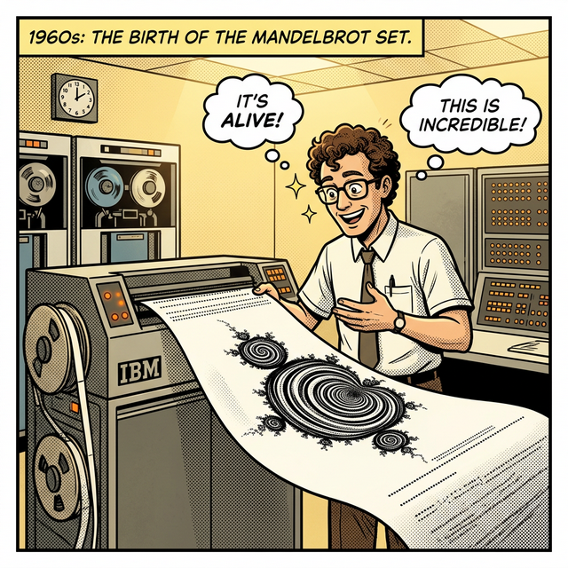

# 08. 여덟 번째 수업: 프랙탈 기하학의 아버지, 브누아 만델브로트

수천 년간 절대 권력을 휘두르던 유클리드의 정수 차원을 박살 내고, 삐뚤어지고 거친 자연의 실상에 수학적 생명을 부여해 '프랙탈(Fractal)'이라는 우주적 용어를 창조한 한 천재의 일대기를 살펴봅니다.

---

## 학습 목표
* 주류 학계에서 이탈한 아웃사이더였던 만델브로트가 이종(IT) 산업 기관(IBM)에서 천재성을 발휘하게 된 배경을 이해합니다.
* 컴퓨터의 태동기가 수학의 패러다임을 어떻게 뒤바꿀 수 있었는지 그 파급력을 조망합니다.

## 1. 정통 수학을 혐오한 폴란드의 아웃사이더

## 1. 정통 수학을 혐오한 폴란드의 아웃사이더

**브누아 만델브로트 (Benoit B. Mandelbrot, 1924~2010)**는 폴란드 바르샤바의 유대인 가정에서 태어났습니다. 2차 세계대전이 터지고 나치가 프랑스를 점령하자, 그는 정규 학교 교육을 제대로 받지 못하고 산속을 떠돌며 굶주리는 소년기를 보냈습니다.

<div align="center">
  
</div>

이때의 방황 때문일까요? 그는 엘리트 수학자들이 사랑하는 깨끗한 대수학 기호나, 완벽하게 증명된 유클리드의 원과 직선 등 '매끄럽고 이상적인' 종이학문을 싫어했습니다.
* 그는 길거리를 걷다가 보이는 거친 지붕 모서리, 강이 구불구불하게 굽이치는 난장판, 그리고 시장에서 팔리는 양배추(로마네스코 브로콜리)의 징그러운 모양이 어떻게 구성되는지 '시각적'으로 상상하는 것만을 즐겼습니다.
* 당연히 그 당시 학계는 방정식을 풀지 않고 뜬금없는 바위 모양이나 바라보는 그를 학문적 찌질이 취급했습니다.

## 2. IBM 슈퍼컴퓨터 연구실로의 도피

1958년 프랑스를 떠나 미국으로 도피한 그는, 운명적으로 구원자를 만납니다. 학界의 벽에 막힌 그를 알아보고 통신망 데이터를 연구해 달라고 채용한 거대 컴퓨터 통신회사 **IBM 연구소**였습니다.

<div align="center">
  
</div>

가르치는 학생도, 시험도, 엄격한 수학계의 감시도 없는 그곳에서 만델브로트는 물 만난 고기였습니다. 그는 통신 잡음 데이터, 경제학 논문, 강물의 범람 데이터까지 분야를 가리지 않고 뒤적였습니다.
그리고 드디어 거대한 결론, **"영국 해안선의 굽이치는 톱니바퀴 모양 비율과 면화 가격의 요동치는 차트 모양 비율이 완벽하게 유사한 어떤 통계적 차원(Dimension) 공식을 따른다"** 라는 것을 발견합니다!

## 3. 컴퓨터와의 찰떡궁합 렌더링 폭발

그가 머릿속으로 공식을 다듬어 냈을 때, IBM의 어마어마한 혜택이 그를 천재로 만들었습니다.
과거의 천재 코흐나 시어핀스키는 수학 공식을 만들고도, 이것을 종이에 손으로 무한히 그릴 수가 없어서 무덤에 가야만 했습니다.
하지만 만델브로트 곁에는 **"파이썬의 할아버지 격 알고리즘을 빛의 속도로 계산해 내는 IBM 슈퍼컴퓨터"**가 모터 소리를 내며 돌아가고 있었죠!

> 만델브로트는 컴퓨터 팀에게 주문했습니다.
> "이 복소수 반복 방정식 식 $(z_{n+1} = z_n^2 + c)$ 하나를 저 기계에 집어넣어라. 그리고 계산 결과가 터져서 날아가지 않는 모든 검은 점들의 궤적 지도(Map)를 화면에 픽셀들로 렌더링하라!"

```python
# 파이썬으로 가동해보는 만델브로트의 IBM 방정식 코어 (단순화)
# 공식: z = z^2 + c

def is_in_mandelbrot_set(c, max_iterations=100):
    """
    복소수 평면의 한 점(c)이 만델브로트 집합(안정적 영역) 내부인지,
    아니면 무한대로 폭발해 버리는(발산) 지점인지 파이썬 반복문으로 알아냅니다.
    """
    z = 0
    for n in range(max_iterations):
        # 이게 바로 만델브로트가 IBM에게 넘겨준 '그 수식'의 정체입니다.
        z = z*z + c
        
        # 값이 너무 커져서 2.0 이상으로 튕겨 나가면(폭발), 이 좌표는 영역 '탈락'
        if abs(z) > 2.0:
            return False 
            
    return True # 100번을 제곱하고 더해도 폭발하지 않으면, 영역 '통과'!

# 예시: 복소수 c = 0.5 + 0.5j 좌표 지점 테스트
test_c = complex(0.5, 0.5)
result = is_in_mandelbrot_set(test_c)
print(f"좌표 {test_c}는 만델브로트 집합에 포함되는가? : {result}")
```

며칠 뒤, IBM 프린터에서는 벌레 모양이 수십만 개 무한히 반복되며 거대하게 우주를 이루는 기괴하고도 아름다운 **'만델브로트 집합(Mandelbrot Set)' 아트웍**이 뽑혀 나왔습니다. 
인류가 손으로 그릴 수 없었던 신의 암호를, 기계 딥러닝 렌더링을 통해 인류 역사상 최초로 만델브로트가 눈으로 확인하는 위대한 순간이었습니다.

## 학습 정리
1. **만델브로트 (Mandelbrot)**: 유클리드의 완벽한 직선과 원의 세계를 벗어나, 자연의 거칠고 부서진 차원(Fractional)을 묘사하는 괴물 수학 '프랙탈 기하학'을 선포한 위대한 개척자.
2. **IBM과 학문적 탈피**: 수학뿐 아니라 경제학, 기상학, 물리학 분야를 통계학적 그래프 하나로 가로지르며 융합해 낸 그는, 정통 학계가 아닌 IT 기업 연구소의 자유방임 덕분에 결실을 보았다.
3. 인류가 종이와 자를 들고 그릴 수 없는 무한 해상도 영역에 도달한 수학을, 파이썬 루프와 같은 **컴퓨터 알고리즘 엔진(반복 연산과 모니터 출력 그래픽)** 을 활용해 물리적 눈과 모니터 픽셀로 꺼내 보인 역사상 최초의 그래픽스 조련사이다.
