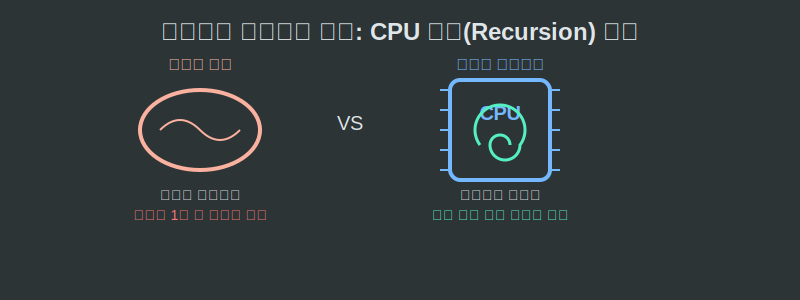
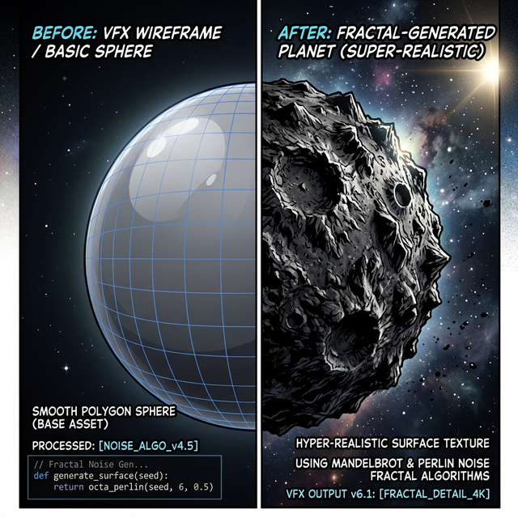

# 09. 아홉 번째 수업: 컴퓨터와 프랙탈의 찰떡궁합

왜 프랙탈은 컴퓨터 과학이 도래하기 전까지 어둠 속에 묻혀 있었을까요? 왜 파이썬(Python)과 같은 현대 프로그래밍 언어를 배우면 프랙탈 기하학을 마치 내 피와 살처럼 너무나도 쉽게 조종할 수 있는 것일까요? 

---

## 학습 목표
* 무한 반복되는 프랙탈 연산을 물리적으로 대체할 수 있는 유일한 하드웨어 도구로서의 **컴퓨터 CPU와 재귀 루프**의 궁합을 총괄적으로 이해합니다.
* CG 영화 특수효과 산업과 텍스처 맵 축소에 프랙탈 방정식이 필수 파이프라인으로 전락하게 된 역사적 과정을 정리합니다.

## 1. 2천만 년이 걸릴 일을 1초 만에 끝내는 CPU 반복기

인간의 뇌는 새로운 것을 창조하고, 복잡한 상황을 유추하는 데는 천재입니다.
하지만 눈앞에 놓인 숫자 $3.14$를 자기 자신에게 $1,000$번 연속으로 곱하라고 시키면, 인간은 짜증을 내다가 포기하거나 계산 실수로 종이를 찢어버릴 것입니다. 

  

하지만 **파이썬의 `for` 반복문이나 재귀 함수(`def() { def(); }`)**는 이 노가다(반복 작업)를 혐오하지 않습니다. 오히려 컴퓨터의 심장 CPU는 오직 이 더하기, 곱하기 반복 톱니바퀴를 돌리는 것에만 최적화된 엔진입니다.

> **\[프랙탈과 컴퓨터의 궁합 방면\]**
> 프랙탈은 "어떤 공식이나 행위를 작게 만들어서, 자기 안으로 또 집어넣어라" 를 무한 반복하는 학문입니다.
> 컴퓨터는 거친 "규칙의 단순 반복 처리(Iteration & Recursion)" 분야의 우주 최강 챔피언입니다.

컴퓨터가 없던 시대에 코흐의 눈송이 100단계를 종이에 그리려면 선을 $4^{100}$ 개 그어야 하므로, 우주 탄생의 끝까지 그려도 인류는 못 그립니다. 하지만 오늘날 여러분이 치는 파이썬 터틀 거북이 코드 20줄은 이 우주의 영원을 그래픽 카드 전력만으로 단 1초 만에 렌더링 맵으로 폭파해 냅니다.

## 2. 픽사(Pixar) 와 할리우드가 훔쳐 간 수학

만델브로트가 선포한 산맥과 구름 방정식 공식을 제일 먼저 훔쳐 간 이들은 1980년대 컴퓨터 그래픽스(CG) 영화 예술가들이었습니다.
스타트렉, 스타워즈 같은 초기 영화의 우주선 뒤로 행성 표면이 매끈하게 둥글게 나타나면 영화는 금세 유치한 만화처럼 싸구려 포스를 풍겼습니다. 진짜 다큐멘터리 현실의 우주 행성 표면처럼, 거칠게 분화구가 박히고 무너져내린 암석 질감을 표현해야 흥행에 성공할 수 있었습니다.

  

* **루카스 필름과 픽사(Pixar)**의 천재 엔지니어들은 이 행성 구체의 픽셀 표면 수학 공식 안에, 만델브로트의 **"노이즈 변위가 포함된 프랙탈 폴리곤 미분열 알고리즘"** 조각 코드를 붙여 넣었습니다.
* 마침내 모니터 속 매끄러운 플라스틱 공은 순식간에 수억만 개의 골짜기를 가진 장엄한 그랜드 케니언의 표면 질감(Texture)으로 스스로 옷을 갈아입었습니다.

데이터 용량은 행성 지형 전체를 다 합쳐보았자 하드디스크 1MB조차 하지 않았습니다! 그저 그래픽 카드(GPU)가 프랙탈 공식 하나를 들고 영화를 상영할 때마다 실시간으로 수억 개를 분리 증식시켜 주는 위대한 공학적 승리만 남았습니다.

## 3. 프랙탈 모듈 최종 결론: 코드로 지배하는 대자연 

* [01: 프랙탈이란?] 직선의 유클리드 기하학을 부숴버린 거친 자연의 통계학. 무한한 해상도.
* [02: 자기 유사성] 부분과 전체가 같다는 프랙탈의 대전제 하에 파이썬 **재귀(`Recursion`) 루프의 Base Case** 생성의 비밀 폭로.
* [04: 소수점 차원] 점선면의 $1, 2, 3$ 정수 껍질을 벗겨, 파이썬 **`math.log()` 비율 연산**으로 정보량이 질량과 무게를 지닌다는 수학적 증명을 도출.
* [06: 예술/생활 속 융합] 맥박 박동과 주식시장 데이터 배열(`Array`) 에까지 잠입한 혼돈 속 질서 엔진.
* [08&09: 만델브로트 & CPU] 컴퓨터 공학이 낳은 계산기와 프랙탈 수학의 화학적 융합을 통한 3D 무작위(Procedural Generation) 그래픽 폭발의 역사적 고찰. 

V3.1 모듈 06을 통해 여러분은 산에 오르거나 구름 텍스처를 볼 때마다 그 뒤에서 무한히 회전 중인 **"거대한 C++ / 파이썬 그래픽 재귀 루프 무한 다항식"** 시스템의 코드가 여러분 뇌 안에서 들려오기를 바랍니다!
