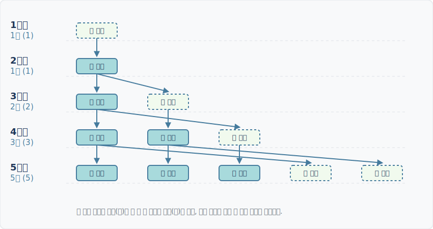

# 02. 토끼와 피보나치수열

## 1. 학습 목표 (Learning Objectives)
* 13세기 수학자 레오나르도 피보나치가 고안한 '토끼 번식 모델'을 이해합니다.
* 시간이 지남에 따라 기하급수적으로 늘어나는 토끼의 쌍을 나타내는 점화식 $F_n = F_{n-1} + F_{n-2}$ 의 원리를 깨우칩니다.

## 2. 영원히 죽지 않는 토끼의 번식
1202년, 피보나치는 한 수학 경연 단상에서 다음과 같은 사고 실험을 사람들에게 던졌습니다.

> **[토끼 번식의 가설]**
> 1. 방금 태어난 새끼 토끼 암수 한 쌍이 있습니다.
> 2. 이 토끼 쌍은 두 달이 지나면 온전한 어른이 되며, 어른이 된 달부터 매달 암수 새끼 한 쌍을 반드시 낳습니다.
> 3. 토끼는 결코 병들거나 죽지 않고, 새끼들도 커서 똑같은 규칙으로 번식합니다.
> 
> **질문: 1년 후에는 총 몇 쌍의 토끼가 있을까요?**

머릿속으로만 생각하면 금세 헷갈립니다. 달력에 직접 토끼의 상태를 기록해보면 아래와 같은 규칙이 생겨납니다.

1. **1개월째**: 달랑 갓 태어난 새끼 **1쌍**
2. **2개월째**: 새끼 토끼가 쑥쑥 자랍니다 (아직 번식 불가, 어른 **1쌍**)
3. **3개월째**: 드디어 첫 새끼를 낳습니다. (기존 어른 **1쌍** + 갓 태어난 새끼 **1쌍** = 총 **2쌍**)
4. **4개월째**: 기존 어른 1쌍은 또 새끼를 낳고, 저번 달 태어난 새끼는 어른이 됩니다. (총 **3쌍**)
5. **5개월째**: 어른 2쌍이 각각 새끼를 낳고... (총 **5쌍**)

이 흐름을 눈으로 쉽게 이해하기 위한 다이어그램을 확인하세요.

위의 숫자들(1, 1, 2, 3, 5, 8...)을 유심히 관찰해보면, **이번 달의 전체 토끼 수**는 정확히 **지난달의 토끼 수**에 **지지난달의 토끼 수**를 더한 값과 완벽하게 일치합니다. 
왜 그럴까요? **이번 달 토끼 수** = **(지난달에 이미 살고 있던 토끼 수)** + **(이번 달에 새롭게 태어난 새끼 수)** 인데, 이번 달에 새롭게 태어난 새끼의 수는 다름아닌 **지지난달에 이미 살고 있던 토끼 수(이들이 모두 어른이 되어 각각 한 쌍씩 낳으므로)**와 정확히 같기 때문입니다.

## 3. 학습 정리 (Summary)
1. **토끼 번식 모델**: 피보나치수열은 '성장한 토끼가 매달 새끼를 낳는다'는 단순한 생물학적 가설에서 탄생했습니다.
2. **이전 두 달의 합계 (점화식)**: $$ F_n = F_{n-1} + F_{n-2} $$
3. 이 단순한 더하기 규칙이 우주적 황금비와 컴퓨터 알고리즘의 가장 강력한 근간을 이루게 됩니다.
