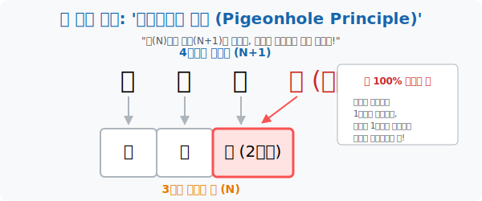

# 1. 100% 무조건 일어나는 마법: '비둘기집의 원리 (1)'

## [도입부] 학습 목표 (Learning Objectives)
- 조합론(Combinatorics) 의 가장 강력하면서도 직관적인 절대 법칙인 **'비둘기집의 원리(Pigeonhole Principle)'** 의 기본 개념을 이해합니다.
- 복잡해 보이는 증명이나 확률 계산 없이도, $N$개의 공간에 $N+1$개의 객체를 넣을 때 발생하는 논리적 필연성을 통해 "반드시 ~한 경우가 존재한다" 고 확언하는 해킹 기술을 익힙니다.
- 파이썬(Python)의 `Set(집합)` 자료형과 리스트 길이를 비교하여, 배열 안에 '중복된 데이터(충돌)' 가 무조건 존재하는지 0.01초 안에 감별해 내는 알고리즘을 구축해 봅니다.

---

## 1. 당구장과 비둘기, 그리고 디리클레

독일의 천재 수학자 디리클레(Dirichlet) 는 1834년에 너무나도 당연해서 아무도 수학이라고 생각하지 않았던 놀라운 논리를 하나 발표합니다. 바로 '비둘기집의 원리(Dirichlet's Box Principle)' 입니다.

> **"비둘기가 4마리 있고, 비둘기집(방) 이 3개 있다고 치자. 비둘기가 모두 방으로 퇴근했을 때, 적어도 1개의 방에는 무조건 2마리 이상의 비둘기가 들어있게 된다."**

너무 유치한가요? 하지만 이 단순한 논리 안에 담긴 철학은 엄청납니다.
누군가 "에이, 다 따로따로 자면 되잖아?" 라고 태클을 건다고 상상해 봅시다.
비둘기들이 최대한 공평하게 독방을 쓴다고 가정(최악의 시나리오) 해 봅니다. 1번 방에 1마리, 2번 방에 1마리, 3번 방에 1마리가 들어갔습니다.
그런데 어쩌죠? **아직 하늘에 남은 비둘기가 1마리 있습니다.** ($N+1$ 번째 비둘기)
이 마지막 비둘기가 1, 2, 3번 방 중 어디로 들어가든, 그 방은 무조건 '2마리 이상' 의 룸메이트 상태가 됩니다.

즉, 아무리 방어적으로 세팅하려 해도 **"방의 개수($N$) 보다 비둘기의 수($N+1$) 가 많으면, 중복(독방 실패) 은 100% 뚫릴 수밖에 없는 운명"** 이라는 완벽한 증명입니다.



<br>

## 2. 일상 속의 비둘기집 해킹

이 간단한 원리를 현실에 적용하면 마치 독심술사처럼 변모할 수 있습니다.

* **"서울시에는 머리카락 개수가 완벽히 똑같은 두 사람이 무조건 존재한다."**
  * 증명: 인간의 머리카락은 아무리 많아 봤자 약 30만 가닥(비둘기집 $N$) 입니다. 그런데 서울시 인구는 약 1,000만 명(비둘기 $N+1$) 입니다. 천만 마리의 비둘기를 30만 개의 방에 우겨 넣으려면 미친 듯이 중복될 수밖에 없습니다.
* **"지금 이 교실(37명) 에는 생일이 같은 달(Month) 인 사람이 무조건 존재한다."**
  * 증명: 1년은 12달(비둘기집 12개) 입니다. 학생 수는 37명(비둘기 37마리) 입니다. 어떻게 우겨 넣든 방이 무너집니다.

---

## 3. 💻 파이썬(Python)의 중복 탐지기 (`Set` 과 `Len` 의 교차)

데이터 엔지니어들은 서버에 들어온 회원 데이터(이메일, ID 등) 에 "중복된 값이 존재하는지" 를 이 비둘기집의 원리로 한 방에 찾아냅니다. 
리스트(`List` $\rightarrow$ 비둘기) 에 데이터를 담고, 중복을 허락하지 않는 자료형(`Set` $\rightarrow$ 비둘기집) 으로 강제 변환했을 때 터지는 에러를 감지하는 것입니다.

### 🐍 파이썬 예제: 데이터 충돌(Collision) 감지 알고리즘

```python
print("--- 🕊️ 비둘기집 원리: 중복 데이터 자동 스캐너 가동 ---")

# 서버에 접속한 5명의 사용자 생일 '월(Month)' 데이터 (비둘기 5마리)
# 우연히 3월생이 2명 있음.
user_birth_months = [1, 3, 5, 3, 11]

# 피코엔지니어의 해킹: List를 '중복을 허락하지 않는 강제 독방' 인 Set으로 감싸버림
unique_months = set(user_birth_months)

print(f" [상태 보고] 입력된 비둘기 수 (List 길이): {len(user_birth_months)}")
print(f" [상태 보고] 실제 존재하는 비둘기집 수 (Set 길이): {len(unique_months)}")
print("-" * 50)

# 만약 비둘기 수가 집의 개수보다 많으면, 어딘가에 중복(동거) 이 발생했다는 100% 증거!
if len(user_birth_months) > len(unique_months):
    print(" 🚨 [충돌 경보] 비둘기집의 원리에 의해,")
    print("    생일이 같은 달인 사용자가 무조건! 100%! 그룹 내에 존재합니다.")
else:
    print(" ✅ [클린] 모든 사용자가 서로 다른 달(Month) 에 태어났습니다.")

# 결과창:
# --- 🕊️ 비둘기집 원리: 중복 데이터 자동 스캐너 가동 ---
#  [상태 보고] 입력된 비둘기 수 (List 길이): 5
#  [상태 보고] 실제 존재하는 비둘기집 수 (Set 길이): 4
# --------------------------------------------------
#  🚨 [충돌 경보] 비둘기집의 원리에 의해,
#     생일이 같은 달인 사용자가 무조건! 100%! 그룹 내에 존재합니다.
```

해커들은 암호학(해시 함수 충돌) 에서도 이 원리를 사용합니다. "저장 가능한 암호의 가짓수($N$) 보다 입력할 수 있는 비밀번호의 종류($N+1$)가 무한히 많다면, 전혀 다른 두 비밀번호가 똑같은 암호 키로 인식되는 '버그(충돌)'가 우주 어딘가에는 100% 존재한다" 는 무서운 이론입니다.

---

## [결론] 학습 정리 (Summary)

1. **비둘기집의 원리**: $N+1$개의 물건을 $N$개의 상자에 넣을 때, 적어도 1개의 상자에는 2개 이상의 물건이 들어간다는 절대 진리입니다.
2. **최악의 시나리오 기법**: "최대한 겹치지 않게 예쁘게 담아보자" 라고 방어적으로 가정하더라도, 남는 데이터 1개 때문에 필연적으로 중복이 발생함을 증명하는 논리 전개 방식입니다.
3. **컴퓨터 과학의 응용**: 메모리 할당, 해시 테이블 충돌 알고리즘, 데이터베이스 무결성 검사 등 '공간' 과 '데이터량' 의 한계를 다루는 모든 IT 기술의 근간 뼈대가 됩니다.
