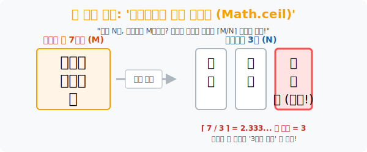

# 2. 올림 연산의 마법: '비둘기집 원리의 일반화'

## [도입부] 학습 목표 (Learning Objectives)
- 비둘기집의 개수보다 비둘기가 단지 1마리 많은 특수 상황을 넘어, 비둘기 수치($M$) 가 집의 개수($N$) 에 비해 기하급수적으로 많아졌을 때 적용되는 **'일반화된 비둘기집의 원리'** 를 탐구합니다.
- 공평 분배(나눗셈) 후 남은 나머지(자투리) 들로 인해 필연적으로 발생하는 **'올림(Ceiling)'** 수학의 오묘한 이치를 깨닫습니다.
- 파이썬(Python)의 `math.ceil()` 함수를 이용하여, 수억 개의 데이터를 수만 개의 서버에 분산시킬 때 구조적으로 터질 수밖에 없는 '최소 최대 병목 구간' 을 컴퓨터가 선제 방어하도록 코딩해 봅니다.

---

## 1. 비둘기가 무더기로 쏟아진다면?

지난 시간에는 "집 3개, 비둘기 4마리 $\rightarrow$ 한 방에 2마리" 라는 기초를 배웠습니다.
그렇다면 비둘기가 미친 듯이 늘어나서 **7마리**가 되었다고 해봅시다. 집은 여전히 **3개**입니다. 적어도 어느 한 방에는 '최소 몇 마리' 이상의 비둘기가 강제로 들어가게 될까요?

수학적인 쉴드(최악의 상황 방어) 를 치기 위해, 우리는 피자 나누기에서 썼던 **"가장 공평한 1/N 배분"** 기술을 발동시킵니다.

1. **1차 배분 (공평 분배)**: 7마리의 비둘기를 3개의 방에 똑같이 1마리씩 집어넣습니다. (1/1/1 $\rightarrow$ 총 3마리 소진, 남은 비둘기 4)
2. **2차 배분 (공평 분배)**: 또 1마리씩 똑같이 집어넣습니다. (2/2/2 $\rightarrow$ 총 6마리 소진, 남은 비둘기 1)
3. **마지막 강제 할당 (병목의 탄생)**: 자, 이제 모든 방이 2마리씩 공평하게 들어있는 상태(Room = 2) 입니다. 그런데 **아직 하늘에 비둘기가 1마리 더 남았습니다.** ($7 \div 3 = 2 \cdots \text{나머지 } 1$) 
   결국 이 마지막 1마리가 1, 2, 3번 방 중 어디로 쏙 들어가든, 그 방은 기존 2마리에 1마리가 얹어지며 **'총 3마리'** 의 초과 거주 상태가 되어버립니다.

정리하자면, **$M$ 마리의 비둘기를 $N$ 개의 집에 넣을 때 세상에서 가장 공평하게 분배($M/N$) 하더라도, 소수점 자투리(나머지) 가 단 0.001이라도 발생하는 순간 무조건 위로 반올림이 아닌 '올림(Ceiling)' 이 일어나는 방이 100% 존재**한다는 뜻입니다.
이것이 바로 `일반화된 비둘기집의 원리: ⌈M/N⌉` 입니다.



<br>

## 2. 군대와 기업을 덮치는 일반화 원리

* **"어느 야구단에 400명의 선수가 있다면, 태어난 달(Month) 이 똑같은 선수가 적어도 34명 이상인 그룹이 반드시 존재한다."**
  * 계산: 비둘기 400마리($M$) 가 12개의 방(1월~12월, $N$) 으로 들어갑니다.
  * $400 \div 12 = 33.3333\cdots$ 입니다. 모든 달에 딱 33명씩 태어났다고 쳐도, 나머지 자투리 때문에 소수점을 올려버린(Ceiling) **34명** 방이 무조건 터지게 됩니다. 

* **"서랍장에 검은 양말 10켤레, 흰 양말 10켤레가 섞여 있습니다. 어둠 속에서 무심코 3짝을 집었을 때, 무조건 같은 색깔 한 켤레(2짝) 가 만들어집니다."**
  * 계산: 양말의 색깔 종류 2개 (비둘기집 2개). 집어 든 양말 조각 3개 (비둘기 3마리).
  * $3 \div 2 = 1.5$ $\rightarrow$ 올림 $\rightarrow$ **2짝(한 켤레)** 이 무조건 매칭됩니다.

---

## 3. 💻 파이썬(Python) 병목 과부하(Overload) 예측기

수백만 건의 트래픽 트랜잭션($M$) 을 16대의 클라우드 서버($N$) 에 분산 처리 시킬 때, 분배 알고리즘(로드 밸런서) 이 아무리 공평하게 일을 던져준다고 해도 특정 서버는 무조건 `⌈M/N⌉` 의 로드를 맞고 버텨야 합니다.
파이썬의 수학 라이브러리(`math.ceil`) 를 이용해 시스템의 최소 한계치를 미리 해킹해 봅시다.

### 🐍 파이썬 예제: 트래픽 오버로드(Ceiling) 예측 시스템

```python
import math

print("--- ☁️ 일반화된 비둘기집 원리: 서버 트래픽 예측기 가동 ---")

# 상황: 10,001 명의 접속자(비둘기 M) 가 5대의 독립된 서버(집 N) 에 할당됩니다.
total_users = 10001
server_count = 5

print(f" [데이터 입력] 접속자 수: {total_users}명 / 서버 대수: {server_count}대")

# 수학적 원리: 총 사용자 수를 서버 수로 나누고 '올림' 처리한다. (단 1명의 나머지라도 터지게)
# math.ceil 은 천장(Ceiling) 으로 숫자를 무조건 끌어올리는 살인적인 수학 함수입니다.
max_load_server = math.ceil(total_users / server_count)

print("-" * 50)
print(f" ⚠️ [병목 경고] 아무리 공평하게 접속자를 분산(로드 밸런싱) 시켜도,")
print(f"    5대의 서버 중 적어도 1대는 100% 무조건! [{max_load_server}명] 이상의 부하를 견뎌야 합니다.")
print(f"    (엔지니어 지시: 서버 1대당 한계 용량을 반드시 {max_load_server}명 이상으로 설계하시오.)")

# 결과창:
# --- ☁️ 일반화된 비둘기집 원리: 서버 트래픽 예측기 가동 ---
#  [데이터 입력] 접속자 수: 10001명 / 서버 대수: 5대
# --------------------------------------------------
#  ⚠️ [병목 경고] 아무리 공평하게 접속자를 분산(로드 밸런싱) 시켜도,
#     5대의 서버 중 적어도 1대는 100% 무조건! [2001명] 이상의 부하를 견뎌야 합니다.
#     (엔지니어 지시: 서버 1대당 한계 용량을 반드시 2001명 이상으로 설계하시오.)
```

나머지 연산이나 복잡한 줏대 없이 그저 나눈 뒤 소수점을 무조건 강제 올림 해버리는 `math.ceil()` 의 철학은 비둘기집 이론의 핵심과 완전히 맞닿아 있습니다. 

---

## [결론] 학습 정리 (Summary)

1. **일반화된 비둘기집 원리**: 객체 수($M$) 가 상자 수($N$) 보다 월등히 많을 때, 적어도 1개의 상자에는 $M/N$ 의 '올림 수' 에 해당하는 객체가 갇힐 수밖에 없다는 법칙입니다.
2. **소수점(나머지) 의 반란**: 공평하게 나누어 떨어지는 정수는 예쁘지만, 단 1의 나머지가 발생해 소수점이 생기는 순간, 누군가는 그 짐 1개를 더 떠안아야 하는 필연성을 다루는 이산수학의 꽃입니다.
3. 이 논리는 클라우드 분산 처리, 우편물 분류 시스템 고장 예측, 최악의 경우를 상정하는 군사 보급 전략 등에서 "절대로 무너지지 않는 한계선(Limit)" 을 구축할 때 쓰입니다.
