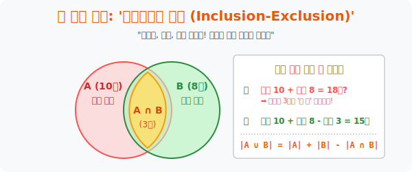

# 3. 중복 카운트의 덫을 피하라: '포함배제의 원리'

## [도입부] 학습 목표 (Learning Objectives)
- '수학을 좋아하는 학생' 과 '영어를 좋아하는 학생' 의 수를 단순히 더하면 인원수가 왜 실제보다 뻥튀기되는지 **'중복(Intersection)'** 의 문제를 시각적 벤 다이어그램(Venn Diagram) 으로 이해합니다.
- 집합 2개, 3개를 합칠 때 발생하는 교집합의 중복 카운팅을 막기 위해 ➕(통째로 더하고) ➖(교차점을 빼고) ➕(공통 코어를 다시 더하는) **'포함배제의 원리(Inclusion-Exclusion Principle)'** 를 마스터합니다.
- 파이썬(Python)의 강력한 연산자인 '합집합(`|`)' 과 '교집합(`&`)' 벤 다이어그램 문법을 활용하여, 빅데이터 고객 필터링 시스템에서 중복 유저를 0.01초 만에 걸러내는 데이터 분석 코드를 짭니다.

---

## 1. 10 + 8 = 15명?! (더하기의 배신)

새 학기 동아리를 조사했습니다.
우리 반에 "피자 동아리" 에 가입한 학생은 10명이고, "치킨 동아리" 에 가입한 학생은 8명입니다.
선생님이 반장에게 묻습니다. "동아리에 하나라도 가입한 우리 반 총인원은 몇 명이냐?"
반장이 해맑게 10 + 8 = 18명이라고 답합니다. (땡! 틀렸습니다.)

알고 보니, 눈치 없는 3명의 학생이 피자 동아리와 치킨 동아리 **양쪽 모두에 가입한 '이중 스파이(교집합)'** 학생이었던 것입니다.
* 반장의 멍청한 계산은 이 박쥐 같은 3명을 피자 명단에서도 세고 1️⃣, 치킨 명단에서도 세어 2️⃣, 결국 3명의 유령 인구를 창조해 버린 셈입니다.

오류 없는 진짜 합산(합집합) 을 구하려면 다음과 같이 계산해야 합니다.
**"피자 명단(10명) 과 치킨 명단(8명) 을 통째로 합친 다음, 양쪽에서 두 번 불려진 중복 찐따 3명(교집합) 의 이름을 한 번 삭선(빼기) 해 준다!"**

> 수학 기호: **$|A \cup B| = |A| + |B| - |A \cap B|$**



<br>

## 2. 세 덩어리의 포개짐 (A ∪ B ∪ C)

집합이 3개가 되면 눈이 돌아가기 시작하지만, 이 또한 아름다운 더하기-빼기 패턴을 가집니다.

1. **포함(Inclusion) +**: 일단 A, B, C 의 덩치를 모두 통째로 더합니다. ($A+B+C$) (엄청난 중복 인구 폭발 발생)
2. **배제(Exclusion) -**: 두 원판이 만나는 럭비공 모양 교집합 3개 구역(A∩B, B∩C, C∩A) 을 모조리 빼줍니다.
3. **재포함(Re-inclusion) +**: 앗! 빼다 보니 세 원판이 모두 만나는 정중앙의 코어 구역(A∩B∩C) 이 3번이나 통째로 날아가 버려서 구멍이 송송 뚫렸습니다. 미안하니 마지막으로 이 정중앙 코어를 한 번 다시 더해줍니다!

> 꿀팁 암기법: **"통째로 더한다(+) $\rightarrow$ 2개짜리 교집합 뺀다(-) $\rightarrow$ 3개짜리 교집합 더한다(+)"**

---

## 3. 💻 파이썬(Python) 합집합/교집합 데이터 마이닝

마케팅 부서에서 이벤트 알림톡을 보내야 합니다.
'할인 쿠폰을 받은 고객(List A)' 과 'VIP 등급 고객(List B)' 에게 메시지를 발송해야 하는데, **"두 리스트에 겹치는 사람에게 메시지가 두 번 연속 날아가면(스팸 항의)"** 큰일이 납니다! 파이썬의 `Set` 문법이 이 재앙을 손쉽게 막아줍니다.

### 🐍 파이썬 예제: 쿠폰 스팸 방지 (Inclusion-Exclusion)

```python
print("--- 📱 고객 데이터 마이닝: 알림톡 스팸 방지 필터링 가동 ---")

# (데이터베이스) 쿠폰 발급 고객 명단과 VIP 고객 명단을 Set(집합) 으로 처리
# Set 은 그 자체로 수학의 벤다이어그램 역할을 수행합니다!
coupon_users = {"아이언맨", "스파이더맨", "헐크", "블랙위도우"}
vip_users = {"캡틴아메리카", "아이언맨", "토르", "스파이더맨"}

# 1. 길이(Len) 확인 (단순 무식한 덧셈을 했을 때 터지는 유령 현상)
dumb_total = len(coupon_users) + len(vip_users)
print(f" ❌ [오류의 계산]: 쿠폰({len(coupon_users)}명) + VIP({len(vip_users)}명) = {dumb_total}번 발송 예정? (스팸 위험!)")

# 2. 파이썬 마법 1: 교집합(&) 무기 장착 (이중 스파이 적발)
double_spies = coupon_users & vip_users
print(f" 🔍 [교집합 색출]: 양쪽 모두에 가입된 스파이! -> {double_spies} (총 {len(double_spies)}명)")

# 3. 포함배제의 원리를 적용한 올바른 발송 횟수 계산식
smart_total_math = len(coupon_users) + len(vip_users) - len(double_spies)

# 4. 파이썬 마법 2: 합집합(|) 무기 - 알아서 중복 제거 후 합쳐 줌
union_users = coupon_users | vip_users

print("-" * 50)
print(f" ✅ [수학적 포함배제(Inclusion-Exclusion) 계산값]: {smart_total_math}명")
print(f" ✅ [파이썬 합집합(|) 실제 데이터 길이]: {len(union_users)}명 (문자 발송 대상: {union_users})")
print("    -> 두 계산 결과는 정확히 100% 일치합니다!")

# 결과창:
# --- 📱 고객 데이터 마이닝: 알림톡 스팸 방지 필터링 가동 ---
#  ❌ [오류의 계산]: 쿠폰(4명) + VIP(4명) = 8번 발송 예정? (스팸 위험!)
#  🔍 [교집합 색출]: 양쪽 모두에 가입된 스파이! -> {'스파이더맨', '아이언맨'} (총 2명)
# --------------------------------------------------
#  ✅ [수학적 포함배제(Inclusion-Exclusion) 계산값]: 6명
#  ✅ [파이썬 합집합(|) 실제 데이터 길이]: 6명 (문자 발송 대상: {'헐크', '캡틴아메리카', '블랙위도우', '스파이더맨', '아이언맨', '토르'})
#     -> 두 계산 결과는 정확히 100% 일치합니다!
```

집합과 벤 다이어그램 모델은 데이터베이스의 생명줄입니다. SQL 에서 사용하는 집합 연산(`UNION`, `INTERSECT`) 도, 빅데이터 엔지니어들이 데이터를 정제(Cleansing) 할 때 매일 사용하는 기술도 결국 이 기초 수학에서 비롯됩니다.

---

## [결론] 학습 정리 (Summary)

1. **단순 합산의 오류**: 겹치는 부분(교집합) 이 존재하는 집단들을 서로 무턱대고 덧셈기호로 묶으면 중복 데이터가 뻥튀기되는 참사가 발생합니다.
2. **포함배제의 원리**: 이 중복 영역을 벤 다이어그램의 그림에서 오려내듯(배제) 수식적으로 빼주어 정확한 총량(합집합)을 구하는 조합론의 꽃과도 같은 공식입니다. 
3. **데이터 공학 기초**: 오늘날 수백만 건의 데이터를 양옆으로 복붙 하여 합치는 것이 아니라, 충돌(Collision) 을 회피하고 결합하는 필수 스킬입니다.
