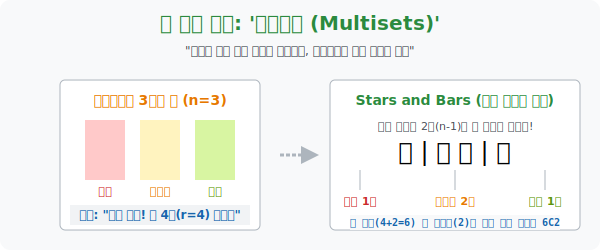

# 4. 베스킨라빈스 아이스크림통의 비밀: '중복조합'

## [도입부] 학습 목표 (Learning Objectives)
- "서로 다른 3가지 종류의 구슬을, 똑같은 종류로 여러 개(중복 허용) 골라도 될 때, 총 4개를 뽑는 방법의 수는 몇 가지일까?" 라는 인간의 머리를 마비시키는 기괴한 선택 모델, **'중복조합(Combinations with Repetition)'** 의 구조를 이해합니다.
- 복잡한 메뉴의 중복 선택을 종이에 '동그라미(별)' 와 '칸막이(막대기)' 를 찍-찍 그어서 푸는 수학계의 전설적인 렌더링 꼼수 **'별과 막대기 기법(Stars and Bars)'** 을 마스터합니다.
- 파이썬(Python)의 `itertools` 라이브러리에 숨겨진 조합 엔진(`combinations_with_replacement`) 을 발동시켜, 인간이 손으로 세면 1시간 걸릴 중복 경우의 수를 0.1초 만에 화면에 출력해 봅니다.

---

## 1. 31가지 맛 아이스크림, 중복 선택이 가능하다면?

아이스크림 가게 파인트 한 통을 샀습니다. 
"손님, 딸기, 바닐라, 메론 3가지 맛 중에 총 **4스쿱(스푼)** 을 골라 담으세요."
단, 아빠는 "난 메론은 0알이고 딸기만 미친 듯이 4스쿱 퍼줘!" (중복 허용) 도 허락했습니다.

자, 이 경우 조합(Combination) 의 가짓수는 어떻게 될까요?
우리가 배운 콤비네이션 무기인 ${}_3\mathrm{C}_4$ ㅡ (3개 중에서 4개를 골라봐!) 라는 건 불가능합니다. 3개밖에 없는데 어떻게 4개를 고르겠습니까? 
하지만 중복이 허용되면 마르지 않는 샘물처럼 똑같은 맛을 계속 뽑을 수 있으므로 이야기가 달라집니다. 이 악마 같은 경우의 수를 **중복조합**이라고 부르며, 기호(H, Homogeneous) 를 써서 **${}_3\mathrm{H}_4$** 라고 표기합니다.

<br>

## 2. 천재들의 해킹법: "별과 막대기(Stars and Bars)"

수학자들은 아이스크림 맛의 이름을 생각하는 대신, 허공에 빈 통(접시) 을 세팅하는 엄청난 은유적 코딩(메타포) 을 짜냅니다.

1. 무조건 골라야 할 구슬(아이스크림) 은 **별(⭐ / Star)** 4개로 고정합니다. 아이스크림의 이름은 나중에 붙입니다!
2. 딸기 / 바닐라 / 메론 3가지 '구역(Region)' 을 만들려면, 벽돌인 **칸막이(막대기 / Bar)** 는 몇 개가 필요할까요? 딱 **2개**만 세우면 왼쪽, 가운데, 오른쪽 총 3방이 만들어집니다.
3. 이제 허공에 별 4개와 막대기 2개를 마음대로 뒤섞어(배열) 던져봅니다.

* **배열 예시 1**: ⭐ | ⭐ ⭐ | ⭐ 
  * 해석: 1번방(딸기) 1개, 2번방(바닐라) 2개, 3번방(메론) 1개 고름!
* **배열 예시 2**: ⭐ ⭐ ⭐ ⭐ | | 
  * 해석: 1번방(딸기) 에 4개가 다 몰렸고, 막대기 2개가 맨 뒤에 붙음 $\rightarrow$ 바닐라 0개, 메론 0개!

자, 마법이 일어났습니다. 
아이스크림의 구질구질한 맛(딸기, 바닐라 등) 의 이름은 사라지고, **총 6개의 일렬 빈자리 (별 4자리 + 막대기 2자리)** 에 막대기(|) 2개를 꽂을 자리 위치만 정해주면 모든 경우의 수가 완벽한 1:1 매칭으로 끝나버립니다. 

* 6개의 자리 중에서 막대기 2개 자리 고르기: **${}_6\mathrm{C}_2 = \frac{6 \times 5}{2 \times 1} = 15가지$**
* 중복조합 변환 공식: **${}_n\mathrm{H}_r \Rightarrow {}_{n+r-1}\mathrm{C}_r$**



---

## 3. 💻 파이썬(Python) itertools 중복조합 부스터팩

프로그래머들은 공식 따위 외우지 않습니다. 파이썬의 표준 무기고(`itertools` 패키지) 안에는 조합, 순열, 중복조합을 모두 토해내는 터보 엔진이 있습니다. `combinations_with_replacement` 함수입니다!

### 🐍 파이썬 예제: 매장의 중복 선택 허용 메뉴 시뮬레이터

```python
# 파이썬 조합/순열 마법 보따리 로드!
from itertools import combinations_with_replacement

print("--- 🍨 아이스크림 중복조합(Multisets) 메뉴 판독기 가동 ---")

# 매장에 있는 3가지 베이스 맛
flavors = ['🍓딸기', '🍦바닐', '🍈메론']

# 손님이 골라야 할 총 스쿱 수(r=4)
k_scoops = 4

# 조합 무기 발동! (맛 3종류 중에서 / 네 번을 뽑는다)
all_combinations = list(combinations_with_replacement(flavors, k_scoops))

print(f" [상태 스캔] 3가지 맛 중에서 중복을 허용하여 {k_scoops}개를 고르는 세팅 완료.")
print("-" * 50)
print(f" 📜 [영수증 출력 - 가능한 모든 주문 레시피: 총 {len(all_combinations)}가지]")

# 파이썬이 토해낸 레시피 15가지를 예쁘게 한 줄씩 출력하기
for index, combo in enumerate(all_combinations, start=1):
    # combo는 ('🍓딸기', '🍓딸기', '🍦바닐', '🍈메론') 형태의 튜플! 합쳐서 출력
    recipe = " + ".join(combo)
    print(f"   [주문 {index:02d}] {recipe}")

# 결과창 (15가지 경우의 수가 정확히 출력됨!):
# --- 🍨 아이스크림 중복조합(Multisets) 메뉴 판독기 가동 ---
#  [상태 스캔] 3가지 맛 중에서 중복을 허용하여 4개를 고르는 세팅 완료.
# --------------------------------------------------
#  📜 [영수증 출력 - 가능한 모든 주문 레시피: 총 15가지]
#    [주문 01] 🍓딸기 + 🍓딸기 + 🍓딸기 + 🍓딸기
#    [주문 02] 🍓딸기 + 🍓딸기 + 🍓딸기 + 🍦바닐라
#    ... (중략)
#    [주문 15] 🍈메론 + 🍈메론 + 🍈메론 + 🍈메론
```

파이썬의 이 한 줄짜리 방어 코루틴 덕분에, 은행의 암호학 시스템, 로또 번호 시뮬레이션 등 수백억 번의 노가다 연산이 개발자의 손가락 하나로 제압됩니다.

---

## [결론] 학습 정리 (Summary)

1. **중복조합(H)**: 대상들을 하나씩만 고르는 잔혹한 단판 승부가 아니라, 똑같은 메뉴(원소) 를 눈치 보지 않고 무한정 중복으로 다시 골라도(Replacement) 되는 너그러운 확률 구조입니다.
2. **별과 막대기(Stars and Bars)**: $n$개의 종류를 구분 지어 주는 $n-1$개의 칸막이(|) 와 $r$개의 동그라미(별) 를 뒤섞어 나열하는 원리로 치환해버리면, 그 복잡한 3차원적 중복 구조가 가장 단순한 1차원 조합(C) 문제로 마법처럼 압축됩니다.
3. 이 로직은 `(x+y+z=10)` 방정식의 정수해(해답) 개수를 구하는 수학의 절대 무기로 영원히 고통받는 고등학교 수학 1등급 킬러 문제의 핵심 원리입니다.
