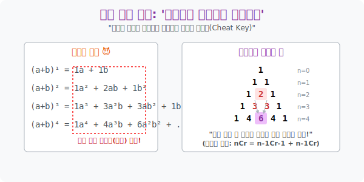

# 5. 전개의 공포를 끝장내는 수학 치트키: '파스칼의 삼각형과 이항정리'

## [도입부] 학습 목표 (Learning Objectives)
- 중학교 시절, 공책 수십 장을 찢게 만들었던 악몽의 괄호 전개 $((a+b)^2, (a+b)^3 \cdots)$ 가 사실은 '조합(Combination)' 의 논리를 품고 있는 아주 정직한 암호 규칙이었음을 깨닫습니다.
- 그 암호를 피라미드 모양으로 아름답게 풀어낸 17세기 수학 천재 블레즈 파스칼(Blaise Pascal) 의 **'파스칼의 삼각형(Pascal's Triangle)'** 을 통해, 식을 직접 계산하지 않아도 $10$, $100$ 제곱의 앞 숫자를 찾아내는 **'이항정리(Binomial Theorem)'** 의 정수를 해킹해 봅니다.
- 파이썬(Python)의 `SymPy` 특수 대수 라이브러리를 통해, 인간이 1시간 동안 손으로 전개해야 할 $(x+y)^{10}$ 방정식을 단 1줄의 코드로 0.1초 만에 풀어버리는 컴퓨터 연산의 웅장함을 체험합니다.

---

## 1. 괄호 속의 노가다, 암호로 풀릴까?

중학교 수학의 최대 위기, 곱셈 공식입니다!
* $(a+b)^1 = \mathbf{1}a + \mathbf{1}b$
* $(a+b)^2 = \mathbf{1}a^2 + \mathbf{2}ab + \mathbf{1}b^2$
* $(a+b)^3 = \mathbf{1}a^3 + \mathbf{3}a^2b + \mathbf{3}ab^2 + \mathbf{1}b^3$

여기서 앞에 튀어나오는 커다란 숫자들(1-3-3-1), 우리는 이 군더더기의 덩어리들을 **'계수(Coefficient)'** 라고 부릅니다. 
고난도의 수학 문제가 나옵니다. **"그렇다면 $(a+b)^{10}$ 을 전개했을 때, $a^7b^3$ 앞에는 대체 어떤 숫자가 나올까?"** 
이걸 풀겠다고 $(a+b)$ 를 10번이나 가로로 쓰고 곱하는 친구가 있다면, 그는 수학을 노가다와 혼동하고 있는 겁니다.

**[암호 해독: 이건 그냥 '자리 고르기' 게임이다!]**
$(a+b)^{10}$ 이라는 것은 사실 주머니 10개 안에 $a$ 와 $b$ 구슬이 들어있다고 생각하면 됩니다. 
이 10개의 주머니 중에서, $b$ 구슬을 **딱 3개** 끄집어낼 수 있는 주머니 3자리를 골라보세요! (동시에 $a$ 구슬은 나머지 7구역에서 자동으로 나오게 됩니다.)

> **"10개의 호주머니 중 $b$ 가 튀어나올 3개를 골라봐!" $\rightarrow$ ${}_{10}\mathrm{C}_3$** 

네, 그렇습니다. 저 무식해 보이던 식 전개의 계수들은 사실 이전 시간에 배운 바로 그 '조합(Combination)' 의 경우의 수였습니다.
* $(a+b)^3$ 의 $ab^2$ 앞 계수는? $\rightarrow$ 3개 중 $b$ 2개 고르기 $\rightarrow$ ${}_3\mathrm{C}_2 = \mathbf{3}$
* $(a+b)^{10}$ 의 $a^7b^3$ 앞 계수는? $\rightarrow$ 10개 중 $b$ 3개 고르기 $\rightarrow$ ${}_{10}\mathrm{C}_3 = \frac{10 \times 9 \times 8}{3 \times 2 \times 1} = \mathbf{120}$ ! 

수학자가 만든 이 미친듯한 숏컷을 **'이항정리(Binomial Theorem)'** 라고 부릅니다. (항이 2개(Di-nomial) 인 방정식의 전개 법칙이라는 뜻입니다.)

<br>

## 2. 블레즈 파스칼의 궁극적 벽돌 쌓기

프랑스의 천재 수학자 파스칼은 이 '이항정리' 의 조합 숫자들을 노트에 예쁘게 피라미드 모양으로 써 내려가 봅니다. 그러자 소름 돋는 규칙(수열) 하나가 튀어나왔습니다.

```text
Row 0:           1                      <- (a+b)^0
Row 1:         1   1                    <- (a+b)^1
Row 2:       1   2   1                  <- (a+b)^2
Row 3:     1   3   3   1                <- (a+b)^3
Row 4:   1   4   6   4   1              <- (a+b)^4
```

**[파스칼 삼각형의 법칙]**
자기 바로 머리 위에 있는 **지붕 두 숫자를 더하면, 무조건 내 숫자**가 됩니다. (예: Row 3의 3 + 3 을 더하면 $\rightarrow$ Row 4의 정중앙에 6이 탄생!)
우리는 더 이상 콤비네이션($\mathrm{C}$) 공식을 외울 필요도 없이, 블록 쌓기 게임처럼 양쪽 숫자를 더해서 내려가기만 하면 무한대로 뻗어가는 전개식의 모든 계수값을 모조리 훔쳐낼 수 있습니다. 이 피라미드를 **'파스칼의 삼각형'** 이라 부릅니다.



---

## 3. 💻 파이썬(Python) 식 전개 초고속 매크로 (SymPy)

자, 이제 파이썬에게 이 수학적 고통을 모조리 떠넘겨 보겠습니다. 파이썬의 대수(Algebra) 전문 라이브러리인 **`SymPy`** 를 쓰면, 알파벳 변수 자체를 기호로 인식시킨 뒤, 말도 안 되는 다항식을 단 1초 만에 쫙 찢어서 전개해 줍니다. 

### 🐍 파이썬 예제: (x+y)^10 원클릭 전개 렌더링

```python
# 파이썬 수학 심볼 처리 엔진 장착!
from sympy import symbols, expand

print("--- ⚔️ 이항정리 매크로: SymPy 다항식 전개 엔진 가동 ---")

# 파이썬에게 'x' 와 'y' 가 문자가 아니라 수학 방정식 기호(Symbol) 임을 선언함
x, y = symbols('x y')

# 퀘스트 생성: (x + y) 의 10제곱이라는 미친 다항식을 만들어라!
monstrous_equation = (x + y)**10
print(f" [타겟 확인] 전개할 방정식: {monstrous_equation}")

# 해커의 트리거, expand() 함수 발사!
# 이 녀석이 파스칼의 삼각형 알고리즘을 타면서 식을 한 방에 풀어버립니다.
expanded_result = expand(monstrous_equation)

print("-" * 50)
print(" 🚀 [전개 결과 출력]")
print(expanded_result)

# 추가 옵션: x^7 * y^3 앞에 있던 숫자가 정말 '120' 이 맞는지 찾아볼까?
# Sympy.coeff 함수를 쓰면 특정 항의 앞에 붙은 깍두기 숫자를 쏙 빼내줍니다.
target_term = (x**7) * (y**3)
hidden_number = expanded_result.coeff(target_term)

print("-" * 50)
print(f" 🔍 [해킹 타겟 역추적] x^7 * y^3 앞에 숨어있던 파스칼의 진실은? -> '{hidden_number}'")
print(f"    (수학적 검증: 10C3 = (10*9*8)/(3*2*1) = 120 과 완벽하게 매칭됨!)")

# 결과창:
# --- ⚔️ 이항정리 매크로: SymPy 다항식 전개 엔진 가동 ---
#  [타겟 확인] 전개할 방정식: (x + y)**10
# --------------------------------------------------
#  🚀 [전개 결과 출력]
# x**10 + 10*x**9*y + 45*x**8*y**2 + 120*x**7*y**3 + 210*x**6*y**4 + 252*x**5*y**5 + 210*x**4*y**6 + 120*x**3*y**7 + 45*x**2*y**8 + 10*x*y**9 + y**10
# --------------------------------------------------
#  🔍 [해킹 타겟 역추적] x^7 * y^3 앞에 숨어있던 파스칼의 진실은? -> '120'
#     (수학적 검증: 10C3 = (10*9*8)/(3*2*1) = 120 과 완벽하게 매칭됨!)
```

이제 여러분은 수학 공책의 백지를 아낄 수 있게 되었습니다.

---

## [결론] 학습 정리 (Summary)

1. **이항정리 (Binomial Theorem)**: 미친 듯이 전개해야 하는 다항식 암호(괄호 속 연산) 가, 사실은 이전에 배운 '고르기 기술(조합)' 이라는 경우의 수 연산과 100% 동일한 매커니즘으로 돌아간다는 해킹 공식입니다.
2. **파스칼의 삼각형**: 이 이항정리의 계수들을 삼각형으로 쌓아보니, "내 머리 위 두 숫자의 합이 바로 나" 라는 프랙탈적인 우주 수학의 진리가 드러났습니다. 
3. **컴퓨터 과학과 대수학**: `SymPy` 와 같은 현대 컴퓨터의 수식 처리 엔진들은 결국 이 파스칼의 알고리즘 패턴을 `Loop(반복문)` 구조로 짜놓은 뒤, 압도적인 CPU 연산력으로 순식간에 복호화하여 토해내는 것입니다.
