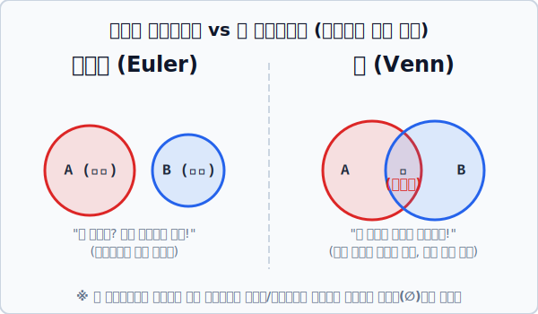

# 03. 엄격함 vs 직관: 오일러와 벤 다이어그램의 충돌

## 1. 학습 목표 (Learning Objectives)
* 존 벤 이전에 존재했던 선배 수학자 **레온하르트 오일러(Leonhard Euler)**가 고안했던 '오일러 다이어그램'의 개념을 살펴봅니다.
* 언뜻 비슷해 보이는 오일러 다이어그램과 존 벤 다이어그램의 근본적인 **'아키텍처(설계 사상) 차이'**가 무엇인지 모형을 대조하여 정확히 해부합니다.

## 2. 존 벤의 선배: 레온하르트 오일러
사실 "집합을 동그라미 그림으로 그려보자!"라는 천재적 접근은 존 벤(1880년)보다 무려 100년 앞서 스위스의 대수학자 레온하르트 오일러(1768년)가 먼저 고안했습니다.
오일러 다이어그램은 **'극강의 현실성(직관)'** 을 추구합니다. 
> "집합 A(홀수) 와 집합 B(짝수) 가 있다고 치자. 겹치는 놈이 우주상에 하나도 없네? **그럼 직관적으로 두 동그라미를 멀찍이 따로따로 떨어뜨려서 그려놔!**" (교장 없는 2개의 섬 모델을 사용함)

## 3. 원을 무조건 겹치게 그리는 존 벤의 고집
존 벤은 100년 뒤, 선배 오일러가 그려놓은 "서로 떨어져 있는 오일러 다이어그램 모형"들을 보며 불만을 품었습니다.
> **존 벤의 불만:** "아니, A와 B가 지금은 안 겹친다고 떨어뜨려 그리면 어떡합니까? 만약 내일 데이터가 추가돼서 겹치는 원소가 새로 튀어나오면, 다시 그림을 처음부터 붙여서(교차하게) 새로 그려야 하잖아요! 이건 논리의 '일반화 도안'이 될 수 없습니다."

그래서 존 벤은 **극강의 논리적 엄밀함과 무결성**을 추구하는 새로운 절대 규칙을 도안에 심습니다!

> **벤 다이어그램의 절대 원칙:** 
> "두 집합이 겹치는 인원이 아예 없든 말든 상관하지 마라! **무조건 교차하는 십자가(벤 다이어그램) 모양으로 겹치게 일단 원 2개를 그려라.** 그리고 겹치는 가운데 영역에 원소가 하나도 조사되지 않으면 구역 이름을 **∅ (공집합: 텅 비어있음)** 이라고 마킹해 두면 논리적 오류 없이 그 하나의 똑같은 다이어그램 모형으로 우주의 모든 경우를 포괄할 수 있다!"

  

## 4. 왜 현대 수학은 '벤' 모델을 표준으로 삼았을까?
오일러 모델도 일상생활에서는 "한눈에 직관적으로 파악"하기에 아주 훌륭합니다. 안 겹치면 떨어뜨려 그리고, 쏙 포함되면 큰 원 안에 아주 작은 원을 그려 넣으니까요.
하지만 '모든 수학적 경우의 논리합'을 따지는 고도의 명제 증명 챕터나 컴퓨터 알고리즘 모델링으로 넘어오면 이야기가 다릅니다. 원이 3개~4개로 늘어났을 때, 오일러 방식대로라면 경우에 따라 그림을 10가지, 20가지 버전으로 다 다르게 그려야 하는 지옥(Hell)에 빠집니다.

반면, 벤 다이어그램 방식은 "일단 무조건 모든 원이 교차하게 만들어 둔 표준 템플릿 딱 1장"만 있으면 끝납니다. 어떤 경우라도 원소가 존재하지 않는 특정 공간에 그냥 빗금을 치거나 공집합(∅) 선언만 해버리면 방어할 수 있으니까요. **'일반화(Generalization)'**라는 수학의 가장 강력한 무기를 장착했기에 벤 다이어그램이 최종 챔피언 자리에 오르게 된 것입니다. 

## 5. 학습 정리 (Summary)
1. **오일러 다이어그램의 특징**: 원소 집단끼리 실제로 공통부분(교집합)이 존재하는지, 없는지, 포함되는지의 '현실 데이터 상태'에 가장 적합한 직관적인 모형으로 동그라미를 붙이거나 띄워서 그리는 유동적 방식입니다.
2. **벤 다이어그램의 특징**: 현실 상태와 무관하게, 일단 **'일어나거나 발생할 수 있는 모든 논리적 교차 구역을 무조건 강제로 발생시키도록'** 원을 똑같이 겹쳐 그리는 수학과 논리학의 가장 엄밀한 범용 템플릿(프레임워크)입니다.
