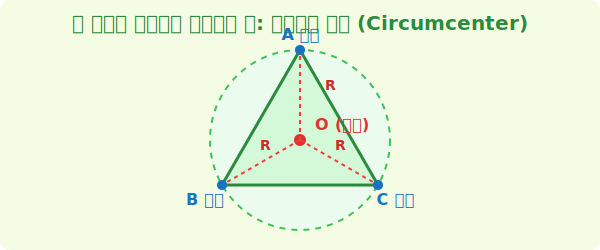

# 1. 세 마을의 중심을 찾아라: 외심 (Circumcenter)

## [도입부] 학습 목표 (Learning Objectives)
- 삼각형의 다섯 가지 중심(오심) 중 가장 바깥쪽 원을 그리는 **외심(Circumcenter)**의 개념을 배웁니다.
- 실생활에서 세 마을에서 정확히 똑같은 거리에 있는 병원/소방서를 짓는 원리가 외심임을 이해합니다.
- 파이썬(Python)의 좌표 형식을 이용해 외심의 위치를 계산하는 알고리즘 원리를 살펴봅니다.

---

## 1. 세 꼭짓점을 모두 지나는 단 하나의 원

평원 위에 아주 멀리 떨어져 있는 세 개의 마을 A, B, C가 있습니다. 이 세 마을은 서로 너무 멀어서, 중간에 커다란 소방서 하나를 같이 짓기로 합의했습니다. 조건은 단 하나, **"어느 마을에서 출발하든 소방서까지의 거리가 완벽하게 똑같아야 한다!"** 였습니다. 

거리가 완벽하게 똑같은 지점을 어떻게 찾을 수 있을까요? 
수학자들은 마을 세 개를 비스듬한 선으로 이어 거대한 **삼각형**을 만들었습니다. 그리고 이 삼각형의 바깥쪽에서 세 개의 꼭짓점을 스치듯 완벽하게 감싸는 커다란 원을 그렸습니다. 이 원을 **외접원(Circumcircle)**이라고 부르고, 그 원의 중심점을 바로 **외심(O, Circumcenter)**이라고 부릅니다. 



원의 중심에서 테두리까지의 거리(반지름 $R$)는 어디로 가든 똑같습니다! 따라서 외심에 소방서를 지으면, 외심에서 A마을(테두리), B마을, C마을까지의 거리가 모두 원의 반지름으로 똑같아지는 마법이 성립합니다.

<br>

## 2. 외심은 어떻게 작도할까? (수직이등분선)

그렇다면 허허벌판에서 콤파스만 가지고 외심은 어떻게 콕 집어서 찾을까요?
비밀은 바로 **'변의 수직이등분선'**에 있습니다.

1. A마을과 B마을을 잇는 선분의 딱 절반(중점)을 찾고, 수직($90^\circ$)으로 선을 쭉 긋습니다.
2. B마을과 C마을을 잇는 선분의 중점에서도 수직으로 선을 쭉 긋습니다.
3. C마을과 A마을 사이에서도 똑같이 긋습니다.

정말 신기하게도, 삼각형의 세 변에서 그어 올린 3개의 수직이등분선은 넓은 평원의 **단 한 점(외심)**에서 기적처럼 만나게 됩니다. 

---

## 3. 💻 파이썬(Python)으로 외심 좌표 구하기

지도 어플리케이션(네이버 지도, 구글 웹 지도 등)을 만들 때 수학 공식은 코드로 변환됩니다. 점 $A(x_1, y_1), B(x_2, y_2), C(x_3, y_3)$ 의 좌표가 컴퓨터 배열로 입력되었을 때, `외심` 알고리즘은 다음과 같이 3개의 수직이등분선의 교점 방정식을 풀어냅니다.

### 🐍 파이썬 예제: 세 점이 주어졌을 때 외심 계산기 

```python
# 세 마을의 (x, y) 좌표라고 가정합시다.
A = (0, 4)
B = (-3, -2)
C = (3, -2)

print("--- 세 마을을 위한 공평한 소방서(외심) 위치 계산 ---")

# 외심 O(Ox, Oy) 를 구하는 대수학 변환 공식 
# (수직이등분선의 교점을 푸는 행렬식을 코드로 압축한 것입니다)
D = 2 * (A[0]*(B[1] - C[1]) + B[0]*(C[1] - A[1]) + C[0]*(A[1] - B[1]))

if D == 0:
    print("세 마을이 일직선에 있어 삼각형(원)을 만들 수 없습니다!")
else:
    # 2차원 평면에서의 외심 공식 (외우지 않아도 됩니다. 원리만 보세요!)
    Ox = ((A[0]**2 + A[1]**2)*(B[1] - C[1]) + 
          (B[0]**2 + B[1]**2)*(C[1] - A[1]) + 
          (C[0]**2 + C[1]**2)*(A[1] - B[1])) / D
          
    Oy = ((A[0]**2 + A[1]**2)*(C[0] - B[0]) + 
          (B[0]**2 + B[1]**2)*(A[0] - C[0]) + 
          (C[0]**2 + C[1]**2)*(B[0] - A[0])) / D

    print(f"A 마을 좌표: {A}")
    print(f"B 마을 좌표: {B}")
    print(f"C 마을 좌표: {C}")
    print(f"📍 소방서(외심) 최적의 좌표: ({Ox:.1f}, {Oy:.1f})")

# 결과창: 
# 📍 소방서(외심) 최적의 좌표: (0.0, 0.5)
```

이 코드는 배달앱 개발자가 '세 명의 라이더가 모두 최단으로 모일 수 있는 허브(Hub)'를 계산하거나 3D 그래픽 엔진에서 메쉬(Mesh)의 중심핵을 계산할 때 매 초마다 수십만 번 호출되는 고성능 기반 코드입니다. 수학의 외심이 곧 컴퓨터 그래픽스의 심장입니다!

---

## [결론] 학습 정리 (Summary)

1. **외심(Circumcenter)의 정의**: 삼각형의 세 꼭짓점을 지나는 바깥쪽 원(외접원)의 중심입니다. 여기서 세 꼭짓점까지의 거리는 항상 똑같습니다.
2. **외심의 작도법**: 삼각형 세 변의 딱 중간을 가로지르는 **'수직이등분선'** 3개가 만나는 교점입니다.
3. **IT 지도 알고리즘**: 공간 데이터베이스 시스템(GIS)에서 세 지점의 등거리 중심을 구할 때 파이썬 코드로 방정식(수직이등분선의 교점 연산)을 풀어 최적의 거점을 찾아냅니다.
