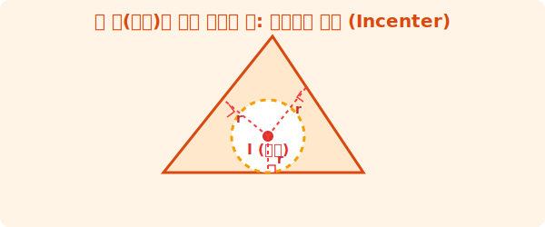

# 2. 세 도로망의 교차점: 내심 (Incenter)

## [도입부] 학습 목표 (Learning Objectives)
- 삼각형의 안쪽을 꽉 채우는 내접원의 중심인 **내심(Incenter)**의 성질을 배웁니다.
- '꼭짓점'까지 거리가 같았던 외심과 달리, '변(테두리)'까지 거리가 같은 내심의 실생활 원리를 이해합니다.
- 파이썬(Python)으로 삼각형의 면적과 둘레 폭을 계산하여 내접원의 반지름 크기를 구하는 법을 알아봅니다.

---

## 1. 삼각형 안에 꽉 끼는 단 하나의 원

거대한 세 개의 고속도로가 교차하면서 거대한 삼각형 모양의 빈 땅이 생겼습니다. 정부는 이 빈 땅 안에 최대한 큰 원형 돔 형태의 체육관을 지으려고 합니다. 원형 돔이 세 개의 도로를 침범하지 않으면서도 최대한 빵빵하게 찰 수 있게 위치를 잡을 수 있을까요?

수학자들은 삼각형 안쪽(內)에서 세 변에 모두 아슬아슬하게 딱 맞닿는 원을 찾아냈고, 이를 **내접원(Incircle)**이라 불렀습니다. 그리고 그 원의 중심점을 바로 **내심(I, Incenter)**이라고 부릅니다. 



방금 1강에서 배운 외심은 세 번의 "점(꼭짓점)"까지의 거리가 $R$로 똑같았죠?
반대로 내심은 원이 선에 닿아있기 때문에, 내심 중심부에서 세 개의 "면(도로/변)"으로 수직($90^\circ$)으로 내려 그은 거리(반지름 $r$)가 모두 똑같습니다!
- 외심 = 점까지 거리가 같음
- 내심 = 선(변)까지 거리가 같음

<br>

## 2. 내심은 어떻게 작도할까? (각의 이등분선)

컴퍼스와 자를 들고 삼각형 안의 내심을 어떻게 찾을 수 있을까요? 외심이 '변'을 반으로 잘랐다면, 내심은 반대로 **'각'을 반으로 자릅니다.**

1. A 마을에서 뻗어나가는 길(각도)을 정확히 절반으로 쪼개는 선을 발사합니다. ($60^\circ$ 라면 $30^\circ$ 씩)
2. B 마을의 뾰족한 각도 절반으로 가르는 선을 냅다 발사합니다.
3. C 마을의 각도 무조건 절반으로 쪼개는 선을 발사합니다.

이 **'세 각의 이등분선'** 3개는 놀랍게도 삼각형 내부의 가장 아늑한 단 하나의 교차로(내심 I)에서 서로 부딪히며 만나게 됩니다!

---

## 3. 💻 파이썬(Python)으로 내접원의 반지름 구하기

해커톤 대회에 나갔는데, "주어진 삼각형 영토 내부에 가장 큰 원형 방어 타워를 세울 때, 타워의 최대 반지름 $r$을 계산하라" 는 미션 코딩 문제가 출제되었습니다. 어떻게 짜야 할까요? 

수학에서 내접원 반지름 $r$과 삼각형 넓이 $S$, 그리고 세 변의 길이 $a, b, c$ 사이에는 다음과 같은 기가 막힌 공식이 존재합니다:
**$$ S = \frac{1}{2} r (a + b + c) $$**

이 공식을 변형하면 파이썬에서 즉각적으로 반지름 $r$을 리턴하는 코드를 작성할 수 있습니다.

### 🐍 파이썬 예제: 넓이를 이용한 방어 타워 반지름 계산기

```python
import math

# 세 변의 길이가 주어졌습니다. (예: 3, 4, 직각삼각형 5)
a = 3
b = 4
c = 5

print("--- 방어 타워(내접원) 최대 크기 계산 코어 ---")

# 1. 헤론의 공식(Heron's Formula)을 이용해 삼각형의 넓이(S)부터 구합니다.
# 헤론 공식: S = sqrt(p * (p-a) * (p-b) * (p-c)), 여기서 p는 둘레의 절반
p = (a + b + c) / 2
area = math.sqrt(p * (p - a) * (p - b) * (p - c))

print(f"삼각형의 둘레: {p * 2}")
print(f"삼각형의 넓이(S): {area}")

# 2. 내접원의 반지름(r)을 도출합니다!
# 공식: r = (2 * S) / (a + b + c)
inradius_r = (2 * area) / (a + b + c)

print(f"📍 계산 완료! 돔 구장의 최대 반지름(r): {inradius_r}")
# 결과:
# 삼각형의 둘레: 12.0
# 삼각형의 넓이(S): 6.0
# 📍 계산 완료! 돔 구장의 최대 반지름(r): 1.0
```

복잡해 보이는 기하학 도형의 문제라도 컴퓨터 공학에서는 **넓이(Area)**와 **둘레(Perimeter)**라는 스칼라 값으로 단방에 쪼갠 후 수식을 역산하여 기하학적 난제를 0.01초만에 시뮬레이션 해냅니다. 

---

## [결론] 학습 정리 (Summary)

1. **내심(Incenter)의 정의**: 삼각형 안쪽에서 세 변에 모두 딱 맞물리는(접하는) 내접원의 중심입니다. 
2. **내심의 작도법**: 세 꼭짓점의 각도를 반갈죽하는 **'각의 이등분선'** 3개가 만나는 아늑한 중심교차점입니다.
3. **면적과 반지름의 관계**: 코딩 알고리즘에서 기하학의 크기를 도출할 때, $S = 1/2 r(a+b+c)$ 와 같은 면적(Area) 공식을 역산하면 파이썬이 즉각적으로 내접원의 크기($r$)를 추적해냅니다.
