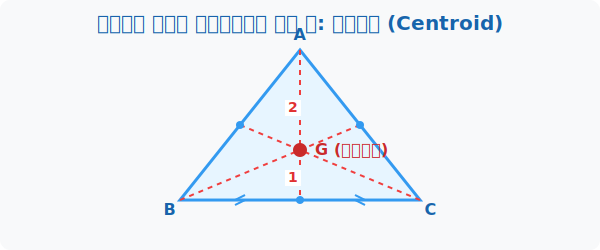

# 3. 물리와 수학의 아름다운 만남: 무게중심 (Centroid)

## [도입부] 학습 목표 (Learning Objectives)
- 판지로 만든 삼각형 위에 손가락을 올려놓았을 때 쓰러지지 않고 완벽하게 수평을 유지하는 밸런스 점, **무게중심(G)**을 이해합니다.
- 꼭짓점과 중점을 잇는 '중선(Median)'의 놀라운 2:1 황금 비율을 배웁니다.
- 파이썬(Python)으로 $X, Y$ 좌표의 "평균(Average)"을 내는 것만으로 무게중심이 수학적으로 도출되는 기적을 코딩해 봅니다.

---

## 1. 삼각형을 허공에 띄워보자

두꺼운 마분지로 삼각형을 오린 다음, 연필심 위에 삼각형을 올려놓고 절대 떨어지지 않는 완벽한 밸런스 존을 찾으려면 어떻게 해야 할까요? 

물리학에서 물체의 무게가 사방으로 공평하게 흩어져 있는 평형점을 무게중심이라고 합니다. 신기하게도 수학의 기하학에서 말하는 삼각형의 **무게중심(G, Centroid)**이 바로 이 물리학의 밸런스 점과 100% 동일한 위치에 있습니다!
외심은 소방서(거리 같음)를 짓기 위함이고, 내심은 원형 돔(내접원)을 짓기 위함이라면 무게중심은 물체의 질량 안정을 잡기 위한 우주의 코어(Core)입니다.



<br>

## 2. 무게중심의 작도법과 2:1의 마법

무게중심을 찾는 방법은 매우 대담하면서도 심플합니다. 아까 외심은 '수직'이라도 신경 썼지만, 무게중심은 그런 것도 필요 없습니다. 무조건 반으로 쪼개고 직진합니다.

1. B마을과 C마을의 길이에서 정확히 한가운데 점(중점)을 찾습니다.
2. 반대쪽 꼭짓점 A에서 그 중점을 향해 무식하게 일직선을 긋습니다. 이 선을 **중선(Median)**이라고 합니다.
3. 다른 삼각형 꼭짓점들도 똑같이 맞은편 중점을 향해 중선을 긋습니다.

이 3개의 중선이 만나는 단 하나의 교차점이 바로 **무게중심(G)**입니다! 
그리고 여기에는 수학 역사에 길이 남을 기적의 황금비율 **2:1** 이 숨어 있습니다. 무게중심은 항상 자기가 그어진 그 중선을 꼭짓점에서부터 정확하게 2:1의 비율로 쪼개버립니다! (위쪽이 2, 아래쪽이 1)

---

## 3. 💻 파이썬(Python)으로 찾는 초간단 무게중심

외심(O)이나 내심(I)의 좌표를 구할 때는 어마어마하고 기괴한 루트($\sqrt{}$)나 나눗셈 방정식이 난무했습니다. 
하지만 삼각형의 무게중심(G)은 물리학의 질량 평균과 같기 때문에, 컴퓨터로 계산할 때 **"그냥 $X, Y$ 좌표들의 단순 평균(무게 1/3 나누기)"**만 내면 끝납니다. 프로그래머들이 제일 사랑하는 기하학적 중심이죠!

### 🐍 파이썬 예제: 리스트 평균을 이용한 제트기 무게중심 추적기

전투기를 프로그래밍할 때 기체의 양 날개와 꼬리의 3개 좌표를 주면 기체의 무게중심을 잡아냅니다.

```python
# 전투기 날개와 꼬리의 3개 좌표들 (A, B, C)
points = [
    (1, 9),   # A (꼬리)
    (-4, -2), # B (좌측 날개)
    (6, 2)    # C (우측 날개)
]

print("--- 기하학 전투기 무게중심 좌표 연산 시스템 ---")

# 1. 모든 X좌표들을 꺼내서 다 더한 다음 3으로 나눈다! (X평균)
x_coords = [pt[0] for pt in points]  # [1, -4, 6]
centroid_x = sum(x_coords) / 3

# 2. 모든 Y좌표들을 꺼내서 다 더한 다음 3으로 나눈다! (Y평균)
y_coords = [pt[1] for pt in points]  # [9, -2, 2]
centroid_y = sum(y_coords) / 3

# 무게중심(G) = ((x1+x2+x3)/3, (y1+y2+y3)/3)
print(f"X 좌표 리스트: {x_coords} -> 평균(G_x): {centroid_x}")
print(f"Y 좌표 리스트: {y_coords} -> 평균(G_y): {centroid_y}")
print(f"📍 전투기의 최종 무게중심(G)은: ({centroid_x:.1f}, {centroid_y:.1f})")

# 결과창: 
# X 좌표 리스트: [1, -4, 6] -> 평균(G_x): 1.0
# Y 좌표 리스트: [9, -2, 2] -> 평균(G_y): 3.0
# 📍 전투기의 최종 무게중심(G)은: (1.0, 3.0)
```

복잡한 2:1 비율 증명과 중선 교점 방정식조차도, 파이썬에게는 단 세 줄 짜리 `sum() / 3` 의 평균(Mean) 함수로 치환되는 가장 아름답고 단순한 마법입니다. 인공지능이 사물의 뼈대를 인식하는 스켈레톤 트래킹(Skeleton Tracking)은 모두 이런 원리 위에서 구동됩니다.

---

## [결론] 학습 정리 (Summary)

1. **무게중심(Centroid)**: 삼각형의 세 꼭짓점에서 마주 보는 변의 중점(절반)으로 그은 3개의 선분, 즉 **'중선'**이 만나는 점입니다.
2. **2:1 질량 보존의 법칙**: 삼각형의 중심을 관통하는 중선은 무게중심 G에 의하여 꼭짓점 방향부터 **$2:1$** 의 비율로 나뉘어지는 마법의 성질을 가집니다.
3. **가장 빠른 코딩 평균 연산**: 파이썬 등 컴퓨터 과학 공간 체계에서 삼각형의 무게중심 $G$좌표는 단순히 꼭짓점 **$X$들의 평균값, $Y$들의 평균값** 하나로 허무할 정도로 완벽하게 도출됩니다.
