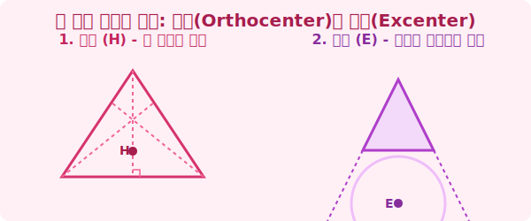

# 4. 직각과 바깥의 세계: 수심(Orthocenter)과 방심(Excenter)

## [도입부] 학습 목표 (Learning Objectives)
- '수직으로 내리꽂는다'는 의미의 교차점, 수심(H)의 개념을 알아봅니다.
- 삼각형의 바깥쪽(외부)에서 세 선과 만나는 유일한 점인 방심(Excenter)의 원리를 이해합니다.
- 삼각형의 5대 중심(오심)이 모두 모여 어떠한 수학적 역할을 하는지 컴퓨터 프로그래밍적 관점에서 마무리합니다.

---

## 1. 폭격기의 타겟팅: 수심(Orthocenter)

꼭짓점에서 마주 보는 변을 향해 중선(절반 자르기)을 쐈던 주인공이 아까 배운 '무게중심'이었습니다. 그렇다면 꼭짓점에서 마주 보는 변을 향해 무지성으로 **$90^\circ$ 직각(수직)**으로 내리꽂아버리면 어떻게 될까요? 

1. 꼭짓점 A에서 밑변을 향해 $90^\circ$ 수선을 발사! 
2. 꼭짓점 B에서 반대 변을 향해 $90^\circ$ 수선을 발사!
3. 꼭짓점 C에서도 마찬가지로 $90^\circ$ 수선을 발사! 

놀랍게도 서로 상관없어 보이던 이 세 개의 90도 미사일 궤적은 삼각형 내부의 단 한 점에서 운명적으로 충돌합니다. 이 폭발적인 교차점을 우리는 **수심(H, Orthocenter)**이라고 부릅니다. 

수심은 삼각형이 둔각(100도 이상 벌어짐) 형태일 경우, 도형의 안쪽이 아니라 바깥쪽 허공에서 만나버리는 매우 독특하고 튕겨나가는 성질을 가집니다! 

 

## 2. 삼각형 밖의 외톨이: 방심(Excenter)

이제 삼각형의 5가지 중심(오심) 중 마지막 주인공인 방심입니다.
방심(Excenter)은 이름 그대로 '방출된' 중심입니다. 나머지 4개(외심, 내심, 무게중심, 수심)는 모두 기본적으로 삼각형의 내부나 근처 테두리에서 놀고 있는데, 얘는 완전히 밖으로 가출해버린 외톨이입니다.

1. 삼각형에서 변 2개를 밑으로 길게~ 연장선을 긋습니다. 
2. 삼각형 바깥쪽에 생긴 각도(외각)를 반으로 가르는 '외각의 이등분선'을 쏩니다.
3. 이 선들이 만나는 외부의 허공 점에 컴퍼스를 꽂고 원을 그리면, 삼각형의 밑변과 연장선 2개에 아슬아슬하게 딱 들어맞는 거대한 원이 탄생합니다.

이 바깥쪽 원을 **방접원**이라고 하고 그 중심부를 **방심(E)**이라고 합니다. 모든 삼각형은 무려 3개의 방심(밑에 1개, 양 옆에 2개)을 가지고 있는 거대한 멀티 유니버스입니다!

---

## 3. 💻 수학의 오심과 프로그래밍 패턴의 융합

이제 삼각형의 오심(외/내/무/수/방)을 모두 모았습니다. 
사실 게임 프로그래머들이나 컴퓨터 비전(Computer Vision) 연구원들은 캐릭터의 모델(폴리곤 Mesh)을 그릴 때 삼각형(Triangle)이라는 기본 단위를 수백만 개 이어 붙여서 3D 캐릭터를 창조합니다. 

이때 오심 데이터를 언제 가져다 쓸까요?
1. **외심(Circumcenter) 코드**: 몬스터의 히트박스(Hit box, 공격 판정 원)를 그릴 때 다리부터 머리끝까지 똑같은 피격 거리를 만들기 위해 씁니다.
2. **무게중심(Centroid) 코드**: 캐릭터가 점프했다가 땅에 착지할 때, 물리 엔진이 발 쪽에 중력 밸런스를 넣어 넘어지지 않게 합니다. 
3. **수심(Orthocenter) 코드**: 빛(Ray)을 쏴서 캐릭터 표면(삼각형 Mesh)의 그림자를 가장 눈부시고 정확하게 반사시키는 직각(Normal Vector)을 계산할 때 사용됩니다.

수학 교과서에 죽어있던 수많은 기하학적 중심들은, 스마트폰 속 3D 게임 그래픽을 연산하는 셰이더(Shader) 파이썬 스크립트 안에서 지금 이 순간에도 빛의 속도로 춤을 추고 있는 것입니다. 

---

## [결론] 학습 정리 (Summary)

1. **수심(Orthocenter)**: 삼각형의 세 꼭짓점에서 마주 보는 변으로 수직($90^\circ$ 미사일)으로 그은 세 수선이 만나는 아찔한 교차점입니다. 
2. **방심(Excenter)**: 삼각형의 내부 각이 아닌 바깥쪽 외각의 이등분선들이 만나는 점으로, 삼각형 밖에 접하는 거대한 방접원의 중심입니다.
3. **오심과 3D 그래픽 알고리즘**: 삼각형의 5가지 중심은 수학자들의 영원한 놀이터였으며, 현재는 폴리곤 그래픽, 물리 엔진, 광원(그림자) 효과를 제어하는 게임 프로그래밍의 핵심 소스 코드로 진화했습니다.
