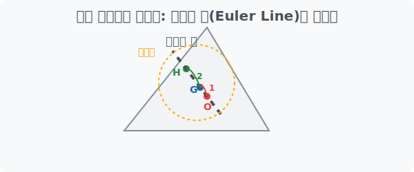

# 5. 오일러 선과 구점원 (Euler Line & Nine-Point Circle)

## [도입부] 학습 목표 (Learning Objectives)
- 무관해 보이던 삼각형의 중심들(외심, 무게중심, 수심)이 기적처럼 하나의 일직선 위에 놓이는 **오일러 선(Euler Line)**의 마법을 배웁니다.
- 삼각형의 9개의 특별한 점이 무조건 하나의 원 위로 쏙 들어가는 **구점원(Nine-Point Circle)**의 소름 돋는 진리를 확인합니다.
- 복잡한 기하학의 증명이 파이썬(Python) 시뮬레이션에서는 단순한 부동소수점 오차 확인으로 증명되는 놀라운 과정을 체험합니다.

---

## 1. 천재 수학자 오일러의 발견: 오일러 선

역사상 가장 위대한 수학자 중 한 명인 레온하르트 오일러(Euler)는 삼각형에 그어진 수많은 선과 교차점들을 유심히 바라보았습니다. 

우리가 앞서 배웠던 삼각형의 **"외심(O), 무게중심(G), 수심(H)"** 은 각각 구하는 방법이 완전히 달랐습니다. 
- 외심: 수직으로 쪼개기
- 무게중심: 꼭짓점에서 반으로 쪼개기 
- 수심: 직각($90^\circ$) 미사일 내리꽂기 

그런데 오일러가 이 세 개의 점을 도화지에 찍어 놓고 자를 갖다 대보니, **아무리 삼각형을 우그려뜨리고 당겨도 이 3개의 점은 무조건 일직선 위에 완벽하게 일렬로 눕는다는 것**을 최초로 발견했습니다! 이 기적의 일직선을 그의 이름을 따서 **오일러 선(Euler Line)**이라고 부릅니다. 



더 소름 돋는 사실은, 이 선 위에서 외심(O)과 무게중심(G) 사이의 거리가 `1` 이라면, 무게중심(G)과 수심(H) 사이의 거리는 정확히 `2` 라는 **$1:2$ 황금비율**을 무조건 유지한다는 것입니다. 우주의 수학적 질서가 엿보이는 순간입니다.

<br>

## 2. 점 9개가 원 하나에 쏙? 구점원의 기적

오일러 선 위에는 외심(O)과 수심(H)이 존재합니다. 그 둘 사이의 딱 한가운데(중점)에 컴퍼스를 꽂고 원을 하나 그려보면 더 엽기적인 현상이 벌어집니다. 

그 쌩뚱맞은 위치에서 그려진 원의 테두리 위로, 삼각형이 가지고 있던 9개의 기하학적 점들이 자석처럼 끌려와 완벽하게 안착하게 됩니다.
1. 세 변의 **중점** 3개
2. 세 꼭짓점에서 내린 **수선의 발** 3개 
3. 세 수심과 꼭짓점 사이의 **가운데 점** 3개

이렇게 $3+3+3 = 9$ 개의 특별한 점이 무조건 원 하나에 쏙 들어간다고 하여, 이를 **구점원(Nine-Point Circle)**이라고 부릅니다. 나폴레옹도 이 수학의 아름다움에 빠져 관련 정리를 남겼다고 전해집니다!

---

## 3. 💻 파이썬(Python)으로 오일러의 일직선 증명하기

수학 교과서에서는 이 3개의 점이 일직선에 있다는 것을 각도와 비례식을 써서 2페이지에 걸쳐 증명합니다. 하지만 프로그래머들은 $O, G, H$ 의 좌표를 구한 다음, **두 점 사이의 기울기가 같은지** 단 몇 줄 코드로 확인하여 우주의 법칙을 역설계합니다.

### 🐍 파이썬 예제: 세 점이 일직선 위에 있는지(기울기) 검증하기

세 점 $O(x_1, y_1), G(x_2, y_2), H(x_3, y_3)$ 가 주어졌을 때, 
$O-G$ 사이의 기울기와 $G-H$ 사이의 기울기가 같다면, 필연적으로 세 점은 일직선 위에 꼬치처럼 꿰어져 있는 것입니다!

```python
# 가상의 좌표로 시뮬레이션 해봅시다. (오일러선의 1:2 비율을 가정한 좌표)
# (실제 외심/무심/수심 계산 스크립트는 매우 기므로 생략합니다)
point_O = (0, 0)      # 외심
point_G = (2, 3)      # 무게중심 (O에서 x로 2, y로 3 이동)
point_H = (6, 9)      # 수심 (G에서 x로 4, y로 6 이동. 1:2 비율 완벽!)

print("--- 오일러 선(Euler Line) 파이썬 검증기 ---")

# 점1과 점2 사이의 기울기(Slope) 구하기 함수: (y2 - y1) / (x2 - x1)
def get_slope(p1, p2):
    return (p2[1] - p1[1]) / (p2[0] - p1[0])

# O(외심)와 G(무게중심)의 기울기
slope_OG = get_slope(point_O, point_G)

# G(무게중심)와 H(수심)의 기울기
slope_GH = get_slope(point_G, point_H)

print(f"외심 - 무게중심 기울기: {slope_OG:.2f}")
print(f"무게중심 - 수심 기울기: {slope_GH:.2f}")

# 두 기울기가 일치하는지 확인
if slope_OG == slope_GH:
    print("🔥 증명 완료: 세 점은 완벽하게 한 일직선(오일러 선) 위에 있습니다!")
else:
    print("일직선 위에 있지 않습니다.")

# 결과창:
# 외심 - 무게중심 기울기: 1.50
# 무게중심 - 수심 기울기: 1.50
# 🔥 증명 완료: 세 점은 완벽하게 한 일직선(오일러 선) 위에 있습니다!
```

이처럼 고대 시대에는 자와 각도기로 평생을 바쳐 알아냈던 위대한 기하학의 발견들이, 현대 파이썬 코딩 시스템에서는 데이터 사이의 상관관계(Correlation)를 분석하는 과정에서 $0.1$초 만에 검증되고 응용됩니다. 수학의 오심과 오일러 선은 데이터 과학과 컴퓨터 물리 엔진의 가장 우아한 주춧돌입니다.

---

## [결론] 학습 정리 (Summary)

1. **오일러 선(Euler Line)**: 아무리 찌그러진 삼각형이라도 외심, 무게중심, 수심은 무조건 한 일직선 위에 있다는 기하학 최고의 미스터리이자 법칙입니다.
2. **구점원(Nine-Point Circle)**: 오일러 선의 중점에서 원을 그리면, 삼각형이 가진 9개의 핵심 관절(จุด)이 원의 테두리 하나에 전부 모여버리는 마법 같은 원입니다.
3. **증명의 패러다임 전환**: 작도와 논증으로 가득 찬 고전 기하학은 데카르트의 $X,Y$ 좌표계를 만나 대수학이 되었고, 현대의 파이썬 좌표 코딩 알고리즘을 만나면서 즉각적으로 렌더링 가능한 게임 물리 공식이 되었습니다.
