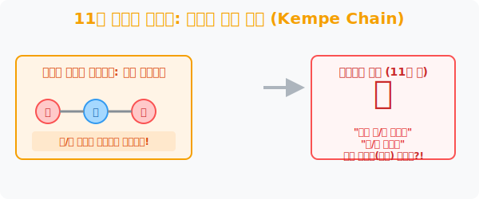
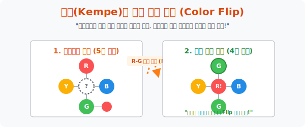

# 3. 11년 천하의 사기극: 켐프의 거짓 증명과 구멍 뚫린 논리

## [도입부] 학습 목표 (Learning Objectives)
- 1879년 알프레드 켐프(Kempe) 가 들고 온 역사적인 4색 정리의 첫 번째 '증명 선언' 과 그의 천재적이었던 무기 **'교대 사슬(Kempe Chain)'** 의 알고리즘을 해부합니다.
- 왜 전 세계 천재 수학자들이 이 증명에 11년 동안이나 깜빡 속아 넘어갔는지, 그리고 퍼시 히우드(Heawood)가 이 논리 블록의 단 1초의 구멍(결함)을 어떻게 찾아 박살 냈는지 배웁니다.
- 파이썬(Python)의 '색상 반전(Color Flip)' 매크로 로직을 관찰하며, 켐프 체인의 스위치 역할을 간접적으로 렌더링 해봅니다.

---

## 1. 알프레드 켐프의 천재적인 '사슬(Chain)' 아이디어

4색 문제가 발표된 지 무려 27년이 지난 1879년, 영국의 변호사 출신 수학자 알프레드 켐프가 **"제가 4색 문제를 완벽하게 증명했습니다!"** 라며 세계 수학계에 거대한 논문을 투척합니다. 
그의 논문은 무식하게 모든 지도를 다 확인하는 것이 아니라, 굉장히 세련된 일련의 매크로 버튼(**교대 사슬 기법**)을 고안해 냈습니다.

- **[상황]** 지도를 한창 칠하다가, 주변에 빨강, 파랑, 노랑, 초록 4개의 색상이 꽉 막혀버려서 가운데 낑긴 놈을 칠할 5번째의 색연필이 필요한 위기일발의 상황에 직면합니다.
- **[켐프의 마술]** 켐프는 5번째 색연필을 꺼내지 않았습니다. 대신 주변국 중 빨강과 파랑으로 연달아 칠해진 나라들의 무리(체인)를 통째로 선택한 뒤, **"빨강은 파랑으로, 파랑은 빨강으로 순식간에 색깔을 싹스위치(반전) 시켜버렸습니다!"** 
- **[결과]** 이렇게 체인 전체의 색상을 뒤집어버려도 자기들끼리는 국경선 색깔 충돌이 나지 않습니다. 놀랍게도 이 버튼 한 방에 가운데 꽉 막혀있던 공간에 '초록색' 이 들어갈 잉여 공간이 모세의 기적처럼 창출되어 버린 것입니다!

이 눈부신 **'켐프 체인(Kempe Chain)'** 증명에 세계의 톱클래스 수학자들은 전원 기립박수를 치며 "4색 문제는 이제 끝났다"라고 선언했습니다.



<br>

## 2. 11년 만에 드러난 지옥의 결함 (히우드의 반격)



11년 동안 전 세계 교과서에 켐프의 이름이 위대한 해결사로 박차 올랐습니다. 
하지만 1890년, 퍼시 히우드(Percy Heawood) 라는 무명의 수학자가 **'켐프 체인 반전 기술(Flip)' 의 치명적인 맹점(Bug)** 을 폭로하고 맙니다.

히우드가 지적한 켐프 논리의 구멍은 치명적이었습니다.
켐프는 "빨강-파랑 체인과 노랑-초록 체인이 교차할 때, 둘 중 하나를 스위치 반전시키면 공간이 빈다" 라고 주장했습니다. 그런데 만약 매우 더럽게 그려진 지도 구석에서 **[빨강-파랑 체인] 과 [노랑-초록 체인] 이 도넛 모양처럼 빙글빙글 타래처럼 꼬여서 서로가 서로의 색칠 변환을 틀어막아 버리는, 이른바 데드락(Deadlock) 상태** 에 빠지면 켐프의 색깔 반전 마술이 먹히지 않고 폭발해 버렸습니다!

히우드는 친절하게도 이 버그가 터지는 복잡한 25면체 지도 그림까지 같이 첨부했습니다.
이로써 11년 천하의 4색 정리 증명은 산산조각이 났고, 세계 수학계는 충격과 공포의 미궁 속으로 다시 굴러 떨어졌습니다. (단, 히우드는 켐프 체인을 살짝 수선해서 "적어도 '5개의 색' 으로는 무조건 다 칠할 수 있다"는 **5색 정리**를 증명해 내는 위업을 보너스로 남겼습니다.)

---

## 3. 💻 파이썬(Python) 켐프의 '색상 반전(Flip)' 스위치 시뮬레이션

알프레드 켐프가 발명했던 역사적인 아이디어인 '서로 연결된 체인 집단의 텍스처 컬러를 통째로 맞바꾸는 로직' 은 오늘날 그래픽 소프트웨어의 배열(Array) 반전 기능과 유사합니다.

### 🐍 파이썬 예제: 체인 집단의 색상 스위칭 (Switching) 매크로

```python
print("--- 🔄 켐프의 교대 사슬(Kempe Chain) 칼라 스위치 봇 ---")

# (데이터 셋) 현재 연결되어 색상이 맞물려있는 국가 체인 집단
# A-B-C-D 가 [빨-파-빨-파] 로 번갈아 칠해져 있다고 가정
kempe_chain = {
    'A': 'Red',
    'B': 'Blue',
    'C': 'Red',
    'D': 'Blue'
}

print(f"▶ 1. [스위치 이전 원본 체인]: {kempe_chain}")

# [마법 발동] Red 는 Blue 로, Blue 는 Red 로 통째로 뒤집습니다 (Toggle)
flipped_chain = {}

for country, color in kempe_chain.items():
    if color == 'Red':
        flipped_chain[country] = 'Blue'   # 색깔을 치환
    elif color == 'Blue':
        flipped_chain[country] = 'Red'    # 색깔을 치환

print("-" * 50)
print(f"▶ 2. [스위치 매크로 가동 후]: {flipped_chain}")

print(" ☞ [판독] A와 B 인접국은 각각 (Blue, Red) 로 여전히 국경 충돌이 없습니다!")
print(" ☞ 주변부의 벽돌 색깔을 교묘하게 뒤집어, 가운데 나라가 칠해질 '빈틈 여유'를 억지로 뽑아냄.")

# 결과창:
# --- 🔄 켐프의 교대 사슬(Kempe Chain) 칼라 스위치 봇 ---
# ▶ 1. [스위치 이전 원본 체인]: {'A': 'Red', 'B': 'Blue', 'C': 'Red', 'D': 'Blue'}
# --------------------------------------------------
# ▶ 2. [스위치 매크로 가동 후]: {'A': 'Blue', 'B': 'Red', 'C': 'Blue', 'D': 'Red'}
#  ☞ [판독] A와 B 인접국은 각각 (Blue, Red) 로 여전히 국경 충돌이 없습니다!
#  ☞ 주변부의 벽돌 색깔을 교묘하게 뒤집어, 가운데 나라가 칠해질 '빈틈 여유'를 억지로 뽑아냄.
```

히우드의 일격으로 증명은 실패로 끝났지만, 켐프가 고안해 낸 이 잔머리 **[색상 스위칭(결합 반전)] 알고리즘** 은 폐기되지 않고 보존되어, 훗날 컴퓨터를 통해 4색 정리를 최종 박살 내는 메인 엔진의 심장 부품으로 재활용되는 영광을 누립니다.

---

## [결론] 학습 정리 (Summary)

1. **켐프의 천재성 (스위칭 마법)**: 색연필이 부족해 막다른 골목에 몰렸을 때, 주변을 둘러싼 [빨강-파랑] 체인 무리의 색깔을 단박에 반대로 투글 시킴으로써 국경선 충돌 없이 강제로 여유 컬러 공간을 조작 창출해 낸 대수학적 전략이었습니다.
2. **환희 뒤의 대재앙 (버그 데드락)**: 11년간 전 세계가 속아 넘어갔지만, 이 켐프의 체인 마술이 통제 불가능할 정도로 꼬여있는 도넛 형태의 위상수학적 극한 지도에서는 로직이 멈추어버린다는 치명적인 모순(결함)이 발각되었습니다.
3. **5색 정리의 방어막**: 템플 체인의 아이디어가 비록 4색에는 패배했으나 "5가지 색연필이면 무적이다(5색 정리)" 라는 방어선을 구축해 주었고, 이로써 4색 문제는 수학계에서 가장 까다롭고 잔인한 인내심의 끝판왕으로 군림하게 됩니다.
