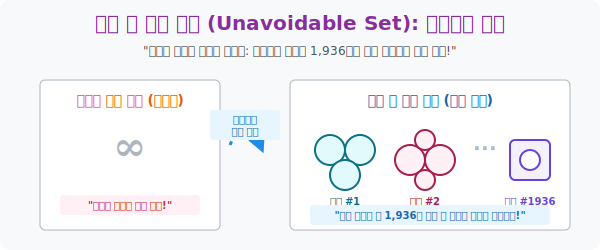

# 5. 무한을 유한으로 깎다: 피할 수 없는 국면 구조 (Unavoidable Set)

## [도입부] 학습 목표 (Learning Objectives)
- 4색 문제를 증명하기 위해 "세상의 모든 무한(∞)개의 지도를 다 검사해 봐야 해!" 라는 일반인의 절망적인 상식을 수학의 논리로 어떻게 박살 내었는지 **'유한 압축(가약성)'** 의 기법을 확인합니다.
- 하인리히 헤쉬(Heesch)와 볼프강 하켄(Haken)이 오일러 공식을 지렛대로 삼아, 아무리 크고 거대한 지도라도 **"결국 이 1,936개의 레고 조각 패턴 중 하나는 무조건 들어가 있다"**는 절대 그물망 작전을 세웠음을 배웁니다.
- 파이썬(Python)의 부분집합 알고리즘을 통해 수만 개의 복잡한 문자열 속에서 필수 패턴 조각들을 색출해 내는 필터링 방어막을 시뮬레이션 합니다.

---

## 1. 무한개의 지도를 압축하는 마법사들

히우드가 켐프의 뒷통수를 친 이후 수학자들은 수십 년간 우울증에 빠져있었습니다. 세상엔 무한한 모양의 지도가 존재하고, 인간의 수명은 유한하니까 모든 지도를 다 확인(증명)할 방법이 원천적으로 막혀있다고 믿었기 때문입니다. 

그러나 1960년대 독일의 하인리히 헤쉬(Heinrich Heesch)가 엄청난 전략을 들고나옵니다. 
**"무한대의 지도를 통째로 볼 필요가 없어! 지도를 쪼개서 블록(레고) 패턴으로 만들면, 도미노처럼 4색이 전이되는 '피할 수 없는 국면 구조(Unavoidable Set)' 들로 요약할 수 있어!"**

이 전략의 핵심은 **오일러 공식($V - E + F = 2$)** 이었습니다. 오일러가 가르쳐준 기하학의 절대 법칙에 따르면 지도 위의 나라 배치(위상) 구조는 무한대로 팽창할 수 없습니다. 
- 나라 3개가 맞닿은 구역 (삼각형 패턴)
- 나라 4개가 맞닿은 구역 (사각형 패턴)
- 나라 5개가 맞닿은 구역 (오각형 패턴)

헤쉬와 미국의 볼프강 하켄은 이 오일러의 저주를 이용해 무한대의 지도를 약 **1,936종의 파편(레고 조각 패턴)**으로 깎아내는 데 성공했습니다. *"이제 저 무한대의 영토 따윈 개나 줘버려라! 이 우주의 어떤 괴물 지도를 그리더라도, 그 안에는 우리가 뽑아놓은 '1,936개의 기본 덩어리 패턴(피할 수 없는 국면)' 중 최소 1개는 무조건 들어있다!"*



<br>

## 2. 1,936개의 패턴만 뚫으면 게임 끝이다!


1976년, 마침내 미국의 수학자 케네스 아펠(Kenneth Appel) 과 볼프강 하켄(Wolfgang Haken) 이 이 무시무시한 전략을 들고나옵니다. 이 전략의 이름이 바로 **'피할 수 없는 집합(Unavoidable Set)'** 입니다.

> "세상의 모든 지도를 무한대까지 그릴 필요가 없다! 지도를 아무리 미친 듯이 복잡하게 쪼개 봤자, 그것들을 잘게 부수면 결국 **정해진 1,936개의 레고 블록 패턴(부분 그래프)** 중 하나를 무조건 포함하게 되어있다!"

이것은 인류 증명사의 거대한 터닝 포인트였습니다.
무한($\infty$) VS 나약한 인간의 싸움에서, **1,936개 VS 수학자들**의 현실적인 물량전으로 전장이 축소된 것입니다.

이제 수학자들의 남은 임무는 **"이 1,936종의 레고 블록들이 각각 4가지 색깔만으로 에러 없이 색칠될 수 있는지(가약성, Reducibility)"** 를 노가다로 검증하기만 하면 되었습니다. 모든 레고 블록 장난감이 4색으로 칠해진다면, 그 블록들로 조립되어 만들어지는 이 우주의 모든 거대한 세계 지도 역시 무조건 4색으로 칠해질 수밖에 없다는 완벽한 성이 세워졌습니다.

단지 이 검증 과정(서로 색깔 매칭 스위칭 테스트)이 엄청나게 길고 복잡해서 인간의 손으로 하나하나 계산하면 한 사람당 1만 시간 넘게 걸린다는 미친 노가다가 기다리고 있었을 뿐입니다. 

---

## 3. 💻 파이썬(Python) 필수 패턴 조각 매칭(Filtering) 스캐너

헤쉬와 하켄이 발명한 "모든 텍스트 데이터 덩어리는 무조건 이 몇 개의 패턴(Set)을 피할 수 없다"는 논리는, 오늘날 백신 프로그램이 무한대의 바이러스 코드 속에서 악성 시그니처 1~2개를 검출해 내는 원리와 동일합니다.

### 🐍 파이썬 예제: 미지의 지도 데이터에서 '필수 패턴' 색출

```python
print("--- 🔍 무한 텍스트 맵 필터: 피할 수 없는 국면 매칭기 ---")

# (데이터 셋) 하켄이 뽑아낸 3개의 '피할 수 없는(Unavoidable)' 필수 패턴 조각
unavoidable_sets = ["TRIANGLE", "SQUARE", "PENTAGON"]

# (상황) 누군가 수억 줄에 달하는 괴물같은 영토 데이터를 들고왔습니다.
monster_map_data = "...(수만줄의 생략)... SQUARE_REGION_FOUND ...(수만줄)..."

print("▶ 스캔 시작: '괴물 지도'가 우리 연구팀의 통제 패턴 안에 들어오는가?")
print("-" * 50)

matches = 0
for pattern in unavoidable_sets:
    if pattern in monster_map_data:
        print(f" 🚨 [적발] 지도 깊숙한 곳에서 '{pattern}' 패턴 구조가 발견됨!")
        matches += 1

if matches > 0:
    print(f"\n✅ [결론] 이 미지의 지도는 무한히 복잡해 보여도,")
    print("   결국 우리가 찾아낸 '가약성 레고 블록'으로 해체 가능함이 판명되었습니다!")
else:
    print("\n❌ [패배] 오일러 공식 위반! 우리가 예견하지 못한 돌연변이 지도입니다.")

# 결과창:
# --- 🔍 무한 텍스트 맵 필터: 피할 수 없는 국면 매칭기 ---
# ▶ 스캔 시작: '괴물 지도'가 우리 연구팀의 통제 패턴 안에 들어오는가?
# --------------------------------------------------
#  🚨 [적발] 지도 깊숙한 곳에서 'SQUARE' 패턴 구조가 발견됨!
# 
# ✅ [결론] 이 미지의 지도는 무한히 복잡해 보여도,
#    결국 우리가 찾아낸 '가약성 레고 블록'으로 해체 가능함이 판명되었습니다!
```

이 간단한 부분집합 코어가 하켄/아펠 연구진 컴퓨터의 디스크 드라이브 안에서 미친 듯이 회전하며, 1936개의 패턴을 우주의 지도 데이터 배열 안으로 끊임없이 투영(Mapping)하고 색을 대조하는 기계적 톱니바퀴의 역할을 수행했습니다.

---

## [결론] 학습 정리 (Summary)

1. **무한을 유한으로 (패턴화)**: "세상의 불가능할 정도로 다양한 지도의 경우의 수를 모두 인간이 세어야 하는가?"라는 철학적 질문을, "1936조각의 기본 패턴 구조 중 무조건 한 개는 들어갈 수밖에 없다"는 귀납적 압축 논리로 분쇄한 수학계 최고 승리입니다.
2. **오일러의 호위 (절대 법칙)**: 저 수많은 국면 패턴들이 도망가지 못하도록 외곽을 두르고 있던 수학적 철창이 바로 앞에서 배웠던 $V - E + F = 2$ 이며, 이 공식 덕분에 지도의 팽창도가 1,936개 선에서 강제 스톱된 것입니다.
3. **가약성 검증(Reducibility)**: 이제 남은 일은 딱 하나, 불분명한 마법의 1,936조각의 레고 블록들이 서로 맞물렸을 때 각각 자체적으로 "4가지 색만으로 퍼즐이 예쁘게 칠해지는가?"를 미친 듯이 검산하는 막노동 단계로 넘어갔습니다.
