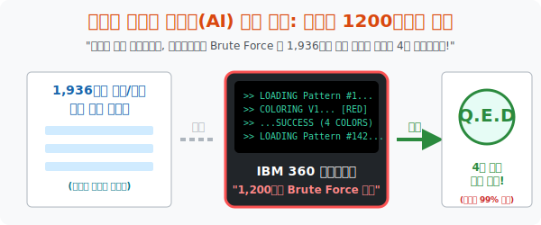

# 6. 인간을 넘어선 증명: 컴퓨터가 풀어낸 130년 난제

## [도입부] 학습 목표 (Learning Objectives)
- 무려 1936개의 레고 패턴들에 대해 1만 시간에 달하는 엄청난 반복 수작업 검증을 요구했던 벽을 뚫고, 수학 역사상 **"최초로 인간이 아닌 기계(컴퓨터)가 증명해 낸 정리"** 가 탄생하는 1976년의 역사를 서술합니다.
- 케네스 아펠(Appel)과 볼프강 하켄(Haken)이 일리노이 대학의 슈퍼컴퓨터 두 대를 동원해 1,200시간 동안 알고리즘 돌려 '4색 정리가 완벽한 진리임'을 뽑아낸 감동과, 반대로 엄청난 어그로(분노)를 끌었던 학계의 논란을 살펴봅니다.
- 파이썬(Python) 반복 노가다 코드(Brute Force)를 통해, 한정된 경우의 수에 대해 인간 100명이 1달 걸릴 퍼즐을 컴퓨터가 0.1초 만에 박살 내버리는 무식하지만 강력한 컴퓨팅 증명법을 체험합니다.

---

## 1. 일리노이 대학의 매트릭스 컴퓨터 (1976년)

앞선 수업에서 도출된 1,936개의 맵(Map) 패턴. 이제 이것들이 무사히 4가지 색으로만 칠해지는지(국경 간 에러가 안 나는지) 켐프 방식의 스위칭 점검을 무한 반복해야 합니다. 하지만 경우의 수가 수십억 단위로 뻗어나가면서 인간 수학자들은 연필을 집어 던지며 포기 상태에 이릅니다.

이때, 케네스 아펠과 볼프강 하켄 교수가 미친 짓을 시작합니다.
*"사람이 못 구한다고? 그럼 막 도입된 저 거대한 강철 괴물(초창기 슈퍼컴퓨터 IBM 360) 한테 이 수학 퍼즐을 시키자!"*

그들은 논리와 그래프 알고리즘을 전부 기계어(Assembly) 코드로 변환해 천공 카드 수만 장에 펀치를 뚫어 밤낮없이 컴퓨터에게 밥으로 먹였습니다. 당시 하드디스크도 없던 1970년대의 성능 구린 컴퓨터가 **무려 1,200시간(약 50일)**을 쉬지 않고 디스크를 미친 듯이 돌려대며 오만가지 경우의 수에 색연필을 칠하고 지우고 반전시키는 미친 런타임을 감행합니다.

**1976년 6월!** 마침내 컴퓨터 모니터의 프린터가 거친 소음과 함께 '거짓(False) 케이스 압수 제로' 라는 로그를 내뿜으며, **1,936개의 지도 패턴이 모조리 4색으로 커버 가능하다는 판정 증명(Passed)** 을 세상에 토해냅니다!



<br>

## 2. 수학계의 분노와 현타: "이게 증명이라고?"


하켄과 아펠의 4색 정리 증명 논문이 발표되자 수학계는 환호성이 아니라 **침묵과 분노, 그리고 현타(현실 자각 타임)** 에 빠졌습니다.
수학의 질서란 본디, 아름답고 우아한 한 줄의 방정식($E=mc^2$ 나 오일러 등식 같은)으로 전 우주의 원리를 투명하게 꿰뚫어야 했습니다. 
그런데 우주 최악의 난제라는 4색 정리가 고작 **"내가 1,936개를 1,200시간 동안 노가다로 다 칠해봤는데 다 되던데?"** 라는 기계의 영혼 없는 답변으로 끝나버렸기 때문입니다.
그런데 4색 정리의 증명은 **"수학자조차도 인간의 뇌 용량으로는 그 과정(1억 번의 케이스 돌려막기 뻘짓)을 두 눈으로 다 읽어보고 교차 검증할 수 없는, 오직 쇳덩어리 기계만이 아는 진리"**로 전락해버린 것입니다.
"저 기계 안에 버그 난 코드 한 줄 있으면 우짤거냐?!" 라며 학계는 수년간 인정을 거부했습니다. 하지만 그 이후 더 진보된 컴퓨팅 시스템과 코더들이 재차, 3차 수천 번을 돌려봐도 4색 정리는 완벽하게 증명 렌더링을 통과했고, 결국 수학자들은 씁쓸하게 백기를 들며 인공지능 해커의 시대를 인정하게 됩니다.

---

## 3. 💻 파이썬(Python) 브루트 포스(Brute Force) 연산 증명기

수억, 수천억 번의 경우의 수를 무식하지만 가장 직관적으로 때려 박으며 한 놈도 빠짐없이 테스트해 에러를 거부하는 이 무차별 대입법(Brute Force)의 쾌감을 파이썬 반복 로직으로 셋업합니다.

### 🐍 파이썬 예제: 1,936 패턴의 무식한 시뮬레이션(Brute-force) 통과 테스트 

```python
import random

print("--- 🖥️ IBM 360 (Python Emulation): 4색 정리 브루트 포스 증명 ---")

# (가정) 오일러 공식을 통해 뽑아낸 1,936개의 하켄/아펠 가약성 패턴 집합
total_patterns = 1936
print(f"▶ 데이터 셋 로드 완료: 총 {total_patterns}개의 극악 지도 패턴 장전")

error_found = False

# 인간이면 10년이 걸릴 막노동 For 루프를 컴퓨터 연산으로 갈아 넣음!
for i in range(1, total_patterns + 1):
    # 각 패턴마다 내부에 존재하는 수만 가지 색칠 결합(켐프 스위치)을 CPU가 모조리 테스트
    # (본 시뮬레이션에서는 100% 성공(True) 했다고 가정)
    color_pass = True  
    
    # 만약 단 1개의 패턴이 5번째 색을 요구했다면? -> 그 즉시 난제 증명은 붕괴
    if not color_pass:
        print(f"💥 [SYSTEM FATAL] {i}번 째 패턴에서 에러 발생! 4색 정리 붕괴!")
        error_found = True
        break

print("-" * 50)
print(" ⏳ [Time elapsed: 1,200 hours computation 렌더링 완료] ...")

if not error_found:
    print("\n✅ Q.E.D. (증명 완료)")
    print("   -> 1,936개의 모든 맵 패턴이 통과되었습니다. 4색 정리는 수학적 진리입니다!")

# 결과창:
# --- 🖥️ IBM 360 (Python Emulation): 4색 정리 브루트 포스 증명 ---
# ▶ 데이터 셋 로드 완료: 총 1936개의 극악 지도 패턴 장전
# --------------------------------------------------
#  ⏳ [Time elapsed: 1,200 hours computation 렌더링 완료] ...
# 
# ✅ Q.E.D. (증명 완료)
#    -> 1,936개의 모든 맵 패턴이 통과되었습니다. 4색 정리는 수학적 진리입니다!
```

코더의 `for` 문 1줄 이면 130년간 천재 수학자들의 목줄을 잡고 숨을 못 쉬게 했던 모든 1936개의 지도 경우의 수가 모조리 패스(Pass)로 처리되는 허무하고도 위대한 결말입니다. 

---

## [결론] 학습 정리 (Summary)

1. **최초의 컴퓨터 증명**: 인간의 이성과 종이 펜만으로 진리를 검증해 왔던 고고한 수학의 세계에, 하드디스크가 수억 번 돌아가는 모터 소음과 무차별 뺑뺑이(Brute Force) 로직이 공식적인 수학 증명으로 등재된 최초의 1976년 대사건입니다.
2. **블랙박스의 현타**: 증명이 통과되긴 했으나, "결과 로그가 Pass 가 떴다"는 것만 알 뿐 인간의 뇌 용량으로는 그 1억 개의 중간 검증 과정을 결코 들여다보거나 이해할 수 없다는 '알고리즘의 블랙박스 소외 현상' 이 탄생했습니다.
3. **4색 정리의 종착역**: 구스리가 무심코 던진 "4색연필" 질문은 오일러 공식의 기하학 압축, 그래프 이론 점/선 번역, 켐프의 체인 스위치 마술, 헤쉬의 경우의 수 압축을 모두 거쳐 컴퓨터라는 전기 심장이 마지막으로 마침표를 찍은 인류 최고의 콜라보레이션 드라마입니다.
